# 6.统计图表

将大量的数据图像化，使数据呈现更直观，更清晰，方便我们对各类数据进行分析。

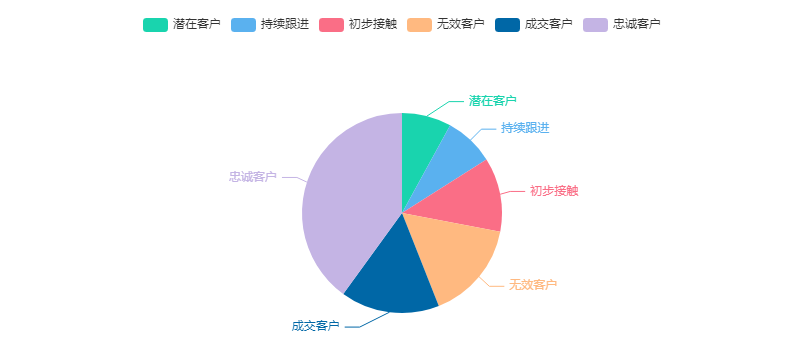

鲸云目前提供了11种图表类型：饼图、环图、柱形图、条形图、折线图、数值图、散点图、表格图、漏斗、热力图、水球图。

入口：应用管理→找到对应的应用→点击应用后面的设置图标→点击新建自定义页面→点击统计图

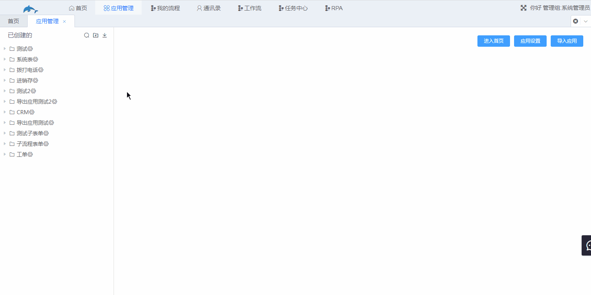

图表类型介绍

1.饼图和环图

​	一般用于显示各项数据占总数的百分比，可以清晰地显示各项数据占总数的比例。

​	应用场景：客户状态分析，分析各个客户状态下的客户数量占总客户数量的比例。

​	制作步骤：

​		a.选择工作表

​		b.选择图形

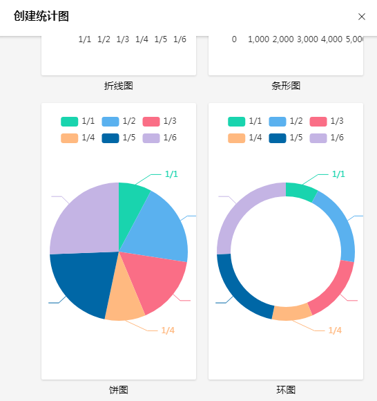

​		c.设置图表

​		自定义筛选器：即表单设计扩展功能处添加的角色自定义过滤器，用于筛选需要呈现的数据。

​		更多筛选：除了使用自定义筛选器筛选呈现数据外，还可以在**更多筛选**处临时添加一个筛选器。

​		图表类型：用于切换图表类型。

​		X轴：设置X轴的字段，当X轴为创建时间或者修改时间时，可以选择X轴的单位，年、月、日、小时。

​		Y轴：设置Y轴字段，默认为记录数量。

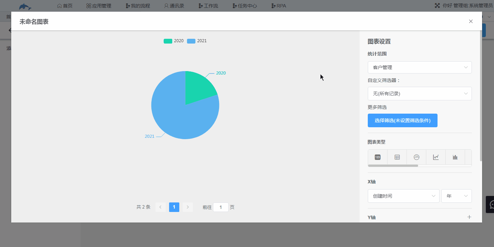

​		下图为环形图。

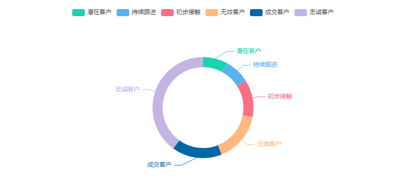

保存后的图表可以在自定义页面中查看。

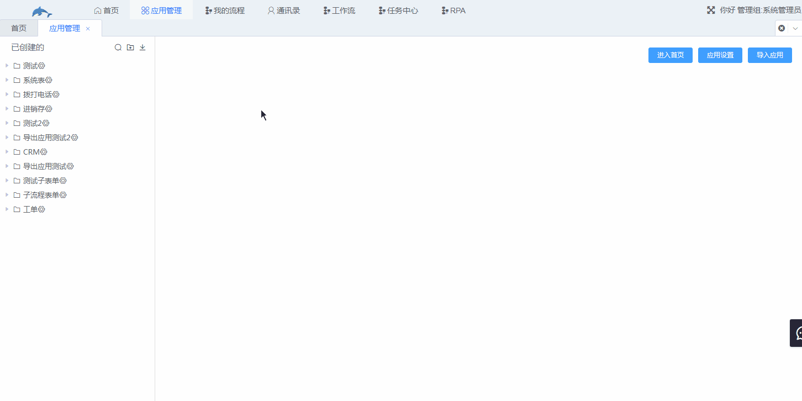2.柱形图和条形图

​	显示不同类别下的数值比较，X轴为类别，Y轴为该类别下的数值，条形图是横向的柱形图。

​	应用场景：统计公司销售团队在一个时间范围内每年、每月或者每日的销售额度。

​	图表设置：

​		工作表选择销售单，时间范围可在更多筛选处筛选出需要呈现的数据的时间范围。Y轴设置处默认为求和，即对一个类别下的所有数值进行累加，除求和外，还有求最大值、最小值以及平均值。

​		Y轴排序：可选择根据Y轴的数值排序，或者按照时间进行排序，下面用条形图进行展示。

​		根据Y轴数量排序。

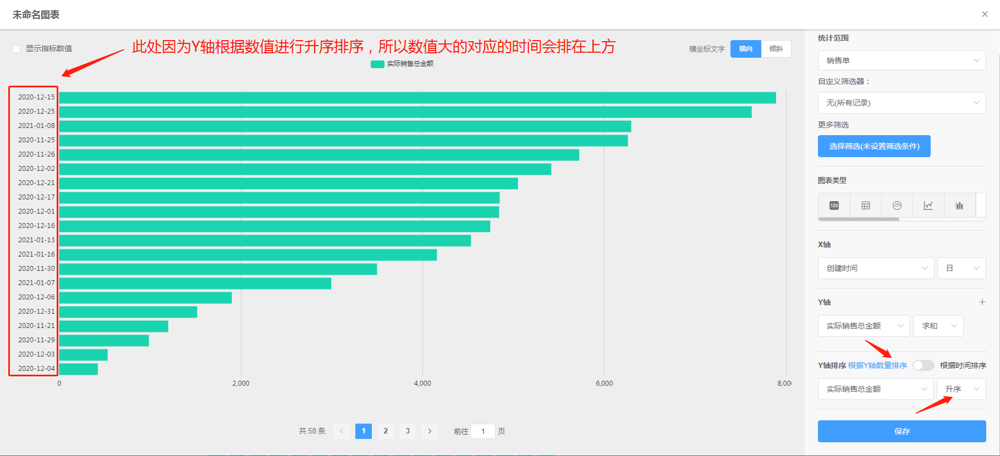

​		根据时间排序。

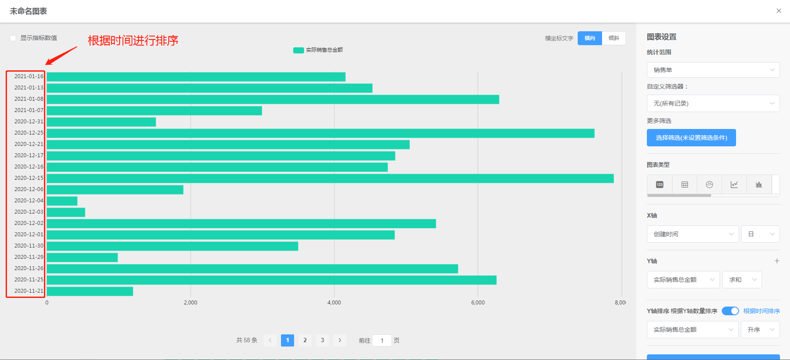

​		在Y轴设置处点击后方的“+”可增加Y轴项，例如在上图基础上再增加多一项建议零售总金额。

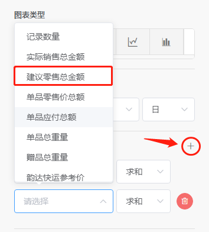

​		效果如下图。

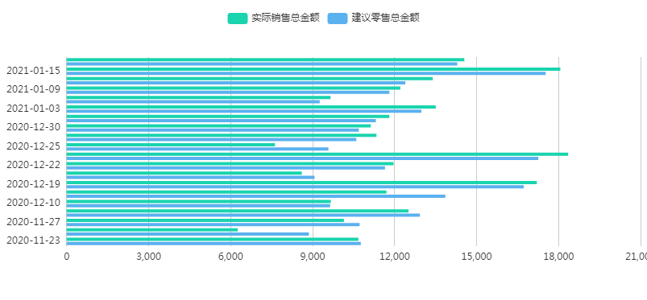

3.折线图和散点图

​	在图中标出每个数据的位置，以点显示，此为散点图，折线图则是将图上的每个点用实线连接起来。折线图和散点图都能显示出某个字段数值的变化趋势，折线图呈现的趋势较为直观，而散点图通常方便观察数据的相关性以及其在图中的分布。

​	应用场景：公司销售额度在某个时间范围内的变化。

​	下图为折线图。

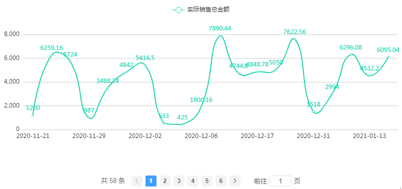

​	下图为散点图。

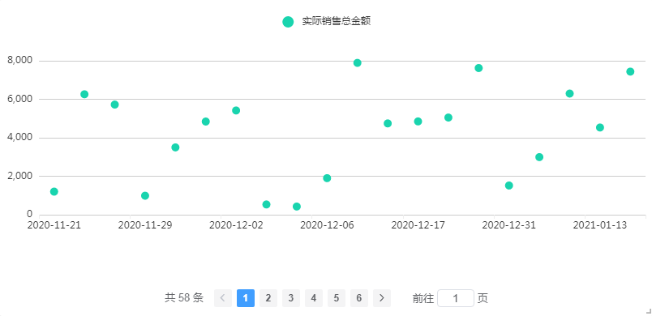

4.数值图

​	对需要统计的数据进行筛选后进行计算（求和、最大值、最小值、平均值），将计算后得到的数据直接呈现在图中，在图表设置中的**文字描述**可填写该数据的描述。

​	应用场景：统计公司2020年12月份的销售单数量。

​	效果如下图。

5.表格图

​	将数据以表格的形式展示出来，第一列为X轴，从第二列开始为Y轴值，Y轴可增加，数据通过求和、最大值、最小值、平均值计算出来。

​	应用场景：分析客户来源。

​	效果如下图。

6.漏斗图

​	用于分析具有规范性、周期长和环节多等特点的业务流程，通过漏斗图能直观分析各环节数据，适用于业务流程多的流程分析。

​	应用场景：分析公司每个客户的阶段进展，即销售漏斗。

​	X轴为客户阶段，Y轴为记录数量，排序选择降序，效果如下图。

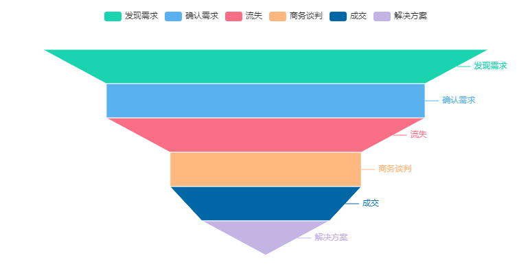

7.热力图

​	由两个坐标系叠加而成，两个坐标系的X轴相同，Y轴不同，即一个X轴对应两个Y轴，第一个Y轴的数值以数值展示出来；第二个Y轴的数值以颜色深浅展示，可显示指标数值。

​	应用场景：在统计各个客户状态下客户数量的同时，显示出该状态下的客户重要程度的平均值。

​	图表设置以及效果如下图，Y轴的数值为客户数量，方块中的数值为对应状态下客户重要程度的平均值，数值大小以深色深浅展示。

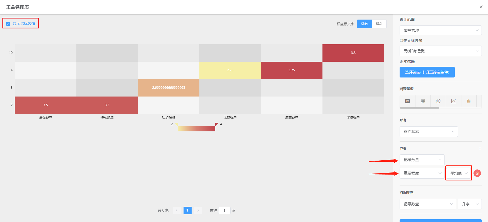