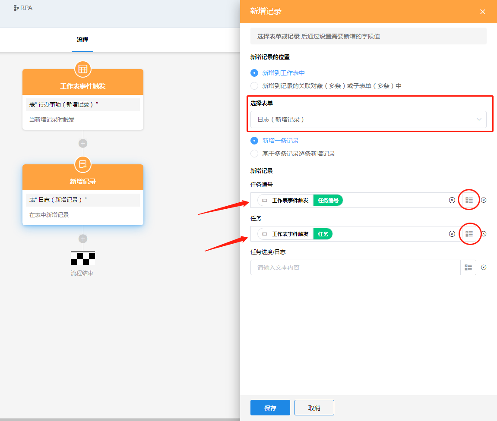
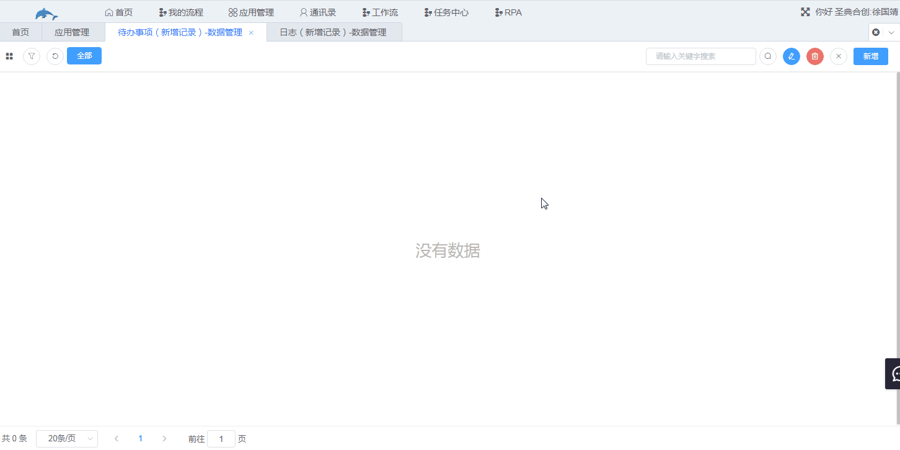

### 8.3.1新增记录

1.节点说明

​	向指定的工作表添加一行或多行记录，或给指定表单的关联对象或者子表单添加记录；新增的字段值可以是固定的内容，也可以从前面节点中选择动态值。

2.示例

​	当“待办事项”表中新增一条记录时，就自动在“工作日志”表中添加对应的任务。

​	a.设置触发器，选择“待办事项”表，触发方式选择“仅新增时触发”。

b.添加新增记录节点并设置节点，新增的记录可以是固定的内容，也可以从前面节点中选择动态值，此处我们选择从工作表事件触发节点中获取动态值。

c.在代办事项表中新增记录触发工作流，日志中会自动添加对应的任务编号以及任务。

​	**如果需要批量新增记录，需要结合”获得批量数据“节点。**

​	给指定表单的关联对象或者子表单添加记录时，选择新增的记录时，只能选择前面节点的记录。