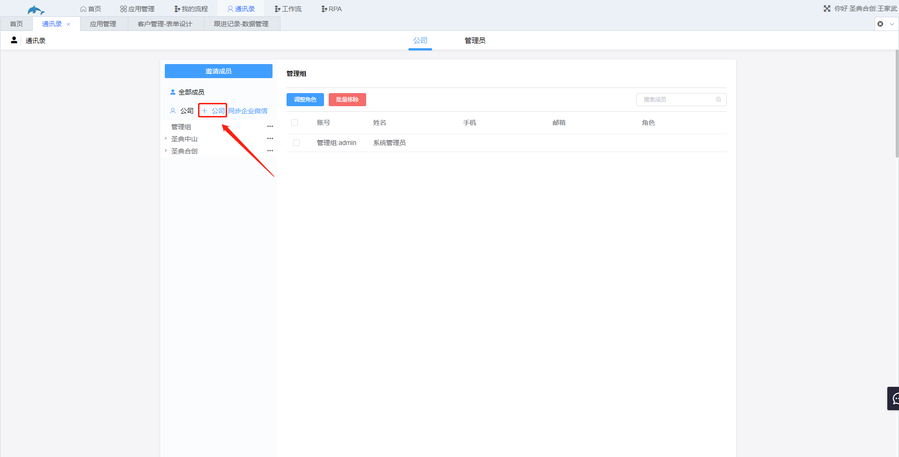
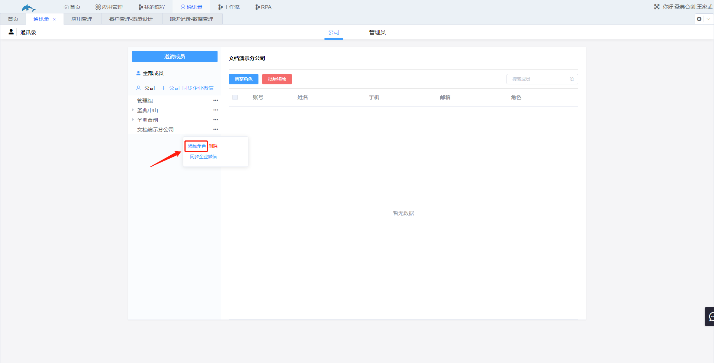
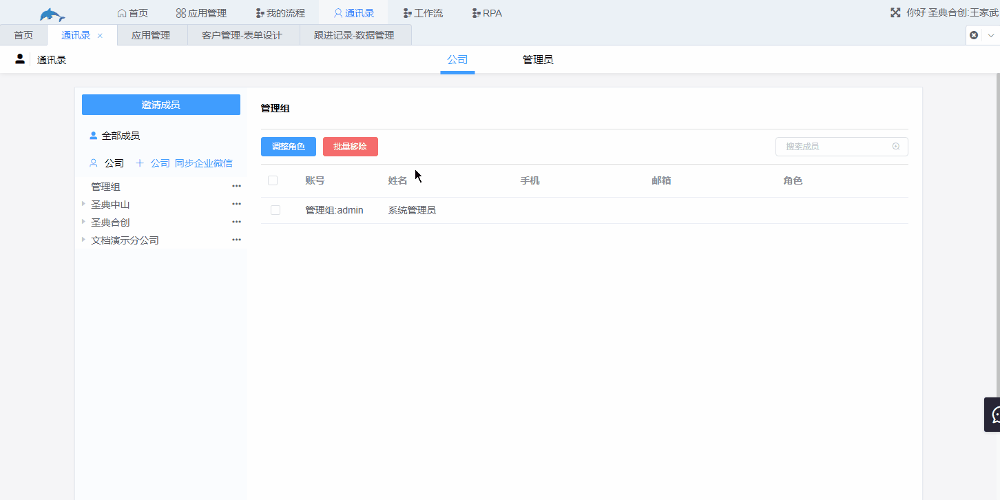
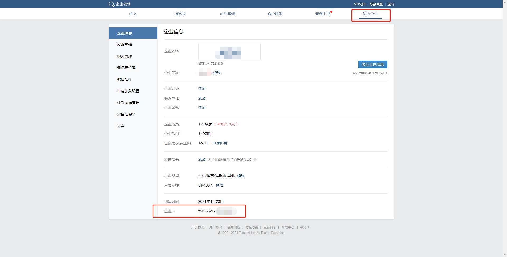
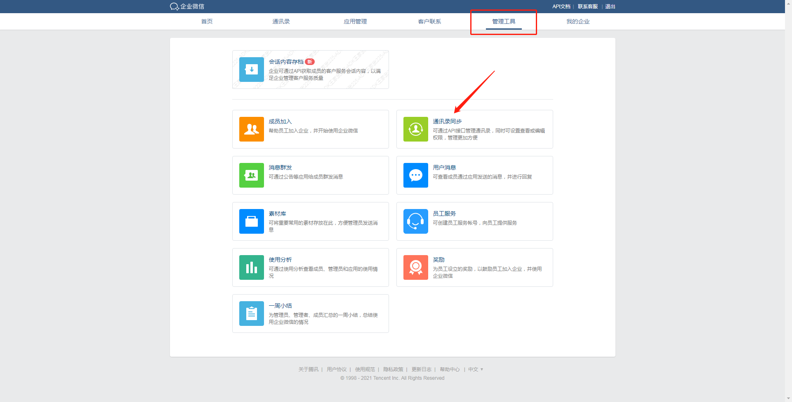
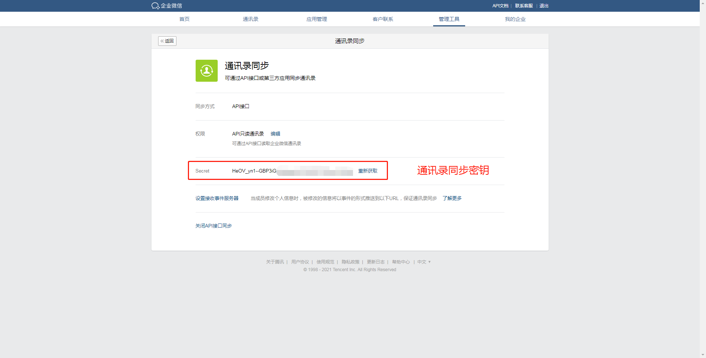
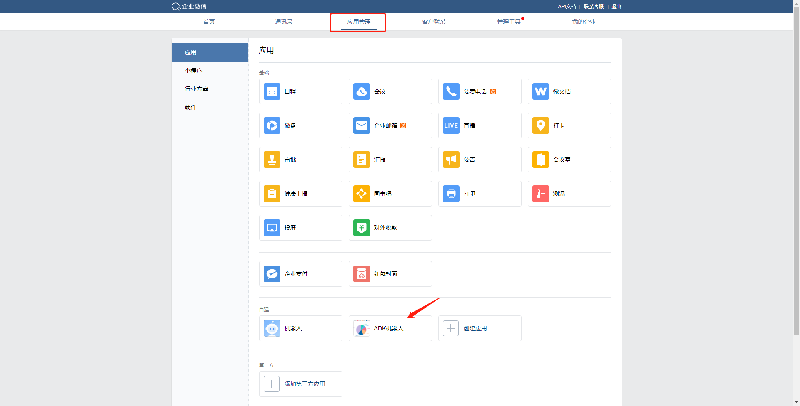
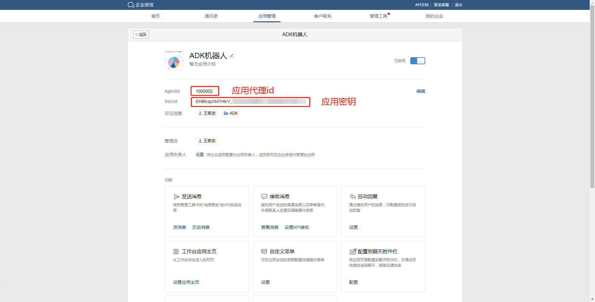
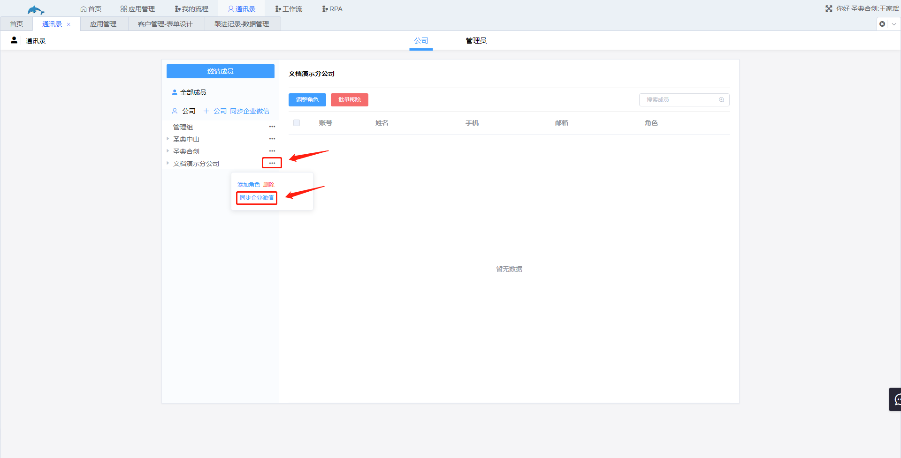
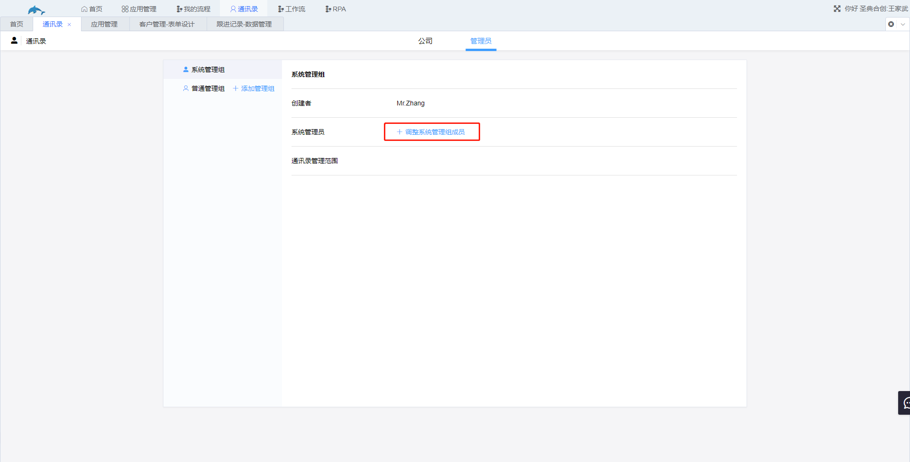

# 9.通讯录

展示公司的组织架构，用于设置通讯录中成员的各种权限以及公司内部的通讯，只有管理员可以访问。

1.公司

​	公司是通讯录第一个需要配置的分组，公司可以点击“+”创建，通过鲸云系统创建的通讯录不能与企业微信进行互通，即工作流发送的站内消息不会同步发送到用户的企业微信中，若消息需要同步发送到企业微信，需要同步企业微信的通讯录。

2.角色

​	用户在公司中的角色，可以是一个部门或者具有某些权力、某些权限的一个分组。添加公司后添加角色。

​	通过邀请成员添加角色成员，添加到通讯录的用户会储存在用户表中，角色会储存在角色表中。

3.同步企业微信

​	配置通讯录的另一方法是直接从企业微信同步通讯录，通过该方法添加通讯录，在使用工作流发送鲸云站内消息时，会同时通过企业微信的机器人把消息发送到用户的企业微信中。需要注意的是，若需要调整用户的角色，需要到企业微信的管理后台调整用户的分组，然后在鲸云通讯录中进行同步。

​	进入企业微信管理后台，将图中需要的四个信息输入点击确定即可，其中的应用为企业微信的机器人。下方图为企业微信管理后台，企业只用于演示，并不存在。

​	企业id。

​	通讯录同步密钥。

​	应用密钥与应用代理id。

​	若在微信管理后台调整了角色，需要进入鲸云系统通讯录，找到对应的公司进行同步。

4.管理员

​	管理员具有鲸云系统的所有权限，包括访问应用管理、通讯录、工作流、RPA等，不受表单设计扩展功能处设置的权限所限制。管理员具有添加和移除管理员的权限。

