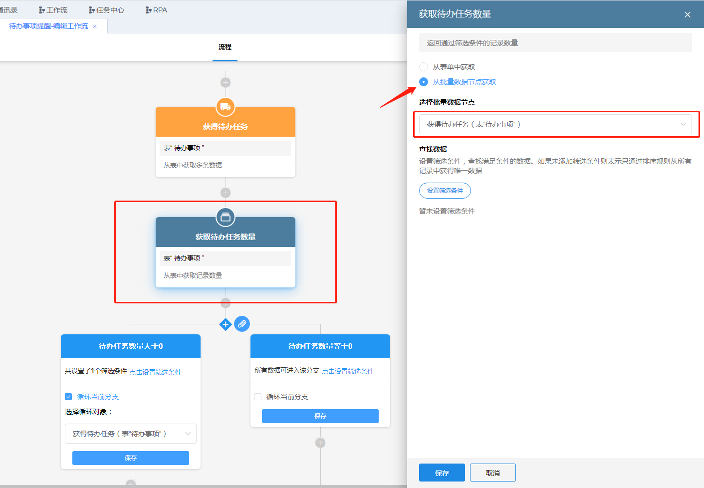
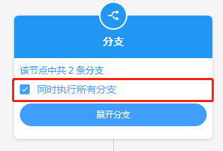
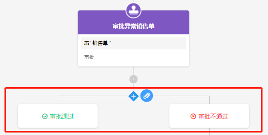

### 8.3.6获取记录数量和分支

1.获取记录数量

​	（1）节点说明

​		获取表单中符合筛选条件的记录数量，也可以获取“获得批量数据”节点查询到的记录数量。

​	（2）示例

​		在上述待办事项提醒示例中，每天上班时间提醒负责人未完成事项，此设计默认了待办事项数量一直不为零，但可能出现待办事项都已经完成但员工未进行新增待办任务的情况，此时需要发送消息提醒员工新增待办任务，该示例需要结合分支节点完成。

​		添加获得记录数量节点，由于前面已经使用了获得批量节点获取了所有未完成任务记录，此时只需要从上一个节点中获取数量，因此选择“从批量数据节点获取”，再点击选择“获得待办任务”的节点。若想直接从表单中获取，则需要重新添加筛选条件。分支部分在下半部分的**分支**进行说明。

2.分支

​	（1）节点说明

​		用于创建工作流的支线，分支的执行顺序为从左到右执行，当一个支线执行完后才会执行另一个支线；可以设置筛选条件来控制工作流是否进入该分支；可以选择“循环当前分支”来遍历“获得批量数据”节点查询到的多条数据；点击分支节点上的可以添加多一条支线；点击“收起分支”可以隐藏分支内容；当收起分支后，可以选择是否勾选“同时执行所有分支”，当同时执行所有分支时，每个分支同时执行，右边的分支不会等待左边的分支执行完后再执行。

* 普通分支：除了在审批节点后面添加分支可以选择“普通分支”或者“审批结果”分支外，其余添加的分支都为普通分支
* 审批结果分支：在审批节点后面添加分支时可选审批结果分支，样式如图。

​	（2）示例

​		对上述待办任务数量大于0和等于0两种情况添加不同的流程，当待办任务量大于0时进行提醒待办任务，等于0时提醒新增待办任务。

​		a.添加分支

​		b.设置筛选条件，待办任务数量大于0的分支筛选条件设置如下。

​		c.待办任务数量等于0的设置操作同上，条件改为等于0，此处省略图解。此时便可以给两个分支分别设置不同的动作来完成需求了。