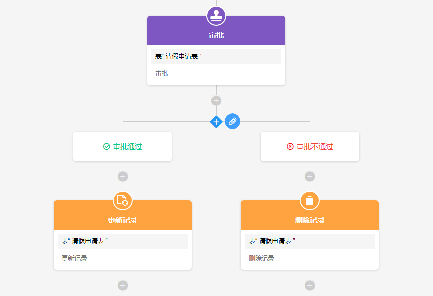
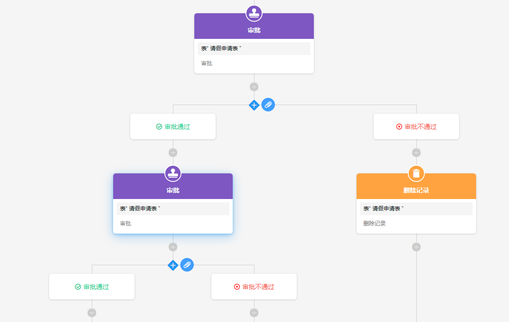
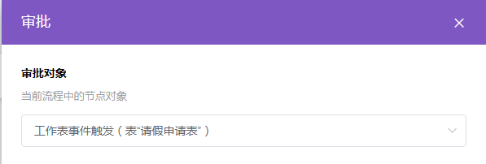
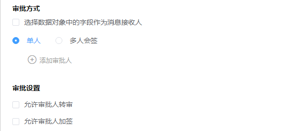
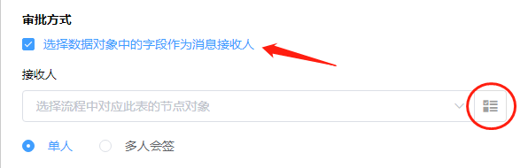
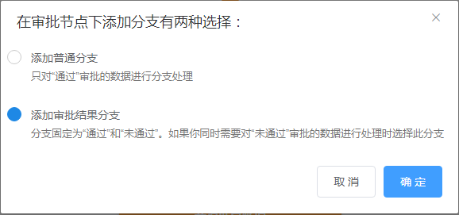
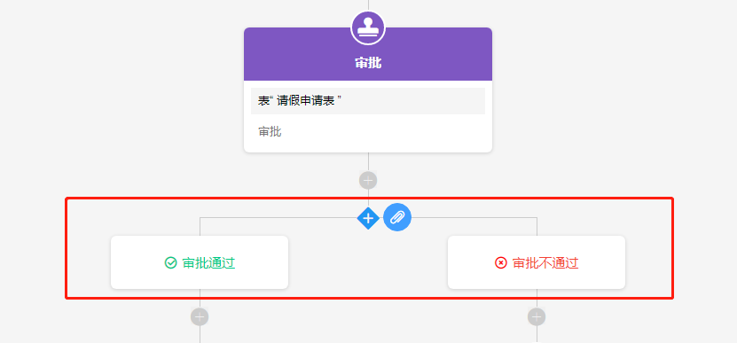
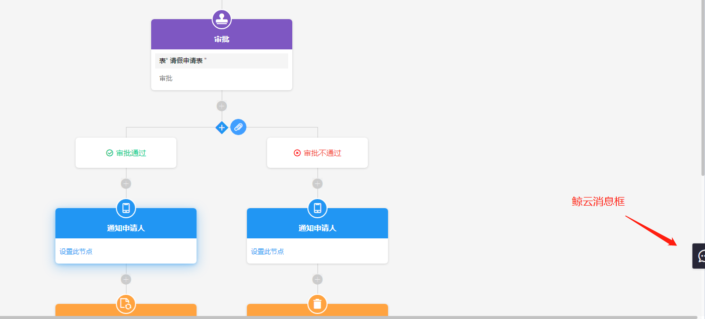

### 8.3.7审批

1.节点说明

​	在工作流程中需要涉及管理审批的情况下，使用审批节点，在审批通过或者否决后进行相应的数据状态变更，或者发送通知。审批人通过选择”通过“或者”否决“操作完成审批流程，让工作流进入下一个动作。需要结合分支节点的”审批结果分支“使用，当审批通过后进入审批通过分支，当审批否决后进入审批否决分支。

2.审批流程设计

​	（1）一步审批

​		即只设置一个审批节点。

​	（2）多步审批

​		根据审批节点的审批结果，可以走不同的分支流程。 即第一步审批人通过后，继续进入第二个审批节点。

3.审批节点设置

​	（1）选择审批对象（即需要审批的记录）

​	

​		审批对象需要选择前面的节点，如触发器、查找指定记录节点、新增记录节点等。

​	（2）设置通知消息内容；

​	

​		消息内容可以是固定内容，或者是从前面节点中获取回来的动态内容。

​	（3）添加审批人、审批方式和审批设置；

​	

​		a.审批方式

​			审批方式有”单人“和”多人会签“。

​			单人：”通过“和”否决“由一个人决定。

​			多人会签：有”只需一人通过“和”需全员通过“，前者只需要多个审批人中的一个通过该流程就进入通过分支；后者需要全部审批人通过才可以通过该审批流程。

​		ｂ.审批人

​			可以点击”添加审批人“直接在通讯录里面选择一个或者多个审批人进行审批，此方式选择的审批人是固定的；若需要在不同的场景下选择不同的审批人，如不同的分公司下审批人不同，则需要勾选”选择数据对象中的字段作为消息接收人“，然后接收人选择通过查找指定记录节点查找回来的审批人。

​		

​		

​	（4）设置节点的审批人的审批权限；

​			a.允许审批人转审

​			即被选定的审批人把审批权限转给他人，如果审批流程先由A审批再到B审批，此时A把审批权限交给C，那审批流程就变为C 先审批，再到B。

​			b.允许审批人加签

​			有”在我审批前增加一位审批人“和”通过申请后增加一位审批人“两种方式。

​			举例：

​			A选择”在我审批前增加一位审批人“，选择了C审批，则需要C审批完再由A审批；

​			原审批顺序为E>F>G，E选择”通过申请后增加一位审批人“，选择了H，则审批顺序变为E>H>F>G。

​	（5）添加审批结果分支。

​			添加分支节点后，选择”审批结果分支“，就会出现如下的支线。

4.消息框位置

​	审批人接收到审批消息后，可以在企业微信手机端接收到，也可以在鲸云消息框中查看。

