### 3.2.8关联对象

1.字段说明

​	不同的表之间可能存在着关联，例如上述销售单中的客户和客户信息表中的某一个客户存在关联，客户信息表中已经存有客户名称、客户地址、联系方式，此时我们在销售单中就可以通过关联对象字段将客户信息表中的信息关联过来，在新增数据时就不需要重复填写地址、联系方式等信息。

2.字段属性

* 显示方式
  * 卡片（一条）
  * 列表（多条）
* 是否模板

​	（1）显示方式为卡片，和子表单相似，数据会以卡片的形式显示，不同之处在于关联对象字段的数据不需要自己手动输入，只需要选择关联表的数据，显示方式为卡片时只能选择一条数据，且卡片中只能显示最多三个字段。

​		案例：将客户信息表中的客户关联到销售单中。

​		a.将销售单中的子表单“客户名称”改为关联对象字段，将客户地址、联系方式字段删除，选择关联表单“客户信息表”。

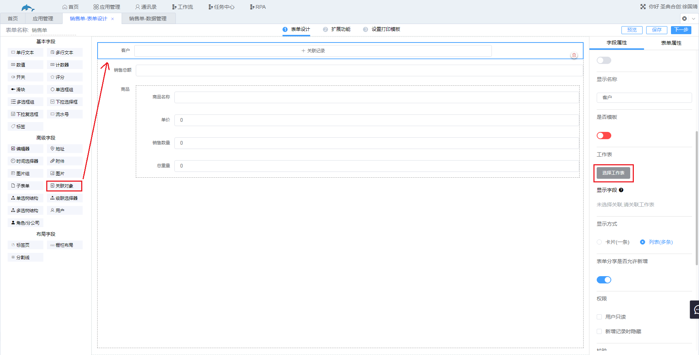

​		b.选择需要显示的字段，显示方式选择卡片，点击保存。

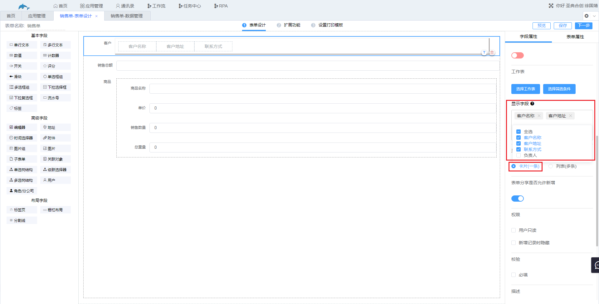

​		c.新增数据，选择销售的客户，效果如图。

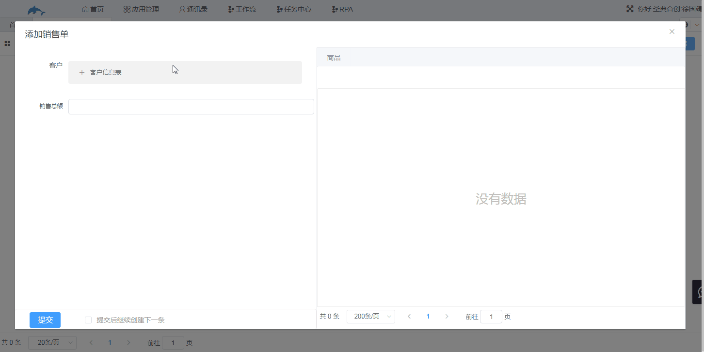

​	（2）显示方式为列表时，效果和子表单的列表相似，不同之处在于关联对象可以选择关联表中的数据，不需要自己手动添加。

​	案例：当我们的商品已经在库存表中录入时，销售单中的商品就不需要我们进行手动添加，我们只需要通过关联对象字段关联库存表，新增数据时只需要选择要销售的商品。

​	库存表如下图，现通过关联对象关联该表。

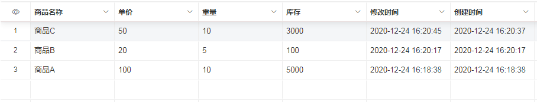

​	a.将上述的销售单的子表单“商品”改为关联对象，选择工作表“库存表”，其他设置如图。

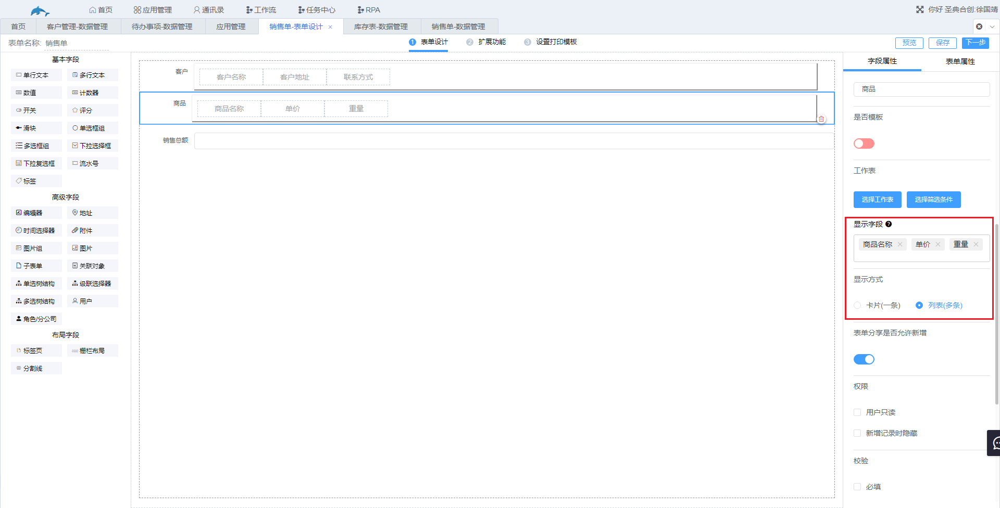

b.新增时效果如图。

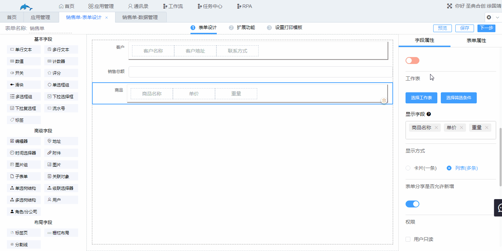

c.销售总额可以通过计算自动添加，后面将通过较为完整的案例进行讲解。

​	（3）是否模板

​	当两张工作表相互关联时，逻辑会进入一个死循环，造成这两张工作表的数据管理界面打不开。“是否模板”可以解决两张工作表相互关联带来的问题，互相关联的两个表只需要其中一个勾选“是否模板”。模板功能的实质是将关联的工作表中的所有记录获取回来存放在关联对象字段中，然后再通过筛选器筛选出与本表数据关联的他表的多条数据。

​	案例：在“客户管理”表中存着公司所有的客户信息，每个客户有对应的一个联系人，联系人存在“联系人”表中，而一个联系人会负责多个客户，此时“客户管理”表和“联系人”管理表就是相互关联的两个工作表。

​	a.我们在“联系人”表的表单设计中，通过关联对象字段关联“客户管理”表，该表**不勾选**“是否模板”。

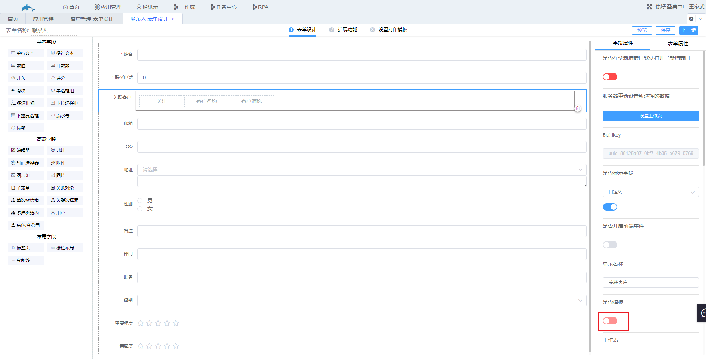

​	b.在“客户管理”的表单设计中，给关联对象“联系人”勾选“是否模板”，并选择工作表“联系人”，显示方式为列表。

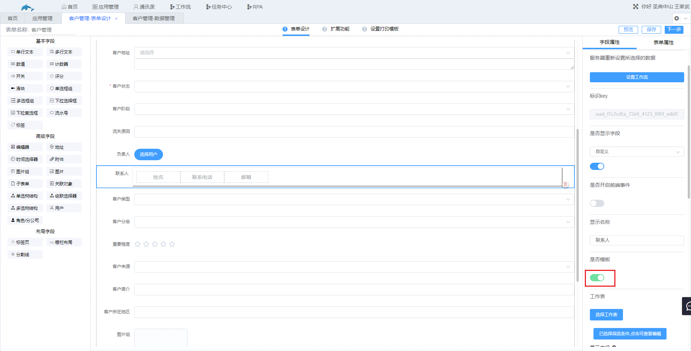

​	c.下图为联系人表，我们给其中的**联系人A**和**联系人B**添加他们负责的**“客户D”**，B的操作同A，此处省略图解。

​	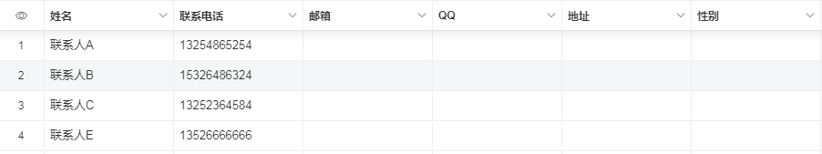

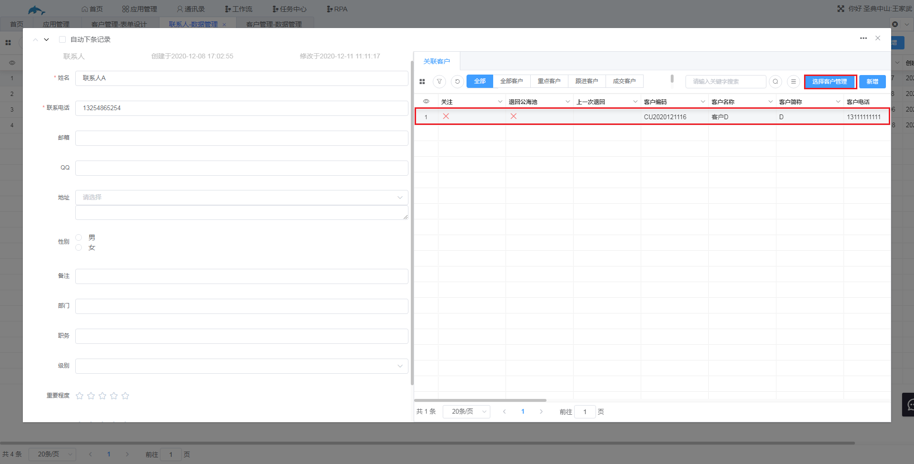

​	d.进入“客户管理”的数据管理，查看“客户D”的联系人，发现此时将“联系人”表的所有数据获取回来了，但未关联客户D的**联系人C**和**联系人E**也一并显示出来，此时需要通过设置筛选条件解决。

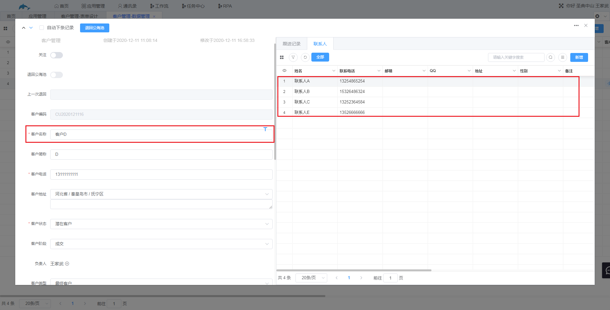

​	e.进入“客户管理”表单的表单设计，给“联系人”字段添加筛选条件。

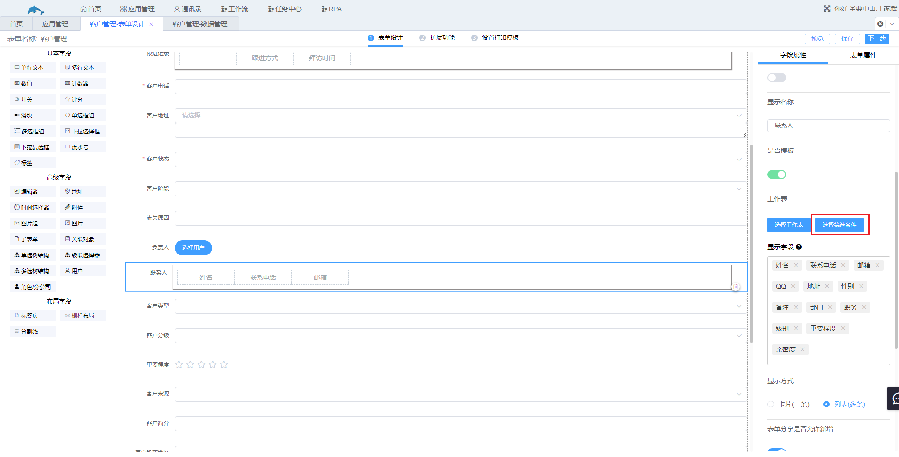

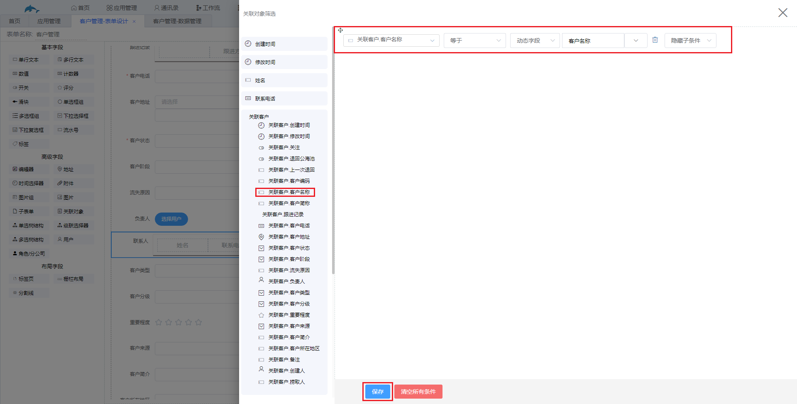

​	f.下图为筛选后的结果，此时**客户D**的联系人中就只会显示与他相关联的**联系人A**和**联系人B**。

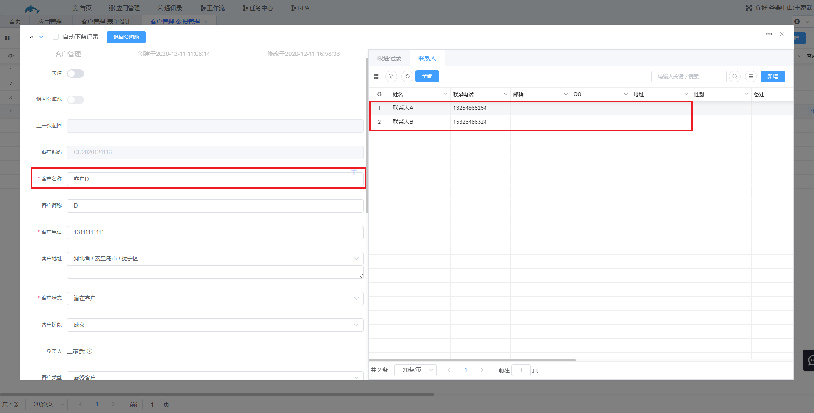