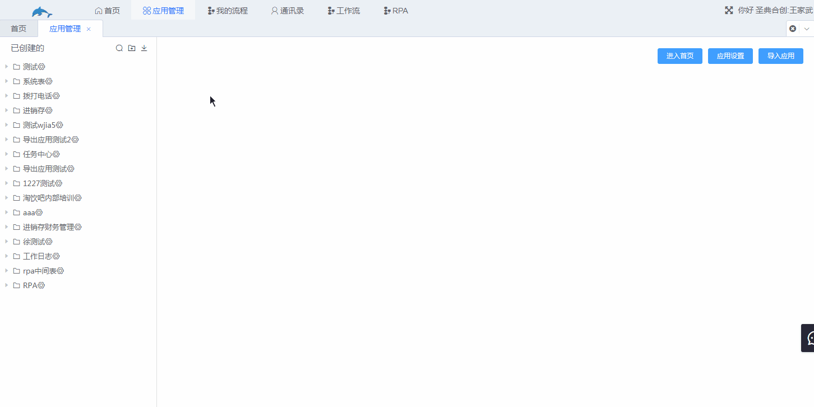
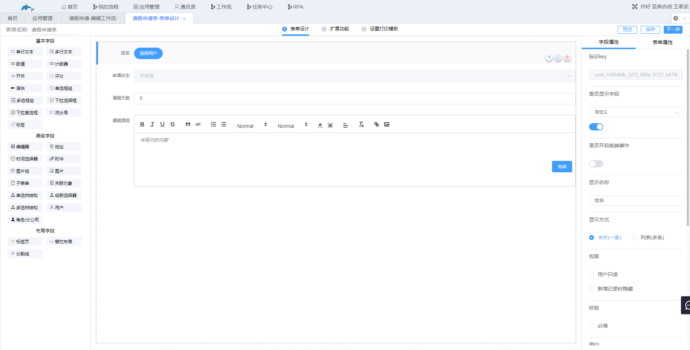
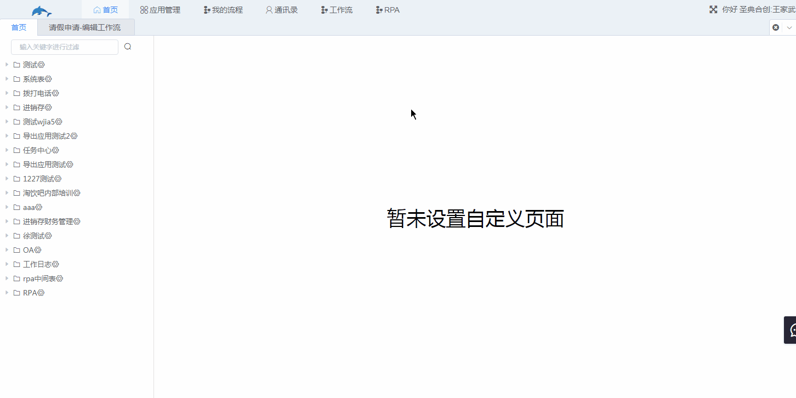
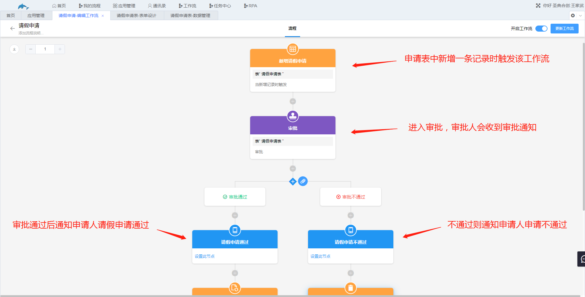
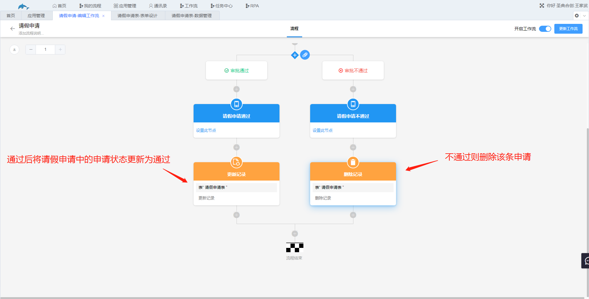
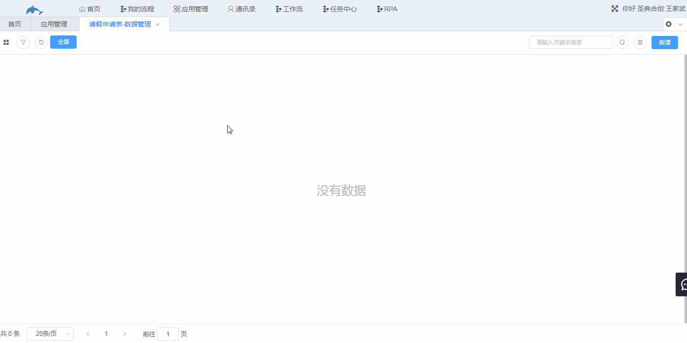

## 2.3快速搭建一个应用

现在通过一个小案例了解应用是如何搭建的，具体的操作介绍以及系统功能详细讲解请移步到后面的文档继续了解。

快速搭建一个请假申请应用，当员工需要请假时，在请假申请工作表中新增一条请假申请，该申请自动发送给上级领导，由领导决定是否批假，如果通过就发送信息通知员工请假申请已通过，如果不通过则通知员工请假申请不通过，并自动删除该申请记录。

搭建思路：首先需要一张表存放请假申请记录，然后设置一个工作流监听这张表，当表中新增了一条请假记录就触发工作流，工作流开始工作，向设置好的通讯录中的审批人发送审批通知，再将审批人审批的结果发送给员工。

步骤：

1.新建一张表单，添加好该表单需要的字段，添加字段的方法就是把左侧的字段拖入到中间添加字段的区域，然后在右侧修改字段的名称以及其他属性。

2.新建工作流，监听该请假申请表，然后添加动作节点，对每个节点进行设置，详细内容请到文档的工作流部分进行了解。为了演示方便，审批人也选择了当前登陆的账号。

3.应用演示，通知消息会同时发送到企业微信。

