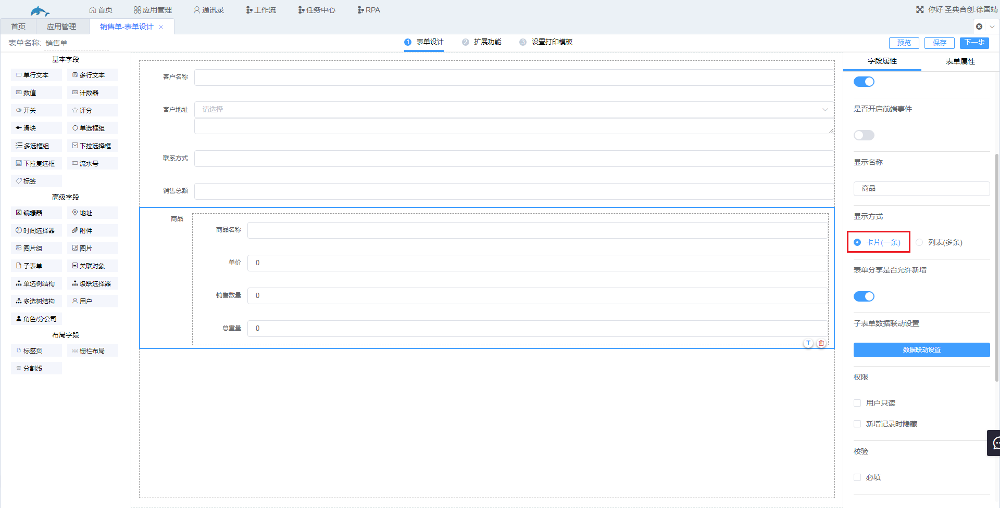
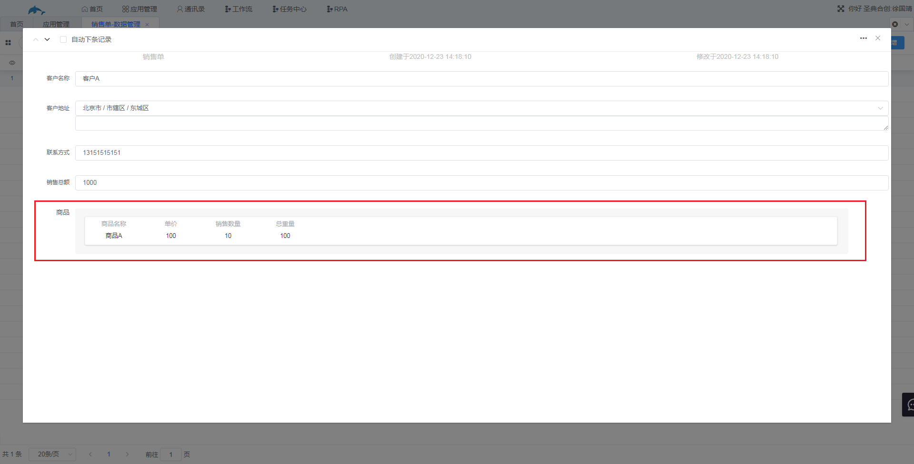
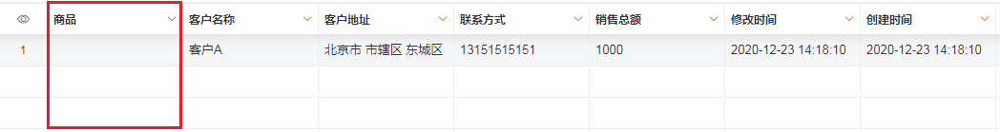
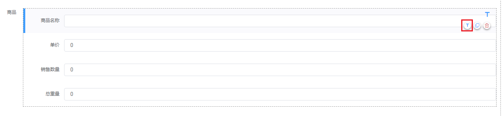
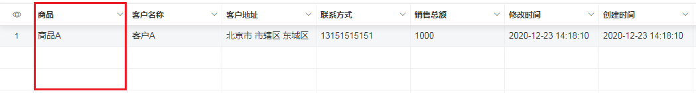
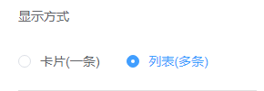
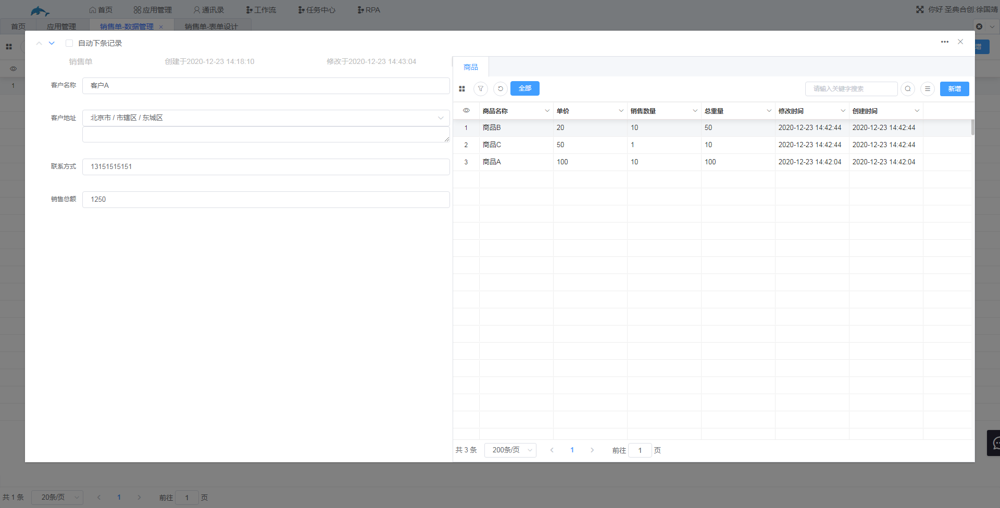
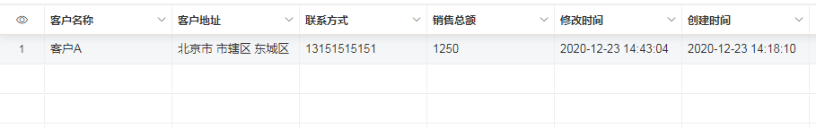

### 3.2.7子表单

1.字段说明

​	常规的表单只能纵向记录数据，通过子表单字段可以给每一行的数据横向添加记录，即可以给每一行数据添加一张表单，该表单就是通过子表单实现的。

2.字段属性

显示方式：

* 卡片（一条）
* 列表（多条）

​	（1）显示方式为“卡片”时，子表单只能添加一条数据，以卡片的形式显示，在数据管理处该字段显示在第一列。

​			案例：在销售单中，除了需要客户名称、联系方式、客户地址、销售价格外还需要添加销售商品的一些信息，包括商品的名称、单价、重量、销售数量等，此时可以用子表单来记录商品的相关信息。

​			a.销售单的表单设计如图，显示方式选择“卡片（一条）”

​			b.进入数据管理新增数据，新增完数据效果如图，名为“商品”的子表单以卡片的形式显示在新增数据页面。

​			c.在数据管理界面处，子表单字段会显示在第一列，此时“商品”一列没有显示数据，是因为子表单的数据也有多列，不可能显示在一列中，我们可以选择一列显示出来。

​			d.进入表单设计处，在子表单“商品”中选择需要显示的字段，点击字段后方的“标题”按钮，即“T”按钮，点击保存。

​			e.此时进入数据管理界面，可以看到“商品”一列显示了“商品名称”字段的数据。

​		（2）显示方式为“列表”时，子表单可以添加多条数据，子表单以表格的形式显示，但该子表单不会显示在数据管理界面中。

​				案例：在上述销售单案例中，商品只有一个，但有时候一张销售单销售的商品有多个，此时的子表单就需要选择“列表”的显示方式。

​				a.进入销售单的表单设计，在字段属性处将子表单“商品”的显示方式改为“列表”，点击保存。

​				b.进入数据管理新增数据，新增完的数据如图。

​				c.在数据管理界面处不会显示该“商品”字段。

