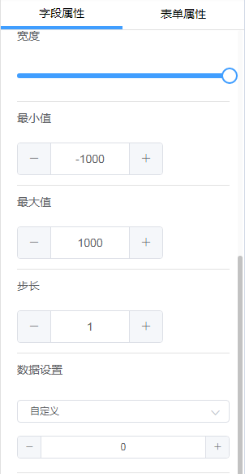
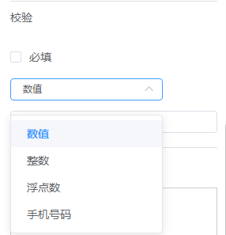

### 3.2.4计数器字段

1.字段说明

​	数据可以用于计算，当记录不需要浮点数时可以采用计数器字段，通过点击“+”、“-”来改变数值，每次变化值为一个步长，步长可以设置。

2.字段属性

​	该字段特有的字段属性如图。可以设置计数器字段的最小值、最大值以及步长，步长为1时，点击“+”数值加1，同理步长为10时，点击“+”数值加10。数据设置处的0为默认值，可以改变该默认值。在校验处可以改变该字段支持的数据类型，当类型为数值时，该字段支持整数和小数；当类型为整数时，该字段不支持小数；当类型为浮点数时，该字段不支持整数。

