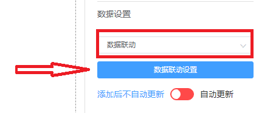
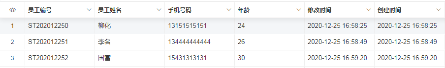
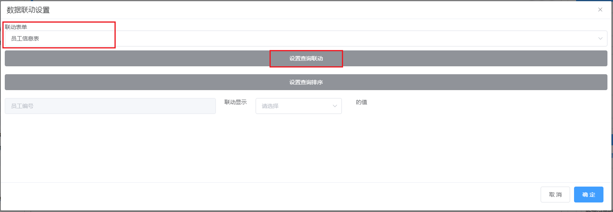
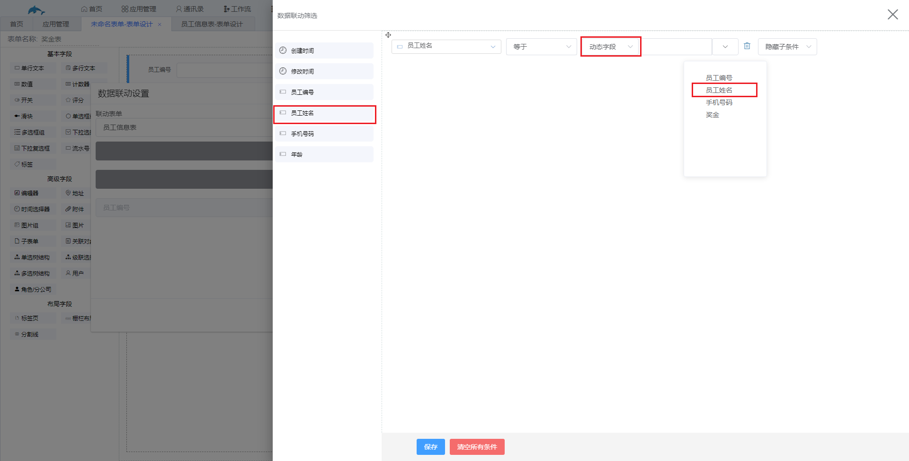
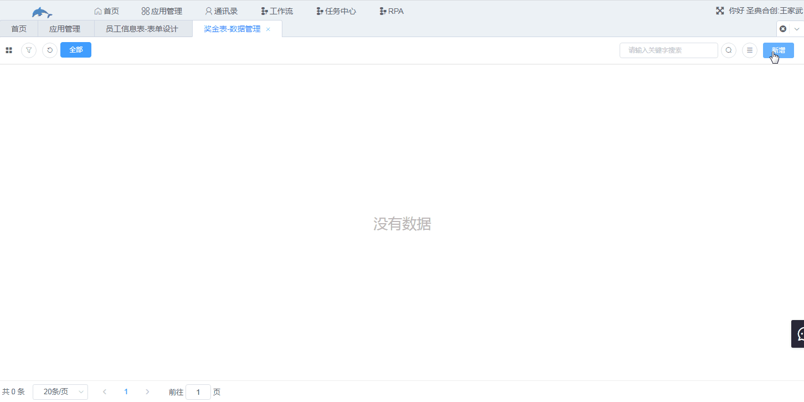

# 4.数据管理

1.功能说明

​	调用其他表中符合筛选条件的数据自动填写在设置了数据联动的字段中，避免反复填写重复的数据。

2.应用场景

​	需要填写的数据已经在其他表中录入。例如员工的信息可能会出现在多张表中，如申请表、奖罚表、工资单等，在这些表格中我们就可以通过数据联动来自动填写员工的信息，避免一些复制粘贴的操作。

3.操作说明

​	数据联动在字段属性的数据设置中，数据设置默认为自定义，点击下拉框选择数据联动即可设置数据联动。

​	案例：根据**员工姓名**将下面员工信息表中其他的数据联动到奖金表中。

​	a.进入奖金表的表单设计，给员工编号和手机号码字段设置数据联动，点击“数据联动设置”后进入到如下界面，选择工作表“员工信息表”，然后点击“设置查询联动”。

​	b.进入到数据联动筛选界面，拖动员工信息表中的“员工姓名”添加筛选条件，第一个员工姓名是我们选定的“员工信息表”中的员工姓名，条件选择**等于动态字段**“员工姓名”，该“员工姓名”是本表的字段，点击保存。

​	

​	c.手机号码字段也按上述操作设置数据联动，此处省略，在奖金表中新增数据，只需要输入员工姓名，就会将员工信息表中该员工的员工编码和手机号码联动过来，效果如下图。

