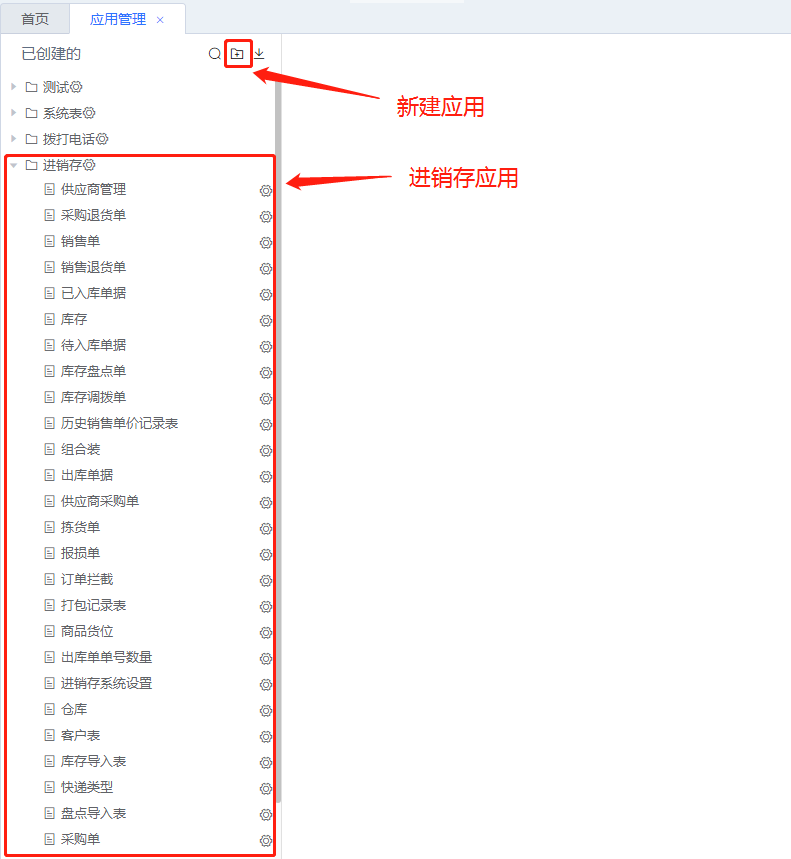
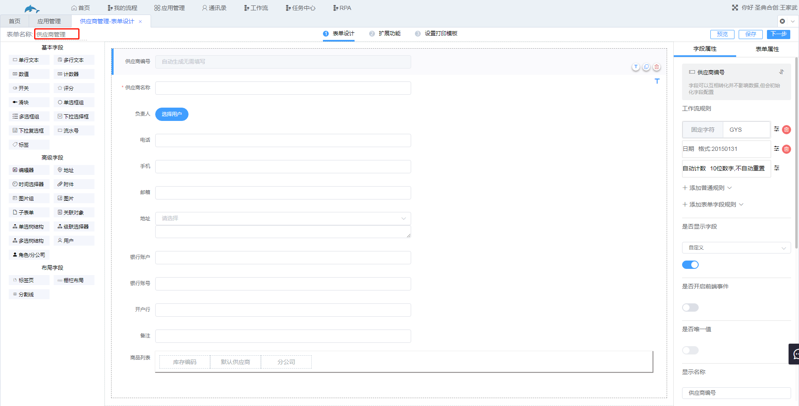
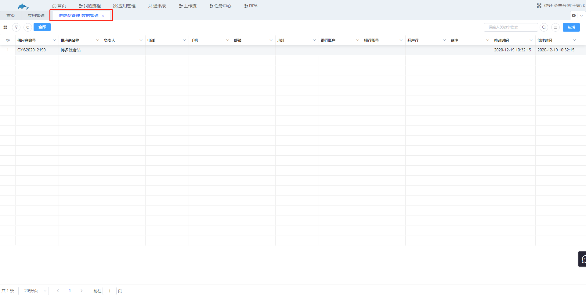
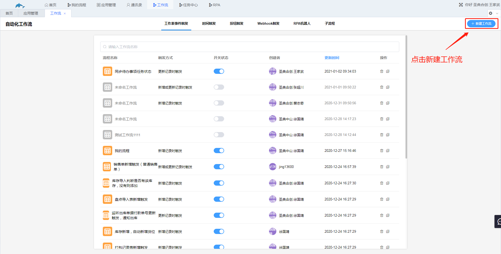

## 2.2主要界面快速介绍

1.应用管理

​	应用，简单说一个文件夹就是一个应用，如下图为进销存应用，应用下面为各个工作表，点击上方文件夹图标可以新建一个空白应用，应用管理中的工作表点开为该工作表的表单设计界面，例如点开供应商管理。

​	

2.首页，首页和应用管理相同，但首页中的工作表点开为该工作表的数据管理界面，如点开供应商管理。

3.工作流，点击新建工作流，选择触发方式后可进入到工作流的设计界面。

