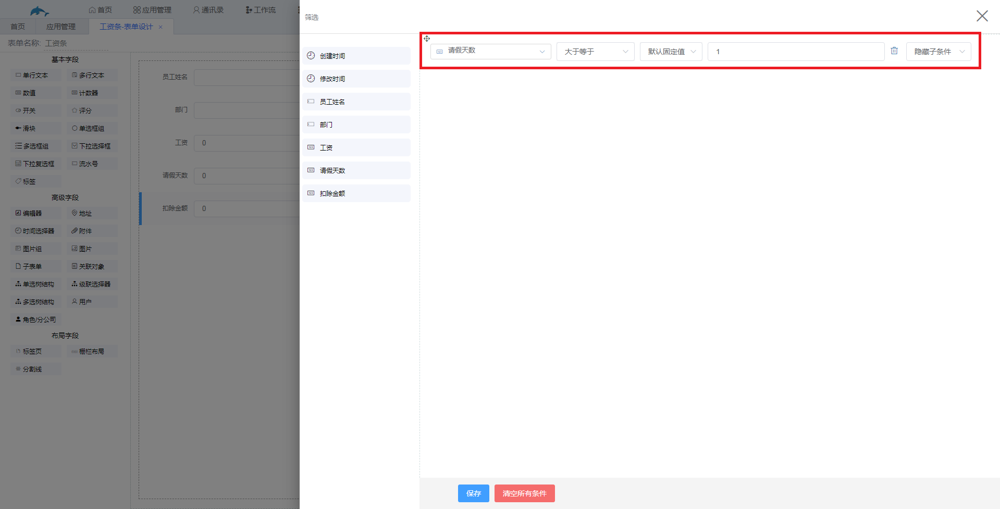
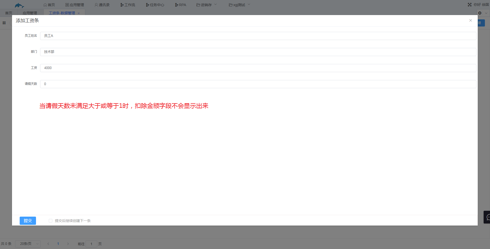
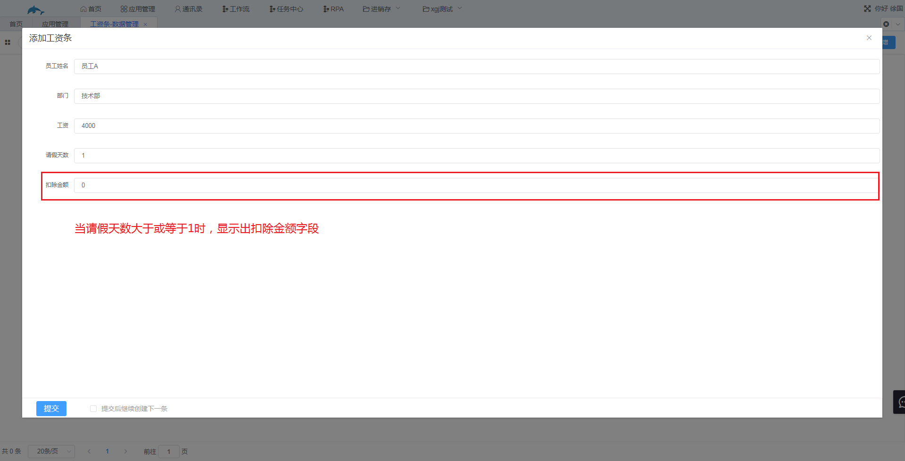
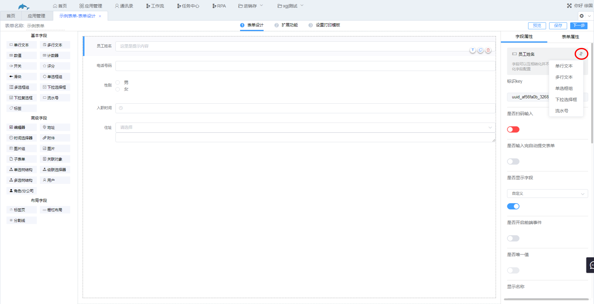

### 3.2.1字段属性

给字段设置特定的属性可以实现数据管理新增数据时的某些功能，如通过设置数据联动或者公式编辑实现自动添加数据功能以及在权限处设置用户权限等。

不同的字段类型有不同的字段属性，但有一些字段属性是通用的，比如显示名称、是否显示字段、用户只读、新增记录时隐藏以及描述。

1.共同的字段属性。

（1）显示名称

​	用来修改字段的名称

（2）是否显示字段

​	默认值为自定义，即会显示该字段。可通过设置公式编辑或者过滤条件来判断新增数据时该字段是否显示，下面以工资条举例讲解设置过滤条件。在本例中包含员工姓名、部门、工资、请假天数和扣除金额5个字段，给扣除金额字段设置如图所示的过滤条件，新增数据时，当请假天数大于或等于1时，扣除金额的字段才会显示出来。

（3）用户只读

​	在权限处设置，勾选该属性的字段，用户只能读取该字段的数据，不能新增或者编辑该字段的数据。

（4）新增记录时隐藏

​	在权限处设置，勾选该属性的字段，在新增记录时不会显示出来。

（5）描述

​	该属性用来编写字段的描述。

2.切换字段类型

​	单行文本、多行文本、单选框、下拉选择框以及流水号字段可以相互切换，将鼠标移入到切换类型图标处会出现切换字段类型菜单。

3.是否扫码输入

​	单行文本特有属性，设置扫码输入的字段，在数据管理处点击新增按钮后该字段的输入框会自动获得焦点。

4.是否输入完自动提交表单

​	单行文本特有属性，设置自动提交表单的字段，在数据管理处新增完该字段的数据后会立即提交并新增一行数据。

5.是否唯一值

​	拥有该属性的字段：单行文本、多行文本、数值、计数器、评分、滑块、单选框组、下拉选择框、流水好、标签和编辑器。设置了唯一值的字段，字段的数据的数据不能重复。

6.提示内容

​	单行文本和多行文本特有属性，用来填写输入框中的提示内容。

7.是否启动密码

​	单行文本特有属性，勾选该项的字段，在新增数据时，输入框中会以黑色圆点代替输入的字符。

8.数据设置

​	（1） 默认值为自定义，即预设好一个固定的值。

​	（2） 数据联动，可关联其他表单实现数据联动，数据联动内容在“数据联动”页面处讲解。

​	（3） 公式编辑。

9.校验

​	指该字段的校验，部分字段可设为是否必填以及进行字符串校验或者邮箱校验。