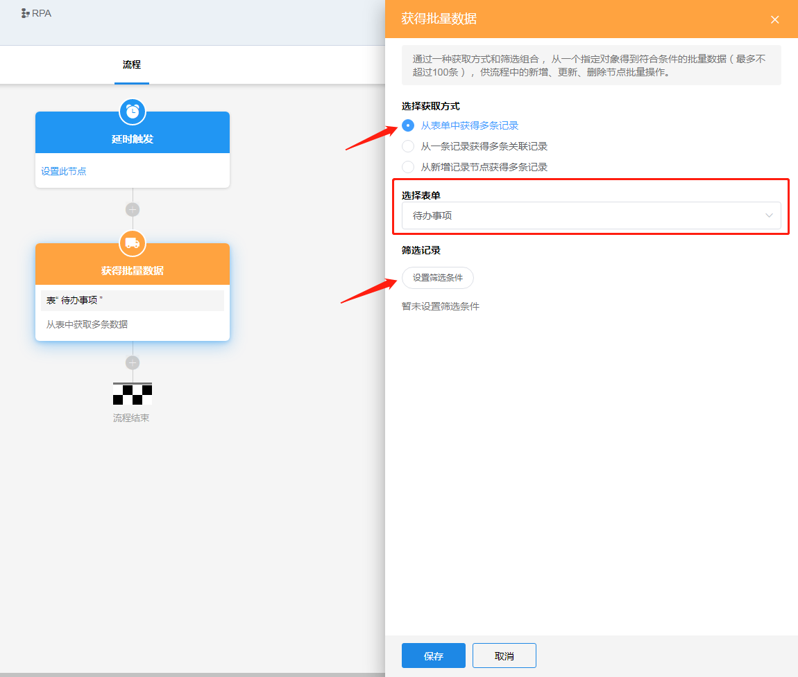
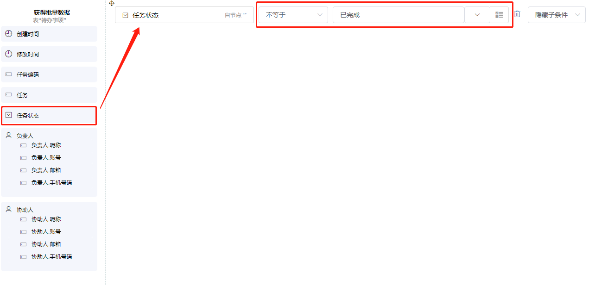
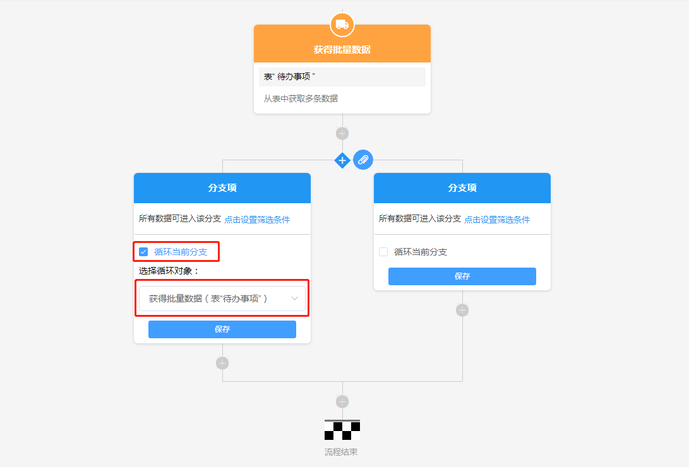

### 8.3.5获得批量数据

1.节点说明

​	获得批量数据：可以获取多条记录，获取后可以通过其他动作节点对这些记录进行操作，例如更新、删除以及将这些记录批量新增到其他表中。

​		（1） 能从工作表中获取多条记录。

​		（2） 能从一条记录中获取多条关联记录。

​		（3） 能从新增记录节点获得多条记录。

2.示例

​	每天早上9点，向指定的人发送信息，提醒当天所有的待办事项。该示例中我们需要用获得批量数据节点获取到所有任务状态为未完成的任务。

​	a.设置好时间触发器后，添加获得批量数据节点，设置节点。

​	b.点击“设置筛选条件”设置查询条件。

​	c.当到触发时间点时，该工作流触发，获得批量数据节点会从“待办事项”表中获取所有任务状态**不为**“已完成”的任务，获取后结合发送站内消息节点对负责人进行提醒，我们同样可以将这些数据新增到别的工作表中，或者进行更新、删除。若要对该节点的每一条记录做处理，需要结合分支节点的“循环当前分支”，如下图。

​	d.此时该分支会遍历每一条获得批量数据节点获取回来的记录。