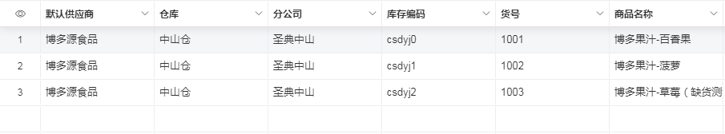
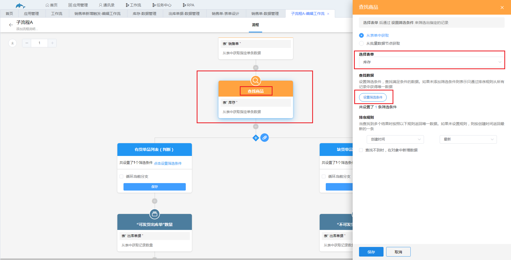
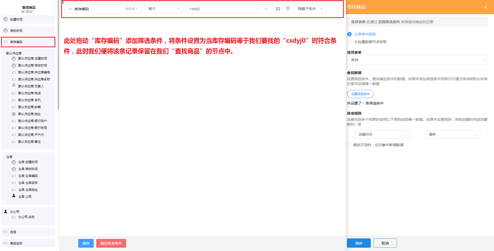

### 8.3.4查找指定记录

1.节点说明

​	从工作表或关联的多条记录中 获取1条记录，后面的节点可以更新、删除这条记录，或者使用这条记录的值为其他节点记录赋值。

* 如果查找到多条记录，根据排序方式取第一条记录。

* 如果查不到，可以通过勾选“查到不到时，在对象中新增数据”直接在表中创建一条新的记录。

2.示例

​	在“库存”表中找到库存编码为“csdyj0”的那一条记录。

​	a.添加“查询指定记录”节点，将节点名改为“查找商品”，选择表单“库存”。

​	

​	b.点击“设置筛选条件”设置查询的条件。

​	c.此时该条记录就被查回并保存在“查找商品”节点中，我们可以添加**更新记录节点**或者**删除记录节点**对该条数据进行更新或者删除，或者添加新增记录节点，将查回的该条记录新增到其他的工作表中。