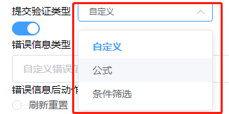
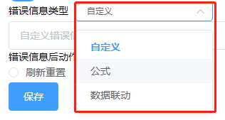
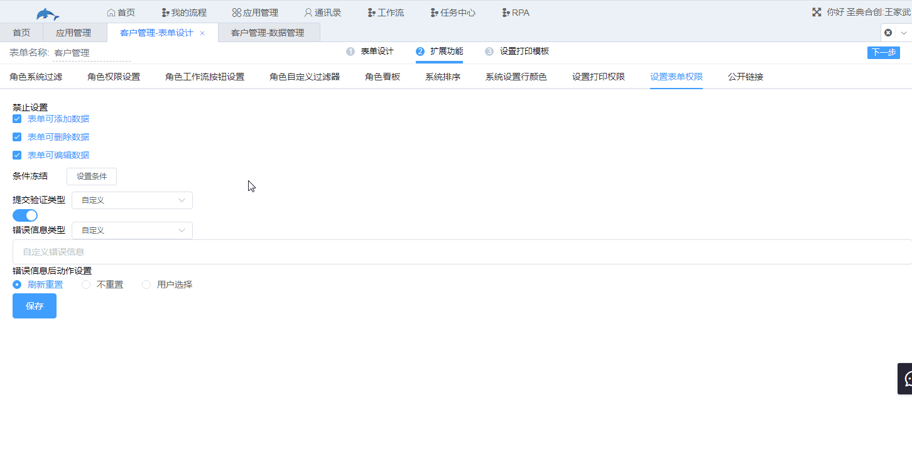

## 5.9设置表单权限

1.功能说明

​	设置表单的权限，与角色权限设置的区别是设置表单权限是设置所有用户操作该表单的权限，而角色权限设置是对某个或者某些角色中的用户设置操作该表单的权限。

2.设置项

​	入口：表单设计→扩展功能→设置表单权限

* 禁止设置
  * 表单可添加数据
  * 表单可删除数据
  * 表单可编辑数据
* 条件冻结
* 提交验证
  * 提交验证类型
  * 错误信息类型
  * 错误信息后动作设置

​	（1）禁止设置

​		默认为勾选状态，代表未开启禁止设置，即该表单可添加数据、可删除数据以及可编辑数据，取消勾选代表禁止该项操作。

​	（2）条件冻结

​		满足条件的记录被冻结，不能被编辑。

​	（3）提交验证

​		设置提交验证，记录需要满足验证条件，不满足条件的记录在提交时会出现错误消息提醒，且该数据不能新增成功，错误消息可以通过“自定义”、“公式”或者“数据联动”设置。

​		a.提交验证类型

​			用于设置验证条件，默认自定义，即所有记录都满足验证条件。验证条件设置有“公式”和“条件筛选”两种类型，即满足设置的公式或者筛选条件为通过验证。

​		b.错误信息类型

​			用于编辑错误信息，自定义时可自己输入错误信息，该错误信息也可以通过“公式”或者“数据联动”获取。

​		c.错误信息后动作设置

​			刷新重置：提示错误信息后，新增数据页面填写的所有记录将被清空。

​			不重置：提示错误信息后，保留新增数据页面填写的信息。

​			用户选择：由用户自行选择是否保留已填写的数据。

3.示例

 	客户管理表单提交数据时，”退回公海池“的值不能为”真“，值为”真“时提示错误信息并清空已填写数据。

