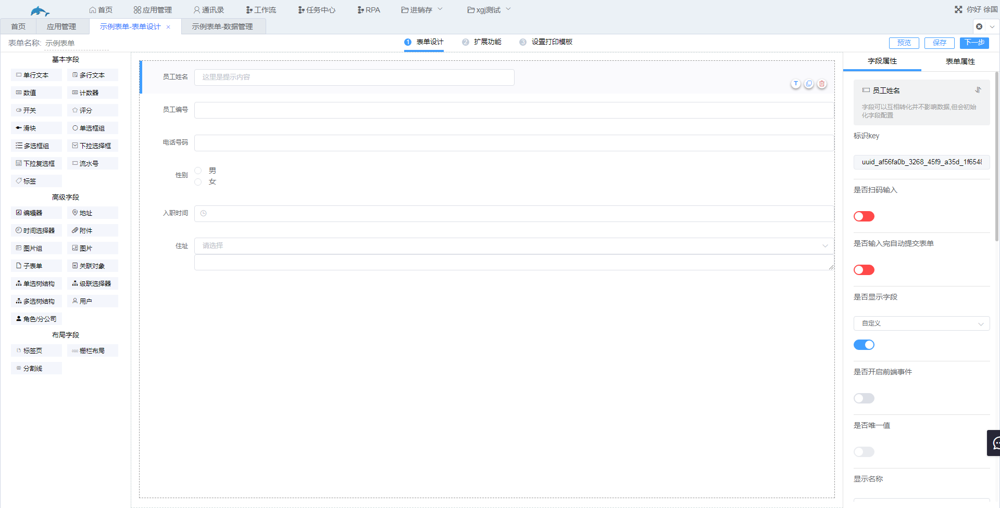
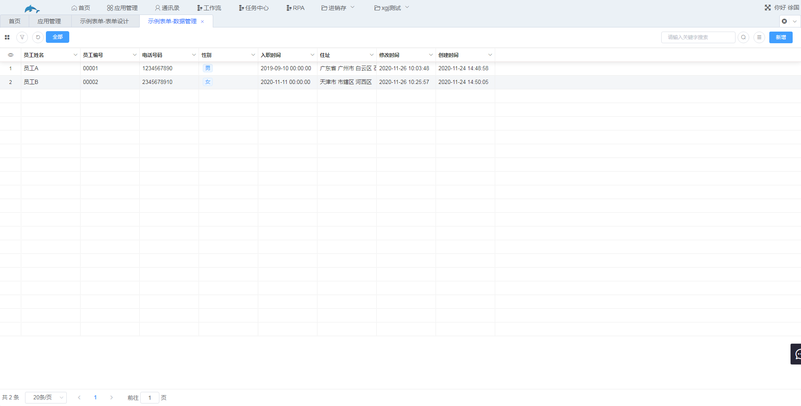

# 3.表单设计

表单用来收集数据，工作中需要制作涉及到录入数据的各种表单如订单信息表、客户信息表、出售单以及报价单等都可以通过表单实现。

1.表单设计的主要步骤有2个：

* 添加字段，即添加表格的表头，例如姓名、地址、电话等。
* 设置字段属性，例如配置数据联动、公式等字段属性使数据收集更加方便。

2.添加字段，表单设计中通过添加字段来构建表格的结构，表头的顺序由字段的顺序决定，下图为表单设计的界面。界面左侧为字段类型，中间为添加字段的区域，右侧是字段的各种属性，不同的字段类型有不同的属性。把需要的字段类型拖入到中间区域，给字段设置属性，点击保存就完成了最基本的表单设计。

​	设计完表单后可以在数据管理界面添加或者编辑数据。

​	数据管理入口：首页→找到相应的表单点击进入。

