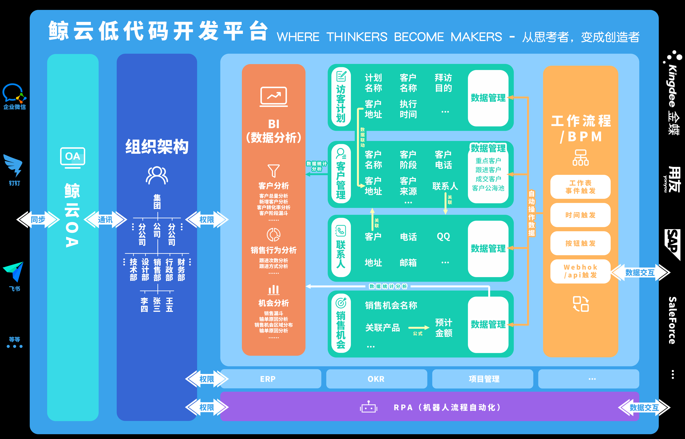

## 2.1鲸云全貌

鲸云分为六大板块：表单设计、数据管理、工作流、BI数据分析、通讯录、RPA（机器人流程自动化）。

​	搭建应用的主要工作落在表单设计、数据管理以及工作流三大部分中；通讯录主要用于通讯、审批以及设置成员的权限；自定义页面用于配置各种图表方便分析应用中的数据。

1.表单设计

​	设计工作表，设置访问该工作表的权限以及其他的操作权限，设置数据的打印模板。

2.数据管理

​	用于录入数据以及编辑数据，另外还可以根据表单设计中设置的打印模板打印数据，支持生成并打印二维码以及条形码。

3.工作流

​	自动化操作，按照预先设置好的流程自动执行，自动增加、删除以及更新数据，另外附有审批、通知功能。让成员从管理数据中解放出来，一方面数据上不会因为失误而录错；另一方面成员可以节省录入、更新大量数据的时间以及为审批跑腿的时间，将更多的时间投入到业务上，实现高效工作。

4.通讯录

​	通讯录可以同步企业微信的通讯录，通讯录的层级为公司→角色→成员。公司由一个或者多个分公司组成，角色由一个或者多个成员组成。角色可以是一个部门，也可以是具有相同职能的一组人，例如订单审核组，一个成员可以加入到多个角色中。

5.BI数据分析

​	为工作表配置图表，分析数据。