### 10.2.3语法

1.声明变量

（1）节点说明

​	声明一个变量，变量可以用于储存数据或者参加函数运算，变量的数据类型有String、Number、Boolean、Date、null、Array、Object。

（2）节点设置

​	点击“+”新增一个变量，输入变量的初始值，选择数据类型，数据类型默认为String。其中null、Array、Object不需要填写初始值；其余的数据类型初始值若不填写，则会使用默认值。String类型的默认初始值是空字符串，Number默认初始值为0，Boolean默认初始值为false，Date默认初始值为空值。

​	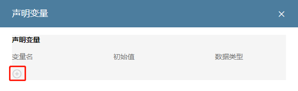

2.变量赋值

（1）节点说明

​	给变量赋值，可以将获取回来的数据赋值给变量，储存在变量中。

（2）节点设置

​	选择需要赋值的变量，然后给该变量赋值，赋值的内容可以是手动添加或者选择前面节点的结果，例如获取元素信息节点的结果。

​	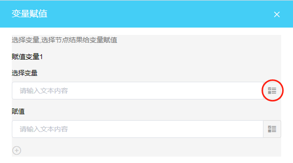

3.分支

（1）节点说明

​	用于创建任务流程的分支，RPA根据分支的判断条件进入符合条件的分支。

（2）节点设置

​	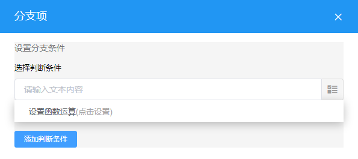

​	点击“设置函数运算”设置分支的判断条件，点击“添加判断条件”可添加判断条件。进入设置函数界面后，按照下图说明设置函数运算。

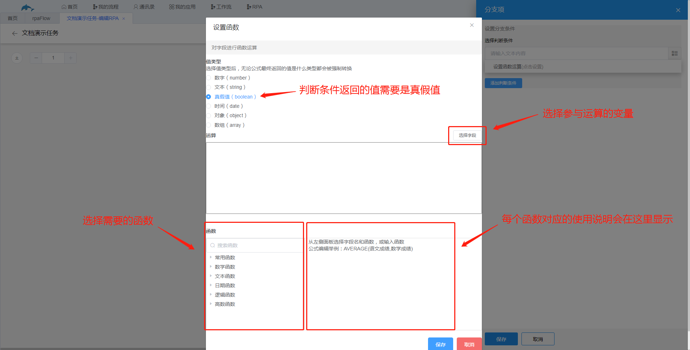

​	点击“+”可新增一个分支。

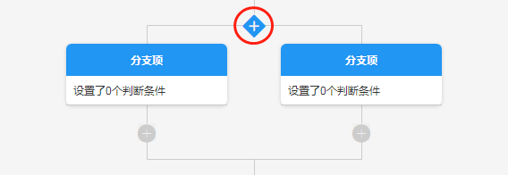

4.计次循环

（1）节点说明

​	用于遍历数组、对象；或者指定需要循环的次数，让某段任务流程循环执行指定的次数。

（2）节点设置

​	循环类型有for循环和while循环。其中for循环可以选择初始值和结束值来指定循环次数，例如让某段任务流程执行5次，则初始值为0，结束值为5；另外for循环可以遍历数组和对象，在选择循环对象中选择“选择节点对象”，然后选择需要遍历的对象。while循环只能用于遍历数组。

​	

​	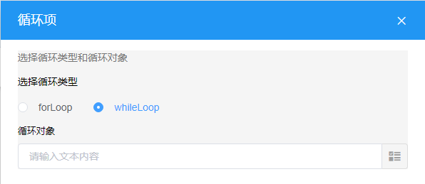

​	

​	示例：获取美团网下图所示分类列表的文本信息。

​	下图为该示例的任务流程图。

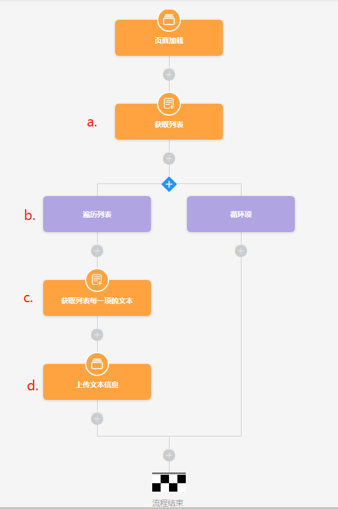

​	步骤：

​		a.获取列表，获取该ul标签中的所有li元素，使用获取元素节点获取所有li，此时我们需要这一整个数组，因此“第几个元素”选择-1。

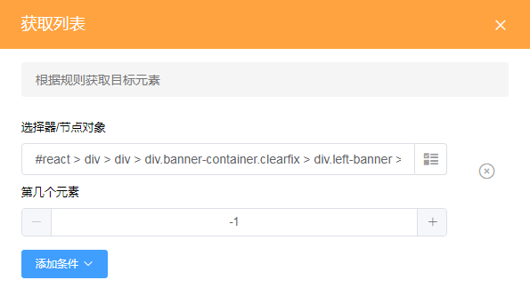

​		b.遍历列表，添加计次循环节点遍历a步骤获取到的数组。选择forLoop，选择循环对象，循环对象为a步骤获取到的结果。

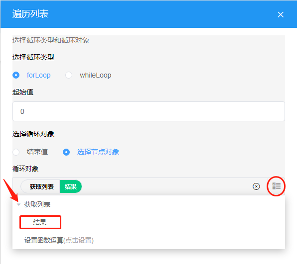

​		c.获取列表每一项的文本，添加获取元素节点获取数组每一项的文本信息。节点对象通过设置函数运算获得，由于数组的每一项都是dom对象，因此值类型选择对象，设置如下图。

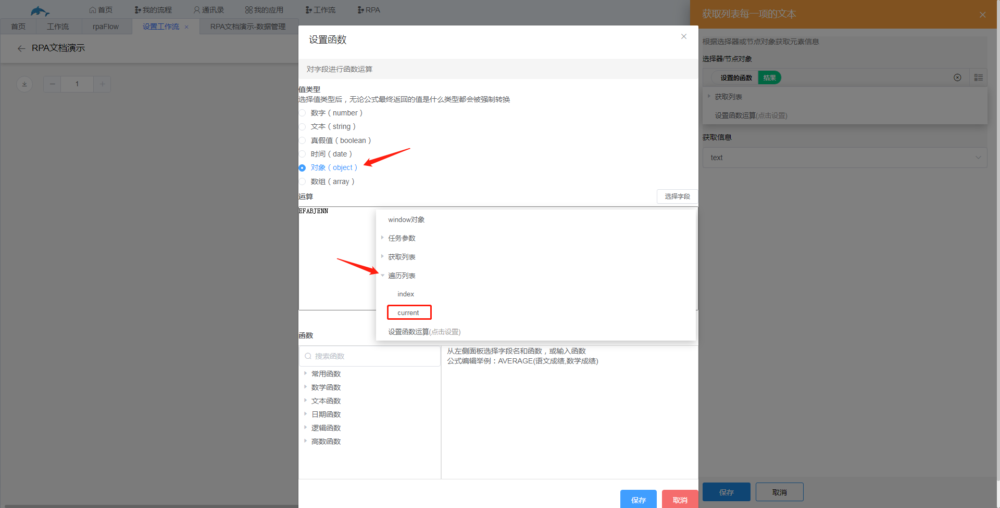

​		此时便拿到数组的每一项，即每一个li的元素对象，获取信息列表选择text。

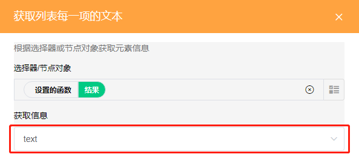

​		d.上传文本信息，添加上传数据节点上传c步骤获取到的文本信息。选择存储数据的表单，然后将c步骤的结果填写在表中的字段。

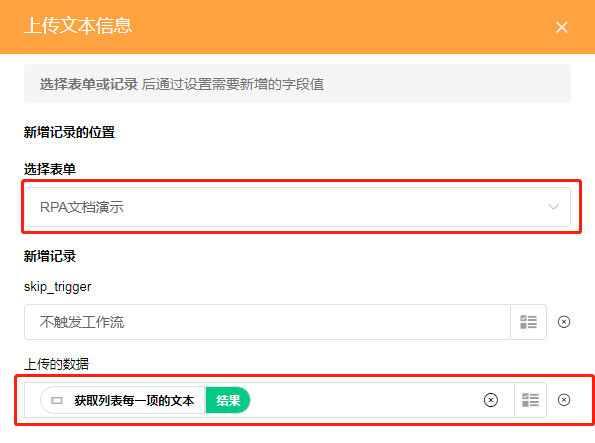

效果如下图。

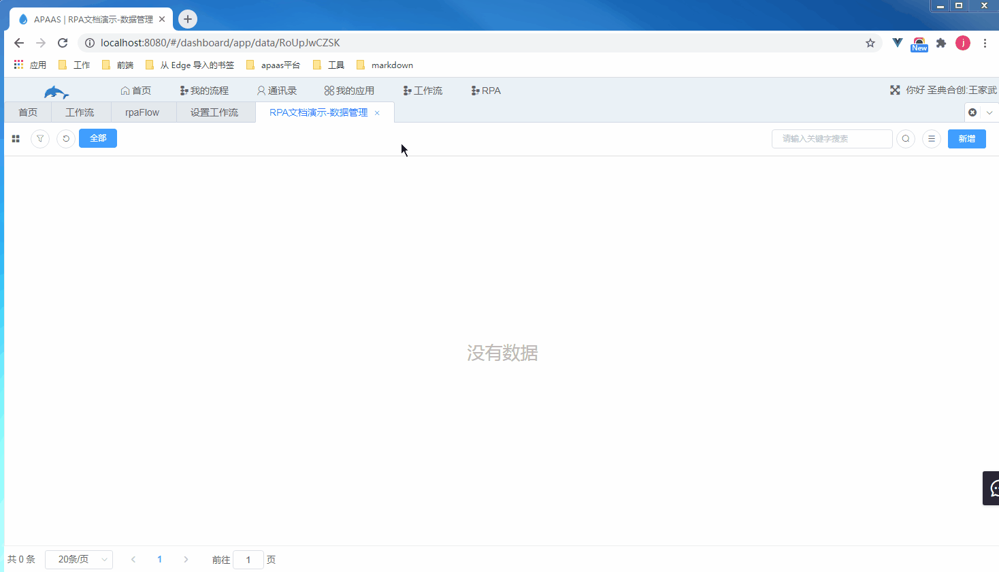

5.函数运算

（1）节点说明

​	用于进行运算。例如获取元素信息节点获取回来的文本信息数据如果需要进行格式上的处理，可以用该节点中的文本函数对获取到的信息进行处理。

（2）节点设置

​	选择返回值类型，然后选择需要的函数以及选择需要进行运算的变量。

​	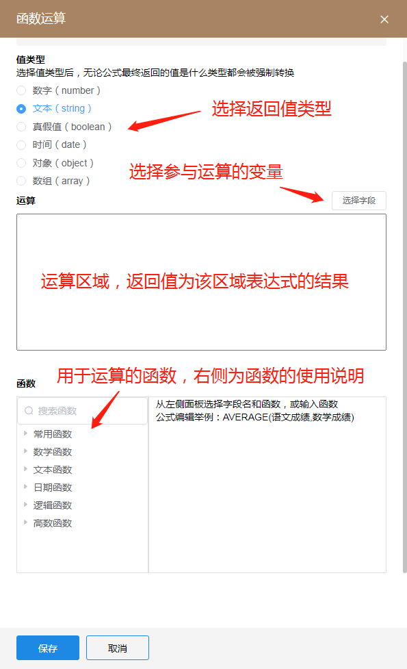

​	示例：在计次循环节点示例中获取到的每一个文本信息前面添加上“函数运算演示”6个字符。

​	该示例的任务流程图如下图所示，即在上一个示例的任务流程中“获取列表每一项的文本”节点下面添加多一个运算函数节点，用于处理文本信息，最后的“上传文本信息”节点也需要将填写的值改成运算函数的结果。

​	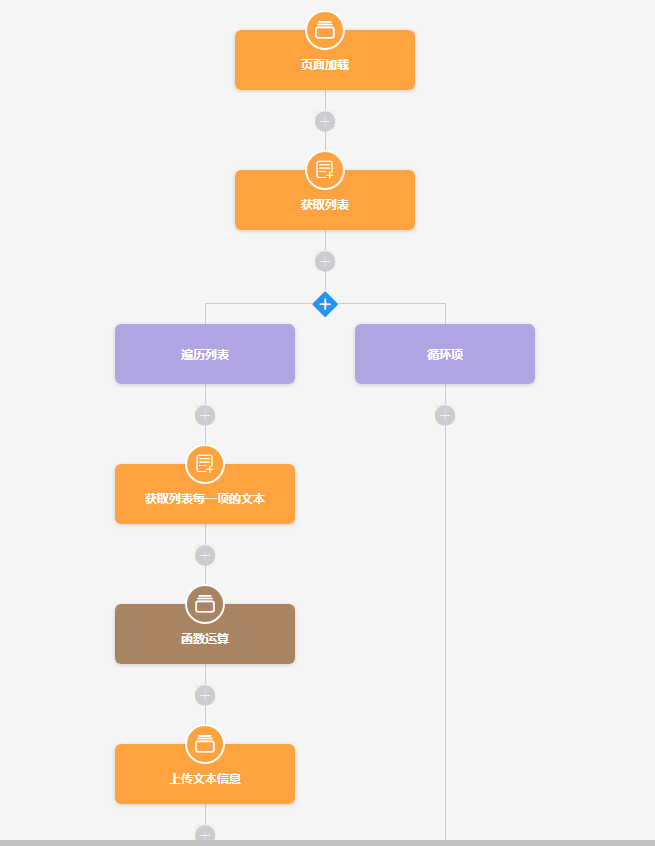

​	a.设置函数运算节点，返回值类型选择文本。

​	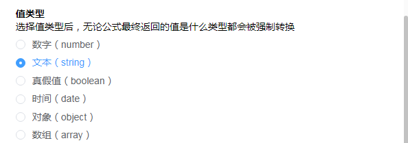

​			函数选择文本函数中的CONCATENATE，该函数用于拼接文本，用法在函数的右侧有介绍。

​	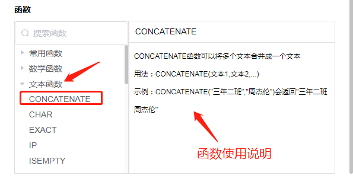

​		在函数的第一个参数输入“函数运算演示”，文本信息要写在英文双引号中，空格是为了方便看出演示效果加上的。第二个参数，点击“选择字段”，选择“获取列表每一项的文本”节点的结果。

​	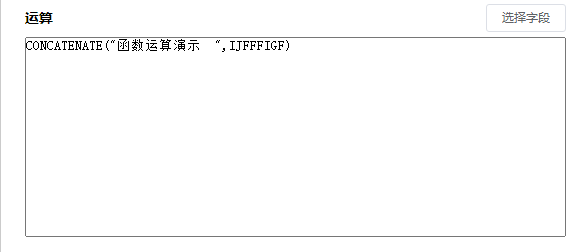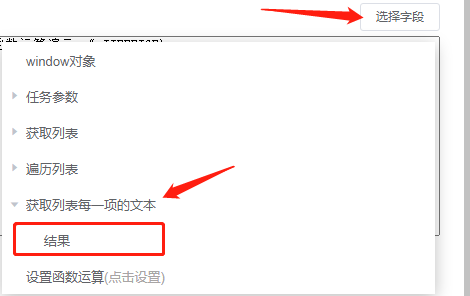

​	b.上传文本信息节点中的字段的值修改为函数运算的结果。

​	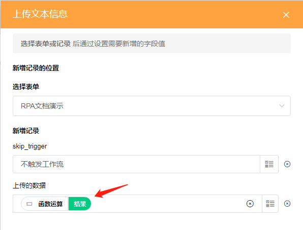

​	效果如下图。

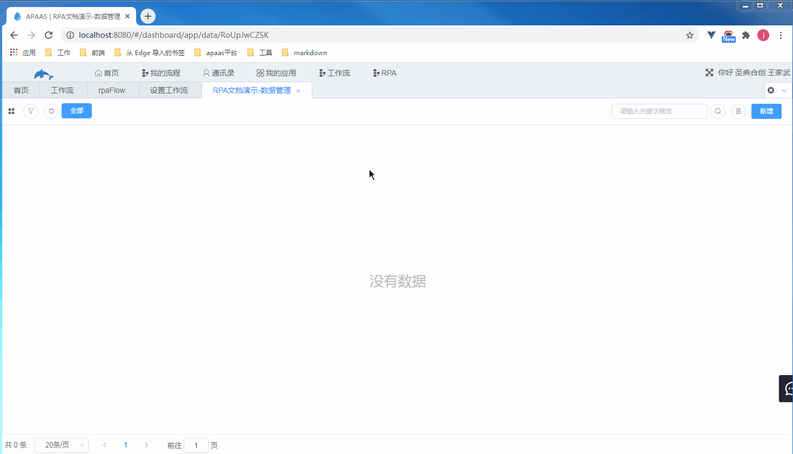