### 10.2.1界面元素

1.获取元素

（1）节点说明

​	通过选择器或者选择器+文本获取页面的某个元素，获取后可对其进行后续的操作。

（2）节点设置

a.选择器

​	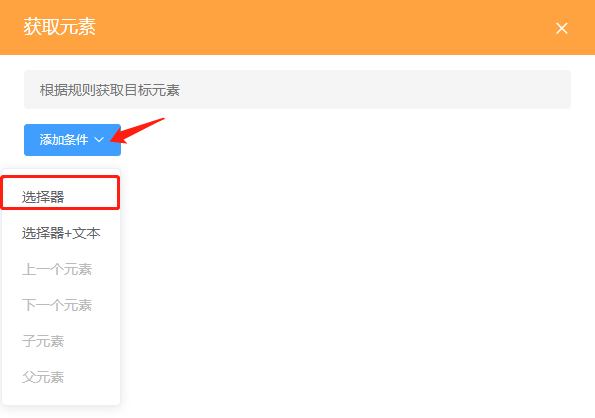

​	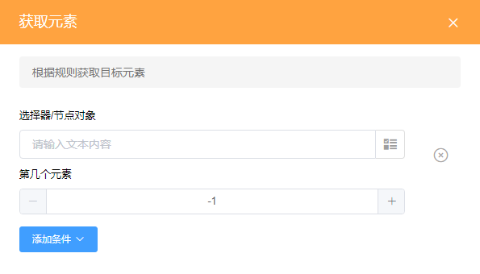

​		①选择器/节点对象：可以通过设置函数填写，或者直接填写选择器，选择器为CSS选择器，需要到网页源码中获取。

​		②第几个元素：由于获取元素返回的是由document.querySelectorAll()方法获取并返回的数组，因此第几个元素中的值实际为该数组的下标，下标为0时是数组的第一个值，后面以此类推，下标为-1时返回整个数组。

​	示例：获取美团页面中的a标签“美团外卖”，并点击。

​		在源码中找到该元素，查看该元素的属性来判断使用哪种CSS选择器。由于页面内容比较多，class重名概率比较大，若只选择一个class则需要使用选择器+文本的形式来获取，获取的元素才会比较准确；或者选择比较特殊的属性，例如a标签中较为唯一的属性href，用a[href="http://waimai.meituan.com"]选择器来选择该元素；最后一种最为准确且方便的方法是直接鼠标右键点击下图中的a标签，选择Copy中的Copy selector，然后直接粘贴到获取元素设置界面的选择器中。

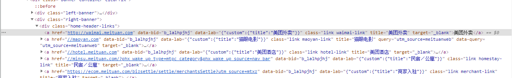

​		下图中选择器直接使用了上述最后一种方式Copy selector获得；第几个元素中，我们需要选择返回的数组中的第一个值，因此填0，点击保存。

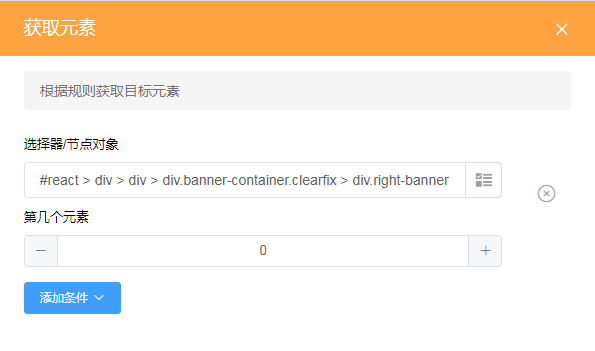

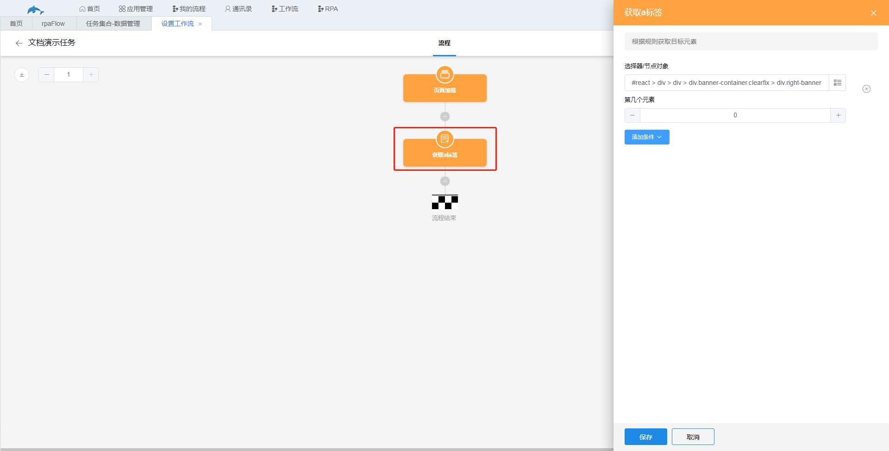

​		因演示需要，此处我们添加一个还未介绍的触发动作节点，节点对象选择我们获取回来的a元素，事件选择click，即点击事件。

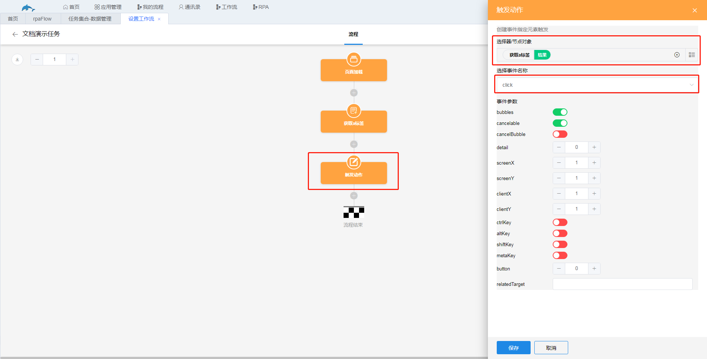

​		效果如下图。

b.选择器+文本。

即除了填写选择器外，还可以添加多元素的文本信息，比如还是一样获取上述a标签，填写如下图。

​	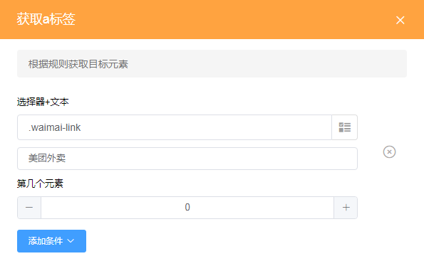

c.添加条件

获取元素后，可以通过添加条件中的选择，来选择该元素的兄弟元素、子元素或者父元素。通常用于获取没有属性的标签元素。

2.获取元素信息

（1）节点说明

​	获取元素的text、length、value或者attribute信息。text为元素的文本信息，length为获取回来的数组的长度，value为元素的value值，attribute为元素的属性。

（2）节点设置

​	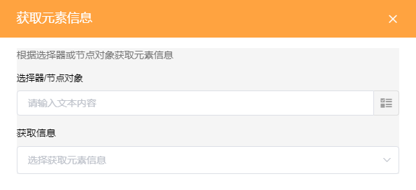

​	同样的，填写选择器或者节点对象，获取元素后再进一步获取信息，选择器可以手动填写，或者从前面的节点中选择，例如我们可以选择上方获取的a标签。

​	示例：获取上述a标签中的文本信息。

​		添加获取元素信息节点。

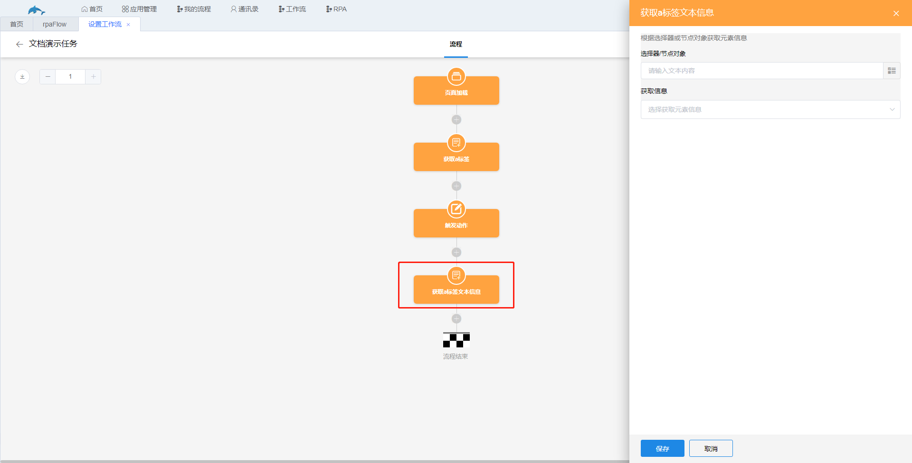

​		设置节点。

​	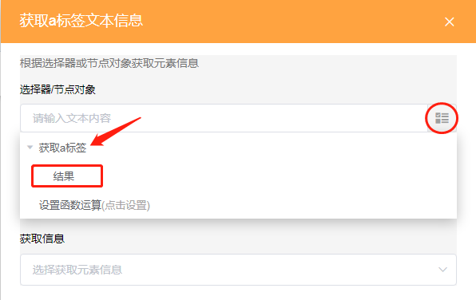

​	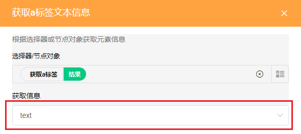

​		展示该效果需要添加一个我们还未进行介绍的上传数据节点，该节点用于将我们获取的信息上传到我们选定的工作表中。此处我们新增一个名为“RPA文档演示”的工作表，将获取的a标签文本信息上传到该工作表中。

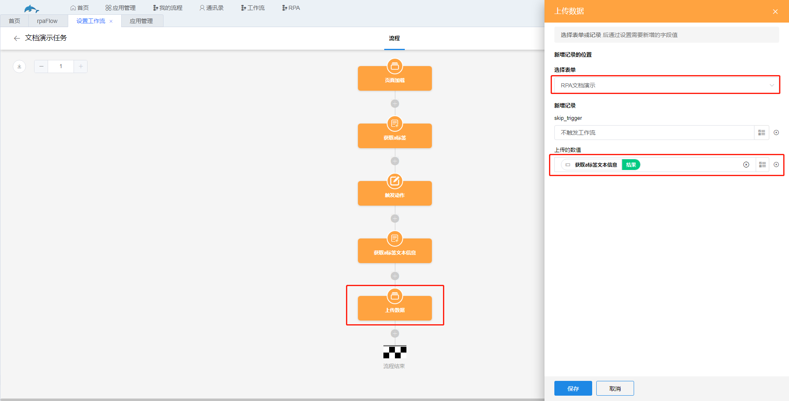

​		效果如下图。

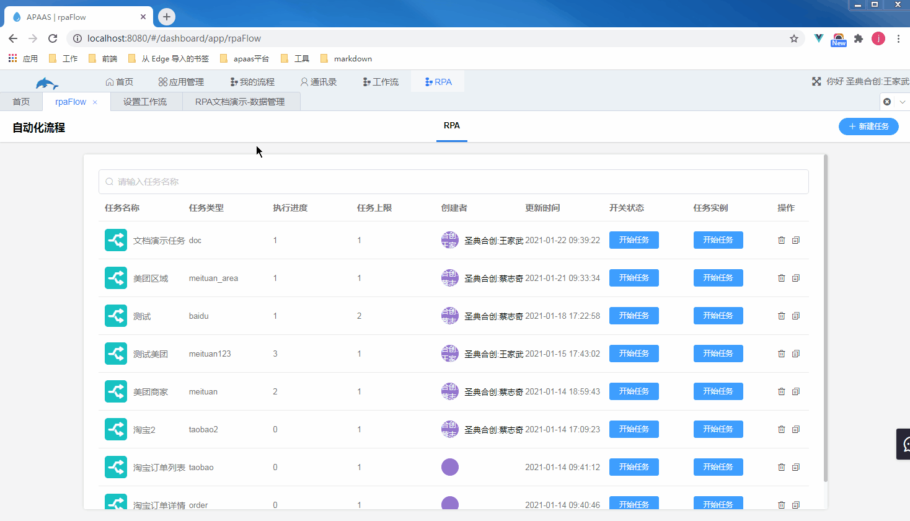

3.设置元素信息

（1）节点说明

​	给选定的元素对象重新赋值value、html或者attribute属性。value为元素的value属性，html为innerHTML，attribute为标签的attribute属性，包括id、class等。

（2）节点设置

​	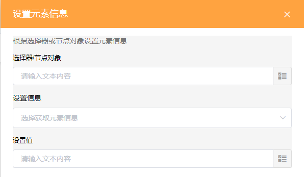

​	选择需要重新给属性赋值的元素，可以是用选择器获取的元素，或者从前面节点中选择的元素。

​	设置信息：选择需要修改值的属性，属性分别有value、html和attribute。

​	设置值：填写属性的值，可以直接手动输入，或者通过设置函数获得。

​	示例：自动给美团官网的搜索框填写上“美食”。

​	步骤：

​		a.使用获取元素节点获取搜索框。

​		b.添加设置元素信息节点，节点对象选择获取元素节点拿到的结果，设置信息选择value，设置值填写“美食”。

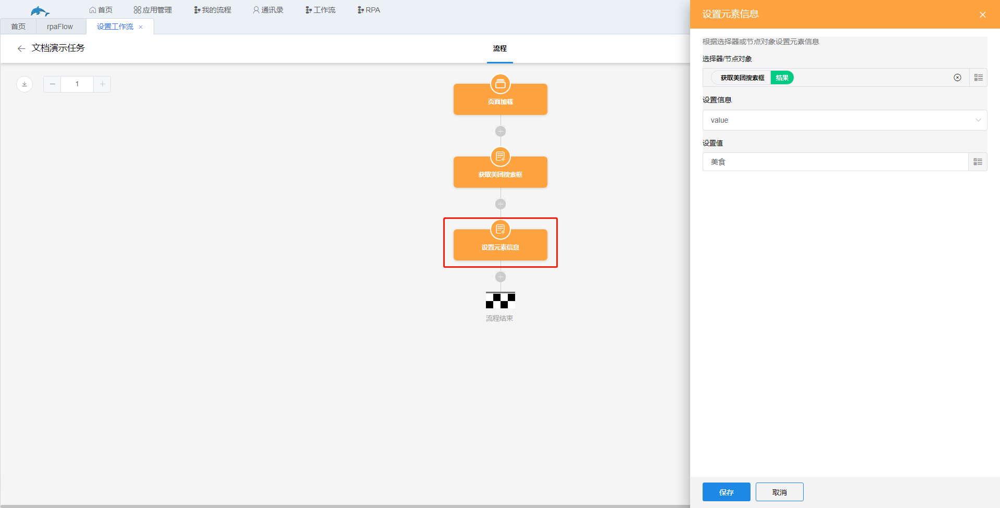

​	效果如图，注意观察搜索框。

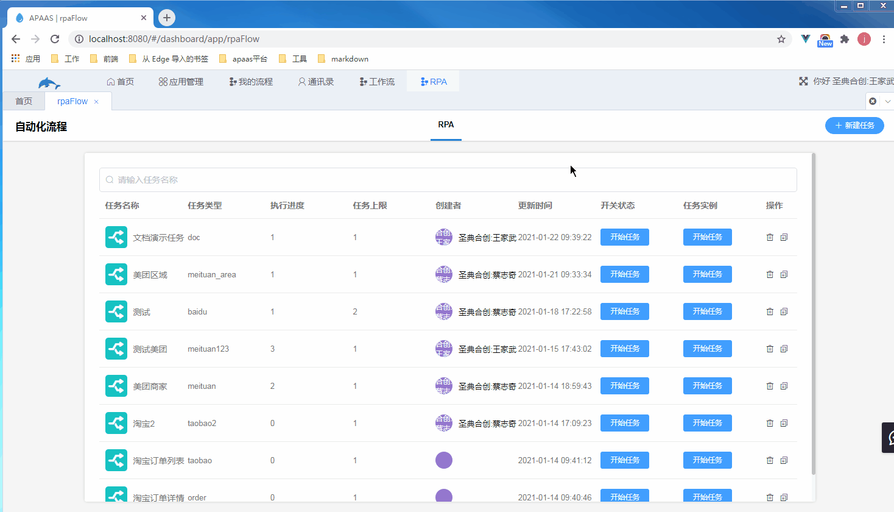

4.移除元素

（1）节点说明

​	移除元素的属性，如id、class、placeholder等。

（2）节点设置

​	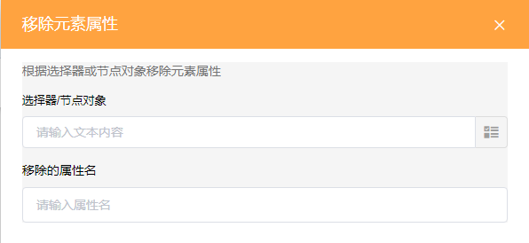

​	选择需要移除属性的元素，并填写上需要移除的属性即可。

​	示例：移除美团官网搜索框的placeholder属性。

​	步骤：

​		a.使用获取元素节点获取搜索框。

​		b.添加移除元素属性节点，节点对象选择上一步骤获取的搜索框，移除的属性名填写placeholder。

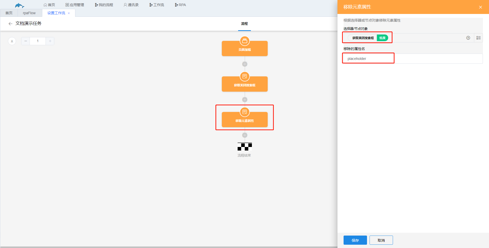

​	效果如图，注意观察搜索框。

5.等待元素

（1）节点说明

​	等待元素渲染完成，在等待的元素还未加载完成时，该任务流程会阻塞在该节点，不继续往下执行，当等待的元素加载完才执行下一个节点。

（2）节点设置

​	只需选择需要等待的元素。