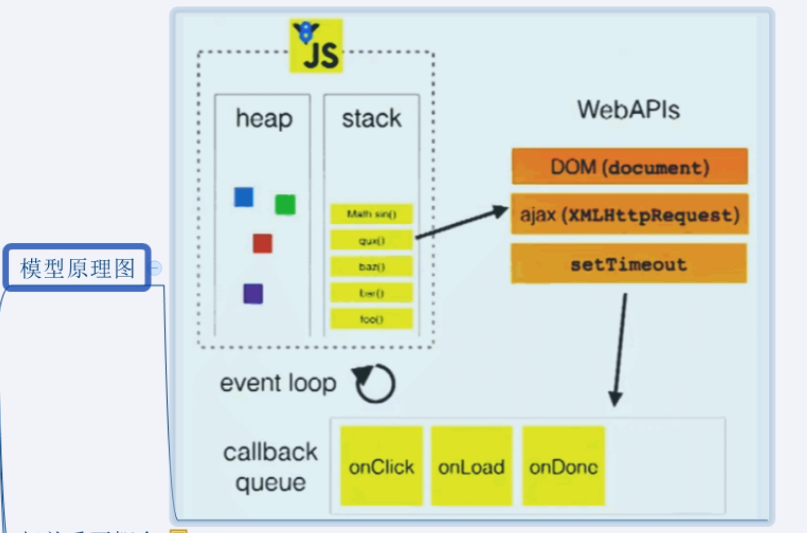

###### 浏览器内核

浏览器内核由很多模块组成

**事件循环模型**：

初始化代码执行完后才会执行回调代码，回调代码存在callback queue中，先后顺序由产生它们的初始化代码决定，比如setTimeout设置1000的比设置2000的早执行。

**加入promise后的事件模型图如下**：

**说明：**

1. JS中用来存储待执行回调函数的队列包含2个不同特定的队列；

2. 宏队列：用来保存待执行的宏任务（回调），比如：定时器回调、DOM事件回调、ajax回调；

3. 微队列：用来保存待执行的微任务（回调），比如：promise的回调、MutationObserver的回调；

4.  JS执行时会区别这2个队列；

   （1）JS引擎首先必须执行所有的初始化同步任务代码；

   （2）每次准备取出第一个宏任务来执行前，都要先将所有的微任务一个一个取出来执行，也就是当宏任务执行时候又插入了一个微任务，需要将该微任务执行完才会继续执行后面的宏任务。

