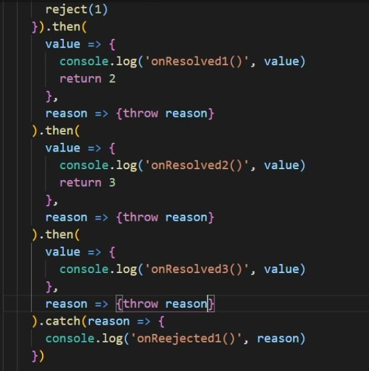

##### 1.错误

###### 1.1错误的类型

+ Error：所有错误的父类型
+ ReferenceError：引用的变量不存在
+ TypeError：数据类型不正确的错误
+ RangeError：数据值不在其所允许的范围内
+ SyntaxError：语法错误

###### 1.2错误处理

+ 捕获错误：try...catch
+ 抛出错误：throw error

###### 1.3错误对象

+ message属性：错误相关信息
+ stack属性：函数调用栈记录信息

##### 2.promise

###### 2.1promise是什么？

​	抽象表达：Promise是js中进行异步编程的新的解决方案。

​	具体表达：（1）从语法上来说Promise是一个构造函数；（2）从功能上来说Promise对象用来封装一个异步操作并可以获取其结果

###### 2.2promise的状态改变

1.pending变为resloved

2.pending变为rejected

成功的结果数据一般称为value，失败的结果数据一般称为reason

**注意：new Promise(() => {})的状态为pending**

```js
const p = new Promise((resolve, reject) => {// 执行器函数
    // 这里执行异步操作任务
    // 如果成功了，调用resolve(value)
    resolve(value)
    // 如果失败了，调用reject(reason)
    reject(reason)
})

p.then(
	value => {// 接收得到成功的value数据  onResolved
        
    }
    reason => {// 接收得到失败的reason数据  onRejected
    
    }
)
```

```js
// 例子
const p = new Promise((resolve, reject) => {// 执行器函数
    // 这里执行异步操作任务
	setTimeout(() => {
        const time = Date.now()
        // 如果当前时间是偶数就代表成功，否则代表失败
        if (time %2 == 0) {
            resolve('成功的数据，time=' + time)
        }
        else {
            reject('失败的数据，time=' + time)
        }
    }, 1000)
})

p.then(
	value => {// 接收得到成功的value数据
        console.log('成功的回调', value)
    }
    reason => {// 接收得到失败的reason数据
    	console.log('失败的回调', reason)
    }
)
```

###### 2.3 产生一个成功值为1的promise对象

```js
const p1 = new Promise((resolve, reject) => {
    resolve(1)
})
// 或者使用下方语句
const p2 = Promise.resolve(2)
```

##### 3. 关于promise的几个问题

###### 3.1 如何改变promise状态

+ resolve(value)：如果当前是pending就会变为resolved
+ reject(reason)：如果当前是pending就会变为rejected
+ 抛出异常：如果当前是pending就会变为rejected

**注意：pending状态只会改变一次**

###### 3.2改变promise状态和指定回调函数谁先谁后？

（1）都有可能，正常情况下是先指定回调再改变状态，但也可以先改状态再指定回调

（2）如何先改状态再指定回调？

​	在执行器中直接调用resolve()或者reject()，然后延迟更长时间才调用then()

（3）什么时候才能得到数据？

+ 如果先指定的回调，那当状态发生改变时，回调函数就会调用，得到数据
+ 如果先改变的状态，那当指定回调时，回调函数就会调用，得到数据

###### 3.3 promise.then()返回的新promise的结果状态由什么决定？

由then()指定的回调函数执行的结果决定；

如果抛出异常，新promise变为rejected，reason为抛出的异常；

如果返回的是非promise的任意值，新promise变为resolved，value为返回的值；

如果返回的是另一个新的promise，此promise的结果就会成为新promise的结果。

**即只有抛出异常或者then中的回调函数返回一个状态为rejected的promise时，该then返回的新的promise的状态才会为rejected，否则都为resolved**

###### 3.4 promise异常穿透

（1）当使用promise的then链式调用时，可以在最后指定失败的回调，

（2）前面任务操作出了异常，都会传到最后失败的回调中处理。

如下图，promise状态为rejected，值为1，当then中都没有失败的回调函数时，视为每个then中的失败的回调函数为reason => {throw reason}即将值做为异常抛出，由catch接收到，若其中一个then有指定失败的回调函数，则由该then中的失败的回调函数来处理该reject(1)。



###### 3.5如何中断promise链？

在需要中断的then中的回调函数返回一个状态为pending的promise对象。

```js
// 例如
new Promise((resolve, reject) =>{
    reject(3)
})
.then(
    value => {},
    reason => {
        console.log('失败，失败值',reason)
        return new Promise(() => {}) // 后面的then都会中断
    }
)
.then(
    value => {console.log('成功，成功值',value)},
    reason => {console.log(reason)}
)
.then(
    value => {console.log('成功，成功值',value)},
    reason => {console.log(reason)}
)
```

