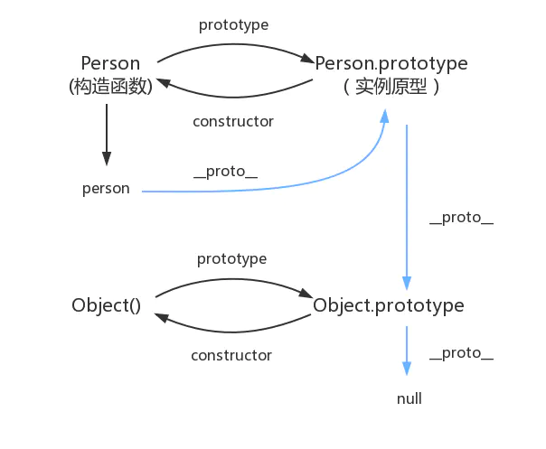
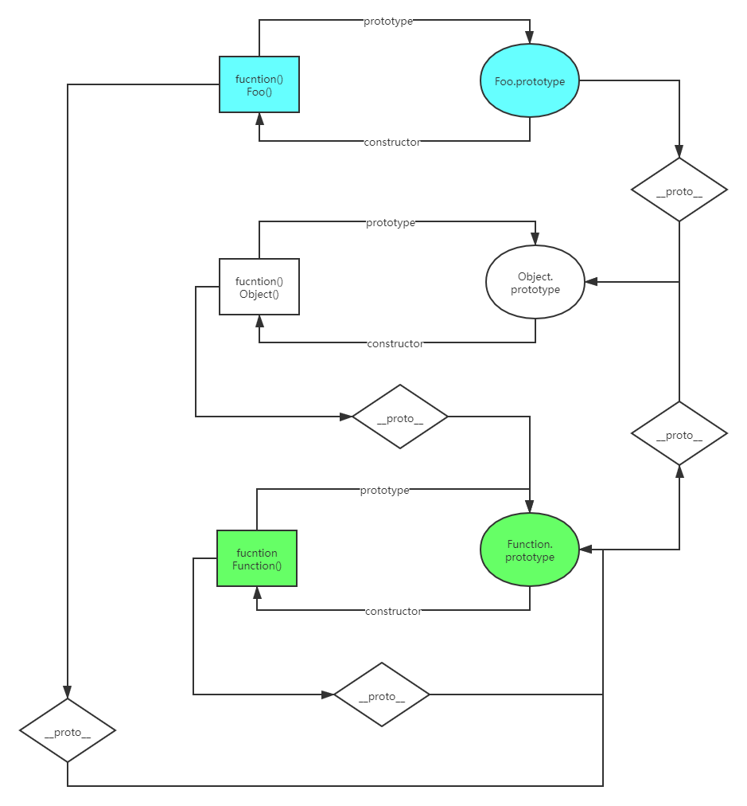

# 原型



​	在JavaScript中，每个函数都有一个prototype属性，这个属性是构造函数构造出来的实例的原型，即

````javascript
person.__proto__ == Person.prototype
````

该属性值默认是一个空对象（没有我们自行添加的属性值，有默认属性值），对象中的属性和方法会被person继承。

该对象中的constructor属性指向函数（构造函数Person()）本身，并且该对象指向函数的原型对象，即object.prototype，例如（即object()的prototype属性）

````javascript
Person.prototype.__proto__ == object.prototype
````

例中object.prototype即为构造函数object()的prototype属性，同样object.prototype中的属性和方法会被构造函数Person()继承，并且同样的,object.prototype中的constructor指向object()

# 原型链

​	又图中相互关联的原型组成的链状结构就是原型链，就是图中蓝色这条线。当从person中找不到某个属性就会从person的原型``person.__proto__``也就是``Peson.prototype``中查找，再找不到继续往``Person.prototype.__proto__``中查找，直到最后若找到null即返回undifined。0

# 补充 

* `prototype`属性为显式原型，`__proto__`为隐式原型
* 函数的显示原型指向的对象（即引用的地址）默认是空Object实例对象（但Object的显示原型不然，即Object.prototype不是Object的实例）
* Object的原型对象是原型链的尽头，即`Object.prototype.__proto__`为null
* 所有函数都是Function的实例（包括Function本身），即`Person.__proto__`都指向`Function.prototype`，且`Function.prototype`是Object()的实例，即`Function.prototype.__proto__ === Object.prototype`
* 特别注意Object()本身是Function()的实例，因此`Object.__proto__ === Function.prototype`



**注意图中绿色部分，即Function()是构造函数Function的实例，即Function()是自身的实例。**

# instanceof

* instanceof 是如何判断的？
  * 表达式： A instanceof B
  * 如果B函数的显示原型对象（B.prototype）在A对象的原型链上，返回true，否则返回false 
* Function是通过new自己产生的实例

# 继承实现方式

* 组合继承（伪经典继承）

```js
        function SuperType (name) {
            this.name = name;
            this.colors = ['red', 'blue', 'green'];
        }
        SuperType.prototype.sayName = function () {
            alert(this.name)
        }

        function SubType (name, age) {
            // 继承属性，第一次调用SuperType
            SuperType.call(this, name);
            this.age = age;
        }
        // 继承方法，第二次调用SuperType
        SubType.prototype = new SuperType();
        SubType.prototype.constructor = SubType;

        SubType.prototype.sayAge = function () {
            alert(this.age);
        }

        var instance = new SubType('Amily', 27);
        alert(instance.colors);
        instance.sayName();
        instance.sayAge();
```

SubType.prototype为SuperType实例，则SubType.prototype的原型为SuperType.prototype，因此继承了SuperType.prototype的方法，但同时也构造了两个不必要的属性name和colors，name为undefined，colors为['red', 'blue', 'green']。不过SubType的实例，由于使用了SuperType.call(this, name)，其创造了和SubType.prototype同名的属性，因此实例的属性会屏蔽掉其原型上的属性。

由于SubType.prototype为SuperType实例，因此SubType.prototype的constructor，与其原型SubType.prototype相同，即为SuperType。我们需使用SubType.prototype.constructor = SubType手动将其改回来。

优点是结构简单易懂，缺点是子类的原型会存在不必要的属性，同时父类构造函数会被调用两次。

+ 寄生组合继承

```js
        function SuperType (name) {
            this.name = name;
            this.colors = ['red', 'blue', 'green'];
        }
        SuperType.prototype.sayName = function () {
            alert(this.name)
        }

        function SubType (name, age) {
            // 继承属性
            SuperType.call(this, name);
            this.age = age;
        }
		// 继承方法，该语句最终效果等同于SubType.prototype.__proto__ = SuperType.prototype，但__proto__属性不是每个浏览器都可以访问，存在兼容问题
        inheritPrototype(SubType, SuperType);

        SubType.prototype.sayAge = function () {
            alert(this.age);
        }

        var instance = new SubType('Amily', 27);
        instance.sayName();

        function inheritPrototype (subType, superType) {
            var prototype = object(superType.prototype);
            prototype.constructor = subType;
            subType.prototype = prototype;
        }
		// 返回一个原型为o且不存在属性的实例，
        function object (o) {
            function F () {};
            F.prototype = o;
            return new F();
        }
```

寄生组合继承只调用一次SuperType构造函数，且避免在SubType.prototype上面创建不必要的、多余的属性，为最理想的继承方式。

# es6 class继承写法

```js
        class Person {
            constructor (name, age) {
                this.name = name;
                this.age = age;
            }
            introduce () {
                alert('我是'+ this.name + ',年龄' + this.age + '。');
            }
        }

        class teacher extends Person {
            constructor (name, age, grade) {
                super(name, age);
                this.grade = grade;
            }
            saySomething () {
                alert('我教' + this.grade + '年级');
            }
        }

        var teacher1 = new teacher('王五', 29, 6);
        teacher1.introduce();
        teacher1.saySomething();
```

