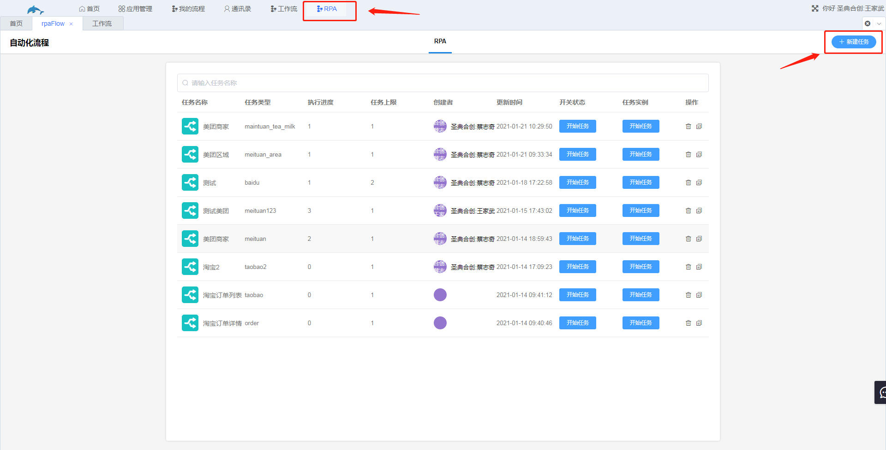
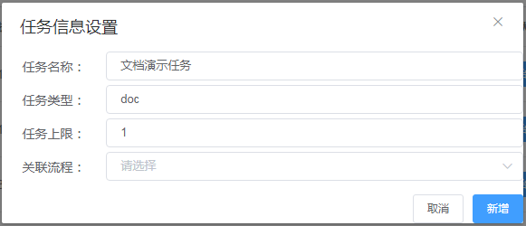
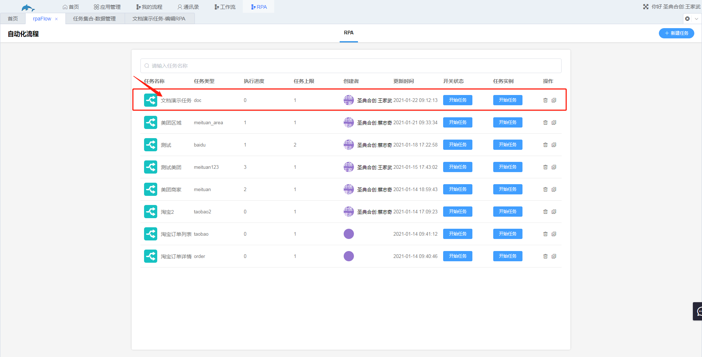
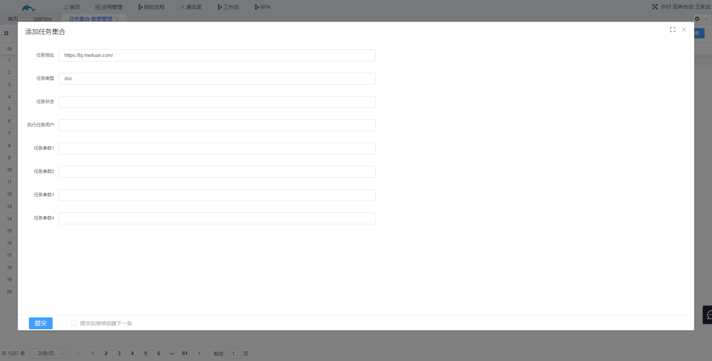
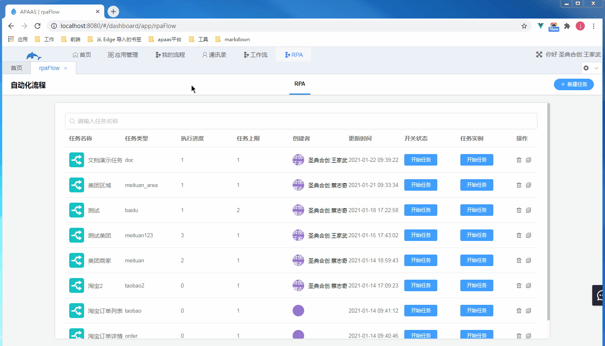
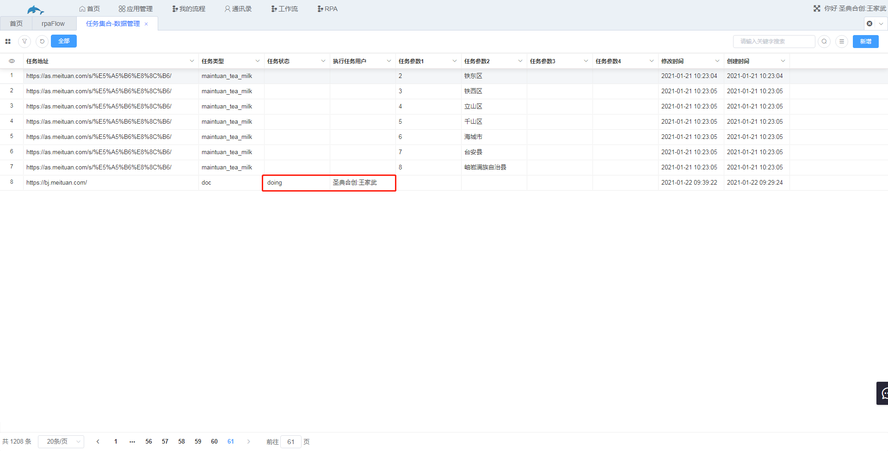
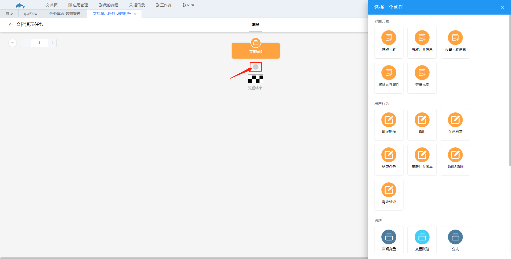

## 10.1新建任务

入口：RPA→新建任务

步骤：

​	1.进入RPA界面，点击新建任务。

​	2.设置任务信息。

​	其中任务类型可以是任意的字符串，可以理解为任务的别名；任务上限表示可以同时开启网页窗口的最大上限，若设置为2，则会同时开启两个窗口执行任务，若其中一个窗口被关闭，则会重新打开一个窗口，保持两个窗口；关联流程，即关联已有的任务流程，若该任务流程需要新建，则该项不需要选择。任务信息设置完成后点击“新增”。

​	新增后RPA界面会新增一条任务，点击任务名称可以进入任务流程编辑界面，此处还有一个准备工作，因此先不编辑任务流程。

​	3.新增任务的参数

​	入口：首页→任务中心→任务集合

​		进入”任务集合“工作表的数据管理，新增记录，填写任务地址和任务类型，任务地址为需要打开网页的网址，任务类型为新建任务时填写的任务类型。下图中的任务地址为美团的地址，填写后点击提交。

​		此时已经可以开始任务了，但因为任务流程还未开始编辑，流程中只有一个网页加载的节点，因此开始任务后只会自动加载网页。

​		开始任务后，我们刚才在任务集合新增的记录会自动新增另外两个参数，任务状态和执行任务用户。任务状态为doing表示该任务执行中，只有任务状态为空值或者为doing时，该任务才可以执行，当任务状态置为done则表示任务已完成，这条任务便不可再被开启。执行任务用户为点击开始任务的用户，该值为空值时，任何一个用户都可以执行此任务，任务被开始后，该值会被置为点击开始的用户，此时其他用户不能开始该任务。

​	4.编辑任务流程

​	入口：RPA→点击对应的任务名称

​		任务流程的第一个节点为页面加载，效果在上方开始任务已经演示，即自动加载我们在任务集合中输入的任务地址。点击“+”会弹出动作节点选择界面，选择需要的动作节点开始编辑任务流程。

