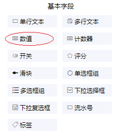
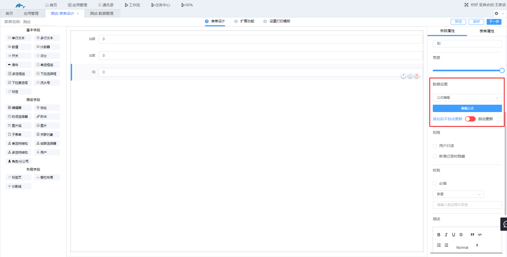
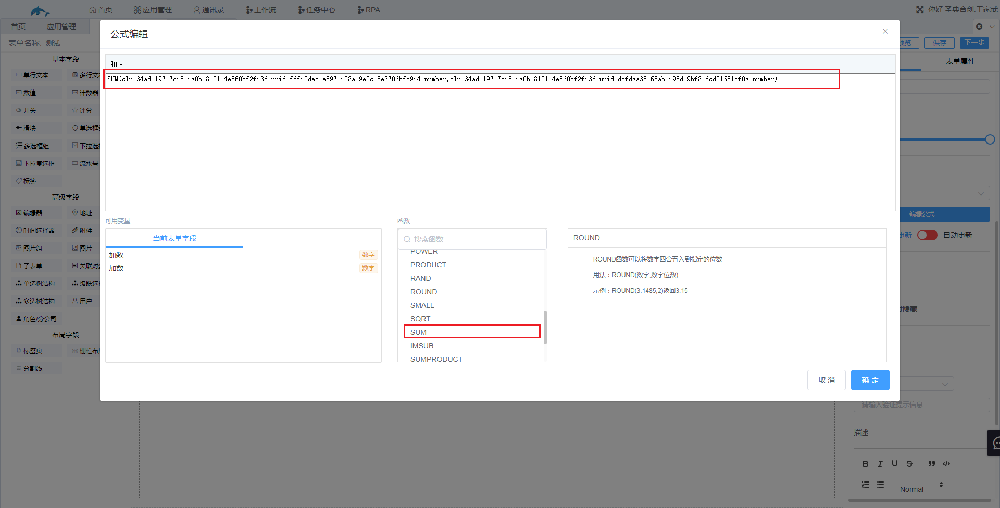
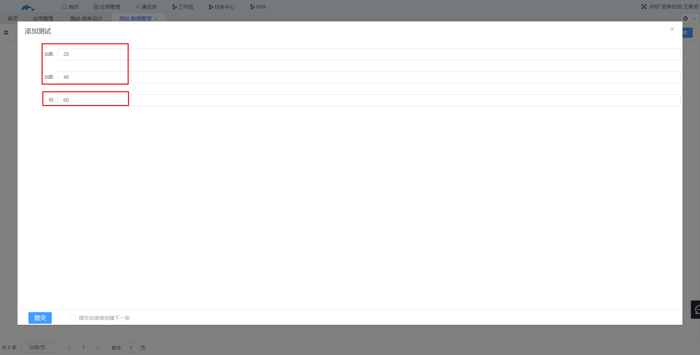
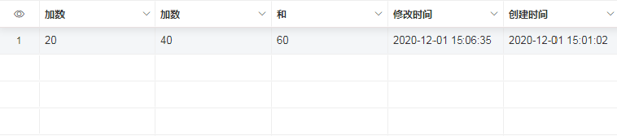
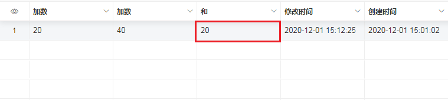
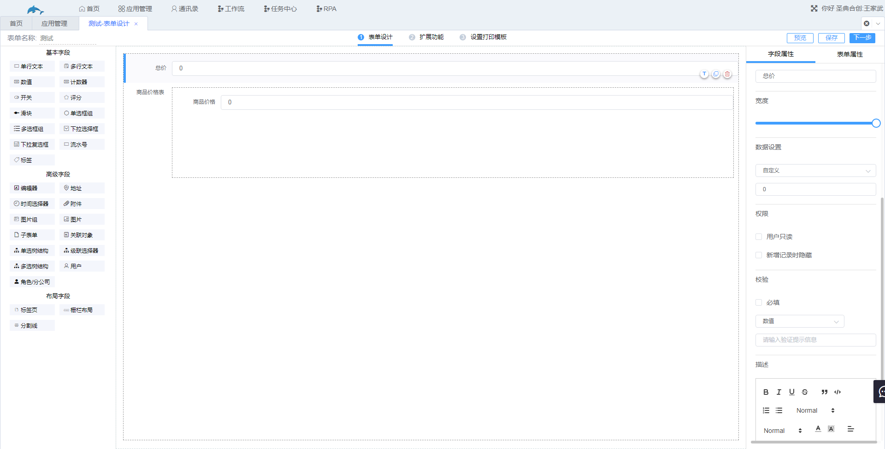
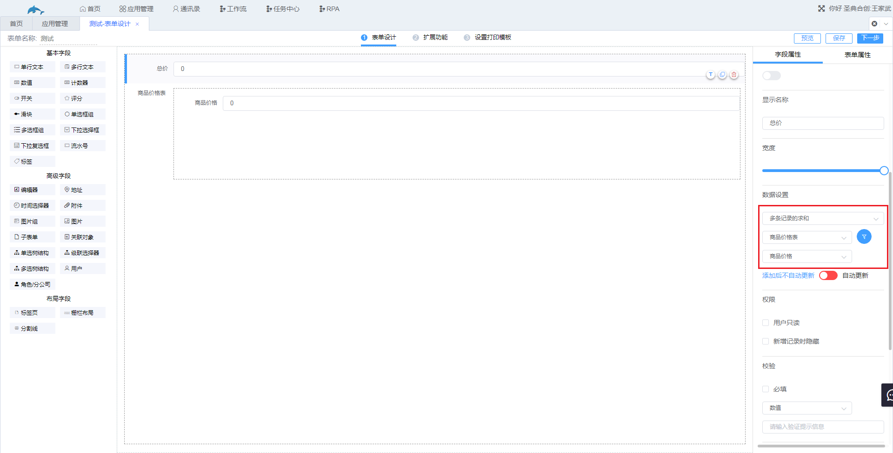
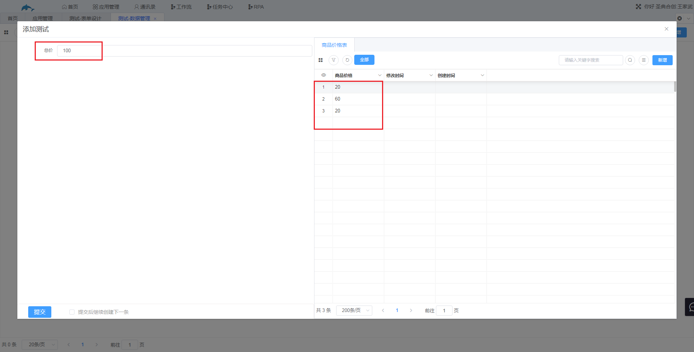

### 3.2.3数值字段

1.字段说明

​	数值字段可以用于计算，需要统计、汇总或者进行其他复杂计算的数据可以用数值字段录入。

2.数据设置

​	（1） 自定义，可以自己定义该字段的默认值。

​	（2） 数据联动，请移步到数据联动处阅读该功能。

​	（3） 公式编辑、添加后是否自动更新。

​		公式编辑用来编辑公式，可对数据进行计算，类似excel中的各种公式，在下面例子中主要讲解“添加后是否自动更新”属性的功能，公式编辑部分的内容在“公式编辑”页面中进行讲解。

​		添加三个数值字段，名称分别为“加数”、“加数”、“和”，给“和”字段设置公式编辑，此时不开启“添加后自动更新”。

​	公式选择“SUM”对两个加数进行加和。

​	添加数据，当输入两个“加数”的值后会自动计算“和”的值，点击提交。

​	结果如下图

​	此时单击该条数据重新编辑，发现可以手动将“和”的值修改，这样会造成数据混乱。

​	我们可以通过开启“添加后自动更新”来解决该问题，“添加后自动更新”勾选后，“和”的值会始终根据公式编辑计算得来，在该例中“和”会始终是两个“加数”相加的结果，手动修改不能改变“和”的值。

​	开启该按钮后，当手动修改“和”的值时不会生效，系统会根据公式编辑计算的结果自动对“和”的值进行修正，即将“和”修改为“20”后系统会自动将其修改成“60”。

​	（4） 多条记录计算，可以将子表单中的多条数据按照选择的运算进行计算，子表单的相关内容请移步到子表单中阅读。

​	案例，计算子表单中商品价格总和。在表单中添加名为“总价”的数值字段，以及一个名为“商品价格表”的子表单，子表单中添加一个名为“商品价格”的数值字段。

​	选择“总价”字段，将“数据设置”字段属性设置为“多条记录求和”，然后选择子表单“商品价格表”（后面的条件筛选按钮还可以对数据进行筛选，此处我们不进行筛选），再选择子表单中的字段“商品价格”，保存。

​	进入数据管理添加数据，点击右上角的“新增”，然后在子表单“商品价格表”中新增数据，左侧的“总价”会自动对子表单中的数据进行加和。

