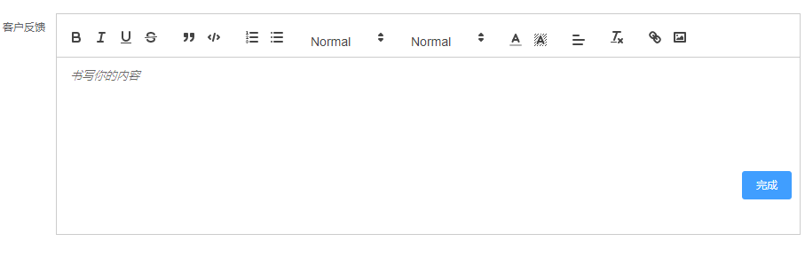

### 3.2.14其他高级字段

1.编辑器字段

​	富文本编辑器，用于编辑比较长的段落，比如客户反馈、工作日志等。

2.地址字段

​	用于录入地址数据。

3.时间选择器字段

​	用于录入时间数据，数据类型为时间类型。

4.附件字段

​	用于上传文件，在字段属性处可以限制文件上传的个数。

5.图片组字段

​	可以上传多张图片，在字段属性处可以限制图片上传的数量。

6.图片字段

​	用于上传图片，仅能上传一张图片。

