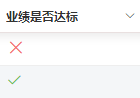
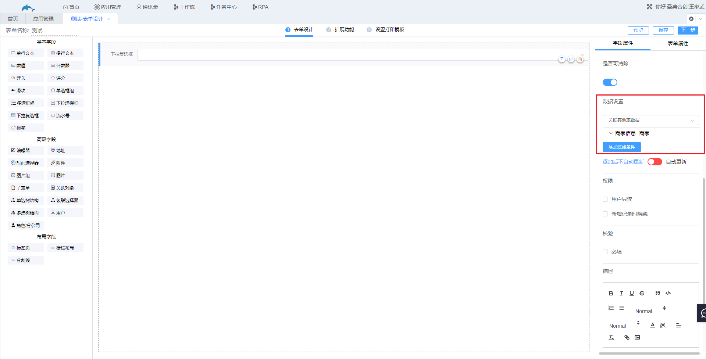
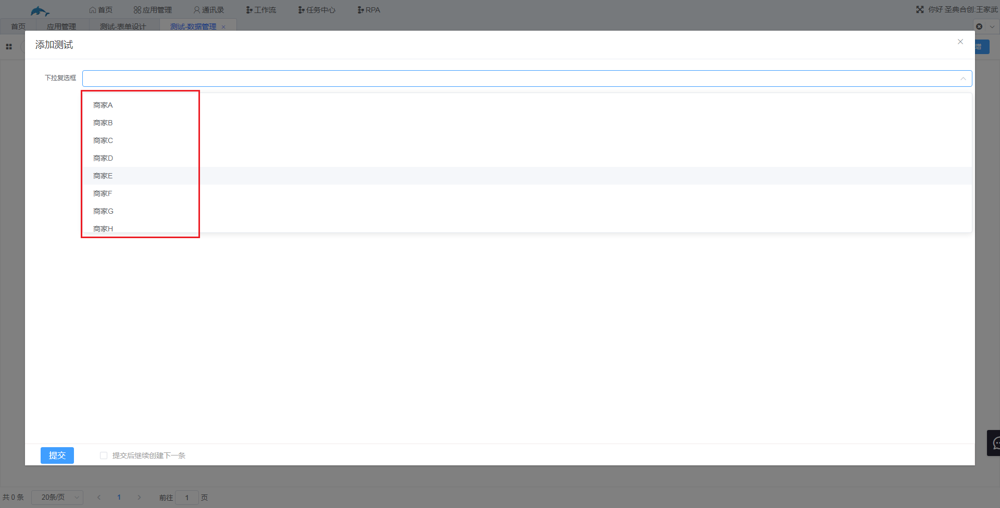
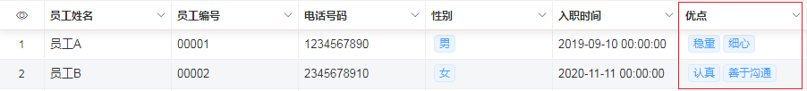

### 3.2.6其他基本字段

1.开关字段

​	使用后的显示效果如图，开关字段的数值只有“真”和“假”，打开开关时数值为“真”，关闭时数值为“假”。

2.评分字段

​	默认值为5颗星，可以在字段属性处设置星星的数量，使用效果如下。

3.滑块字段

​	同计数器一样可以设置最小值、最大值以及步长，数据类型为数值。

4.单选框组以及多选框组字段

​	单选框组新增数据时只能选择一个选项，多选框组可以选择多个选项。

5.下拉选择框以及下拉复选框字段

​	（1） 下拉选择框新增数据时只能选择一个选项，下拉复选框可以选择多个选项。

​	（2） 数据设置-数据联动，下拉选择框和下拉复选框字段联动过来的数据会显示在选项中，并不是直接给字段新增数据。

​	（3） 数据设置-关联其他表数据，可以将其他表的某个字段的数据关联过来成为下拉选择框或者下拉复选框的选项。

​			例如，将下面“商家信息”表单中的“商家字段”关联到下拉复选框中。

​			新建一张表单，添加下拉复选框字段，在数据设置处选择“关联其他表数据”，然后选择“商家信息”表单，再选择“商家”字段，在“添加过滤条件”处还可以对关联过来的数据进行筛选，此处我们不进行筛选。

​			在新增数据时就可以看到“商家信息”表单中的“商家”字段的数据关联到了下拉复选框的选项中。

6.标签字段

​	使用效果如下。

