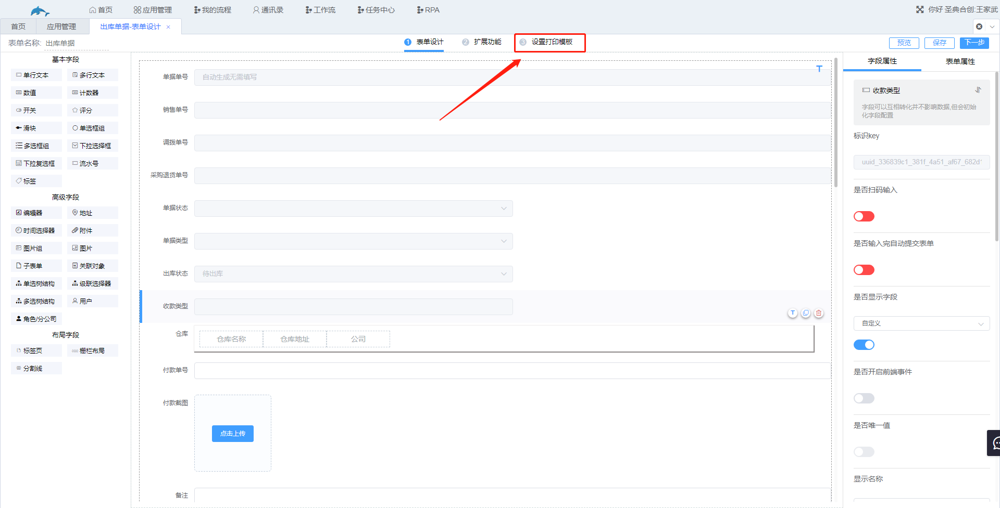
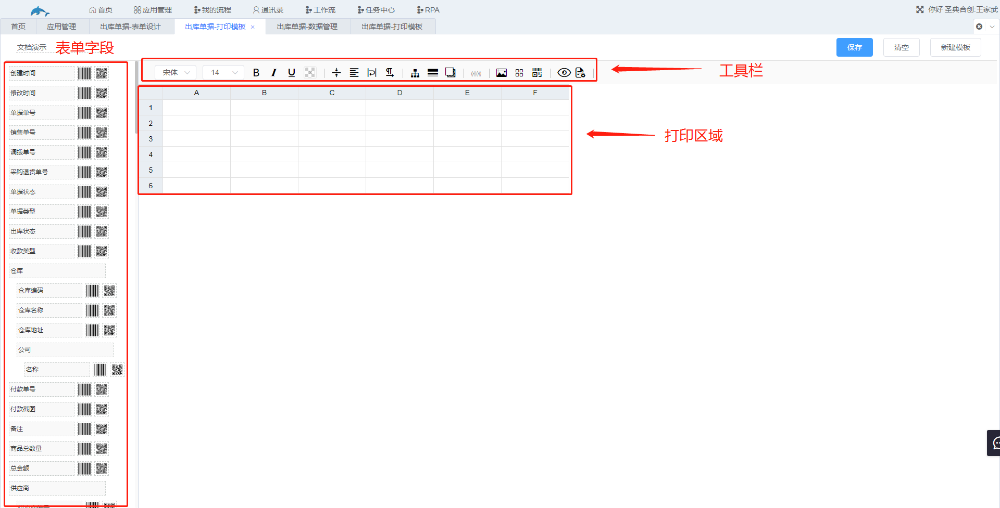
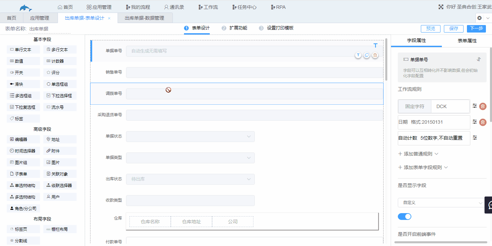
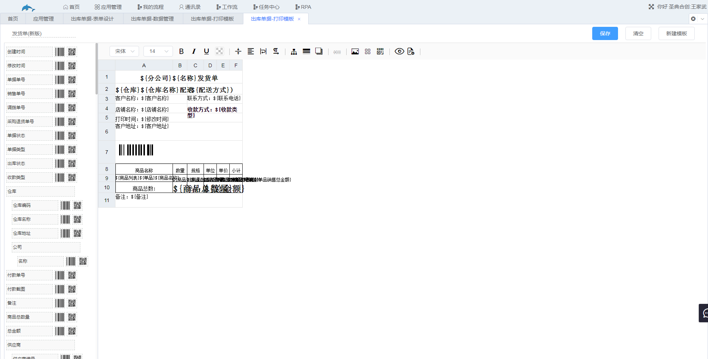
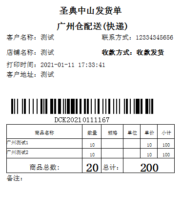

# 7.设置打印模板

若数据管理中的记录需要打印，需要有一个打印模板，记录会按照打印模板中的格式打印出来，此打印模板就是在“设置打印模板”中添加并设置的，配合工作流操作可以实现数据的自动打印。

入口：应用管理→选择工作表进入表单设计界面→设置打印模板→新增模板

1.界面介绍

2.基本操作

​	将需要打印的字段拖入到表格中。

3.设计打印模板

​	通过拖拽可以改变表格的宽高，从而控制打印内容的位置，再配合工具栏，将模板设置成自己想要的效果。下图为设计完成的出库单据打印模板。

​	该模板的打印效果如下图。

