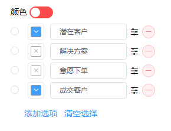
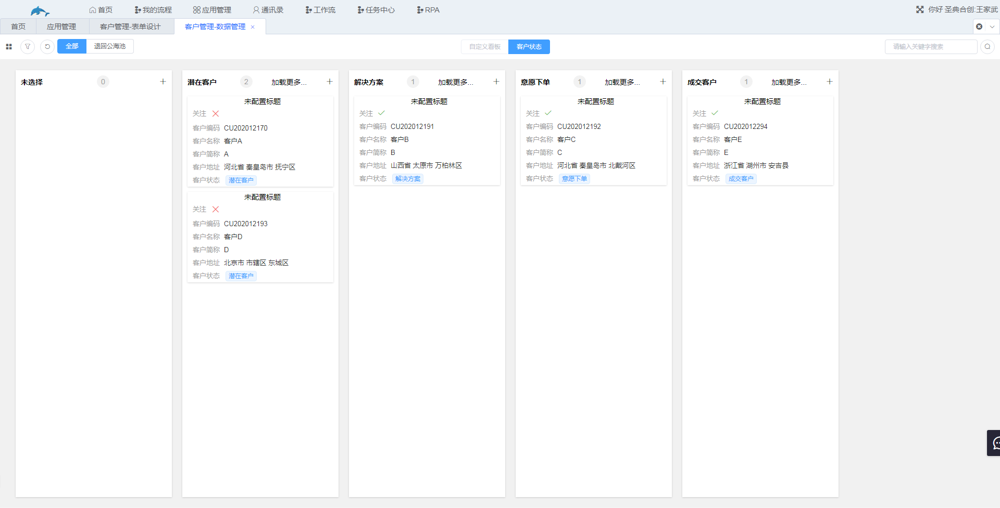
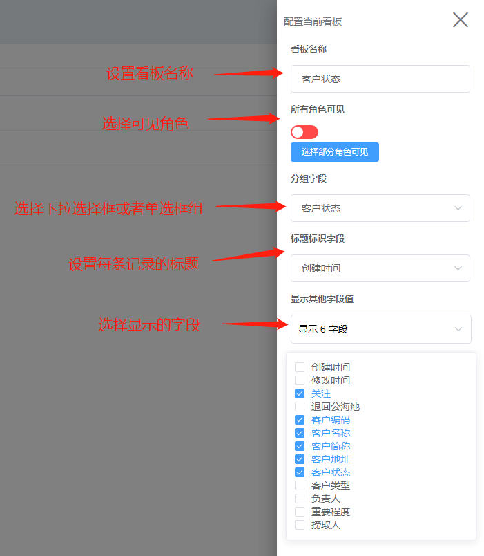
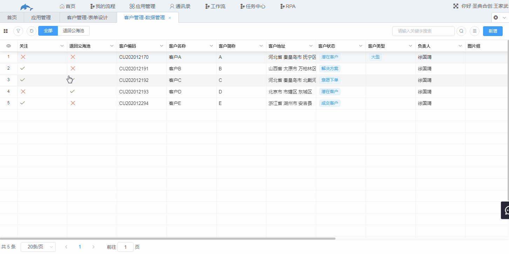

## 5.5角色看板

1.功能说明

​	给单选框组或者下拉选择框字段配置看板，用户可以在看板处直观看出单选框或者下拉选择框值相同的记录。

2.示例

​	客户管理表的下拉选择框客户状态有“潜在客户”、“解决方案”、“意愿下单”、“成交客户”四种。

​	配置看板时选择该下拉选择框，效果如下图。

3.设置

​	入口：表单设计→扩展功能→角色看板

​	（1）点击新增，进入看板设置界面，设置完成点击保存。

​	（2）进入数据管理，点击看板，选择该看板即可查看。

