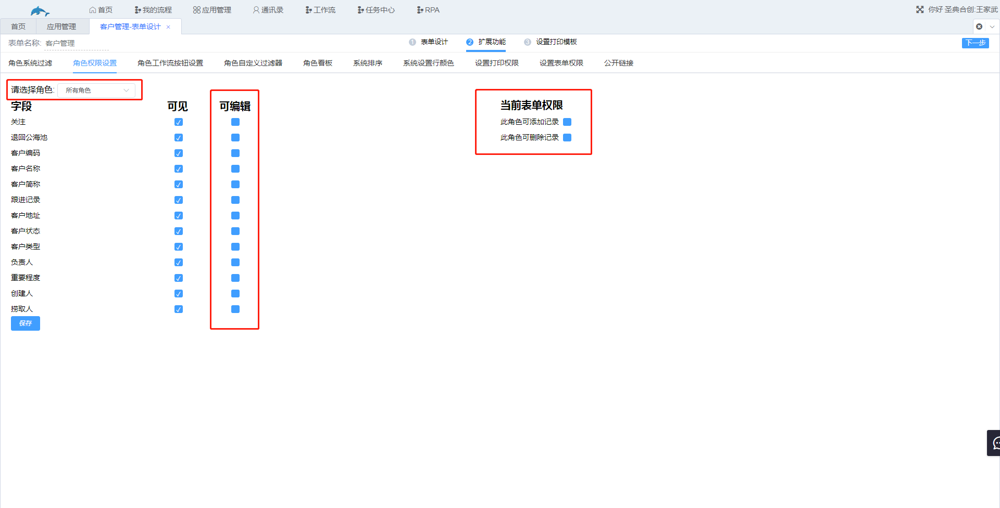
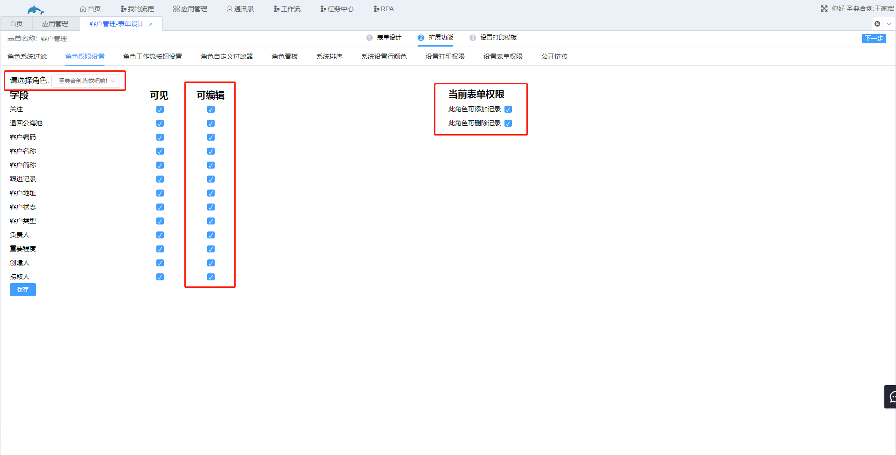

## 5.2角色权限设置

1.功能说明

​	给角色设置权限，字段权限有“可见”、“可编辑”；表单权限有“此角色可添加记录”、“此角色可删除记录”。勾选代表该角色拥有该权限。管理员不受该功能限制。

2.设置

​	入口：表单设计→扩展功能→角色权限设置

​	需要先取消所有角色对应的权限，然后再给需要权限的角色勾选该权限。

​	示例：客户管理表只对销售部门开放编辑、添加记录和删除记录的权限，其余角色权限只有可见。

​	步骤：

​	（1）取消所有角色“可编辑”、“可添加记录”和“可删除记录”的权限。

​	（2）给销售部门勾选“可编辑”、“可添加记录”和“可删除记录”权限。

