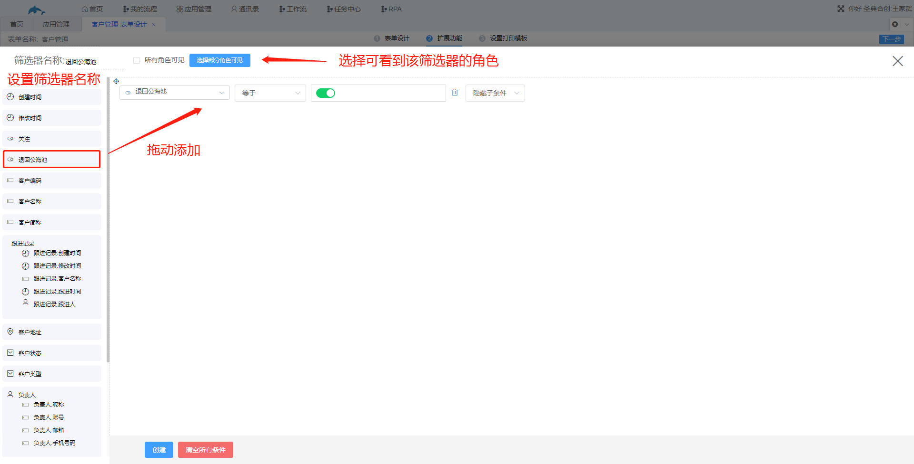
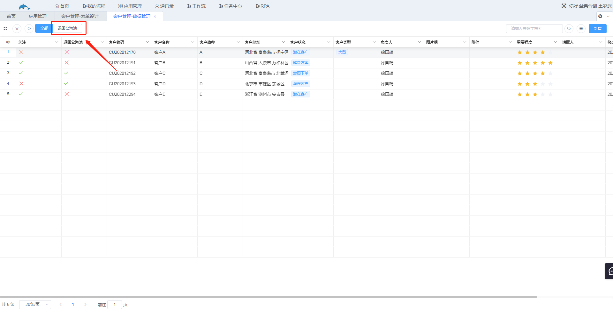

## 5.4角色自定义过滤器

1.功能说明

​	和数据管理的自定义筛选器功能上是相同的，都是在数据管理处添加一个筛选器，区别是数据管理处的自定义筛选器是用户自己定义以及使用的，其他用户看不到该筛选器，而角色自定义过滤器可以给角色设置筛选器，即对开放权限的角色都是可见的。

2.设置

​	入口：表单设计→扩展功能→角色自定义过滤器

​	（1）点击“新增”，进入到筛选器设置界面，设置筛选器名称，选择可见角色，添加筛选条件，设置完成点击保存。

​	（2）在数据管理处可看到该筛选器，在角色自定义过滤器中选择的角色都可以看到该筛选器。

