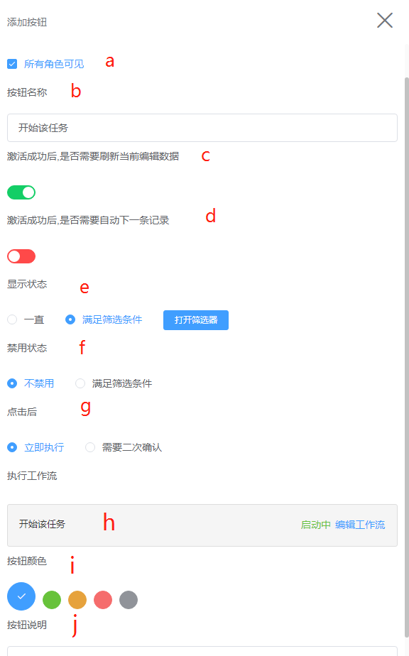
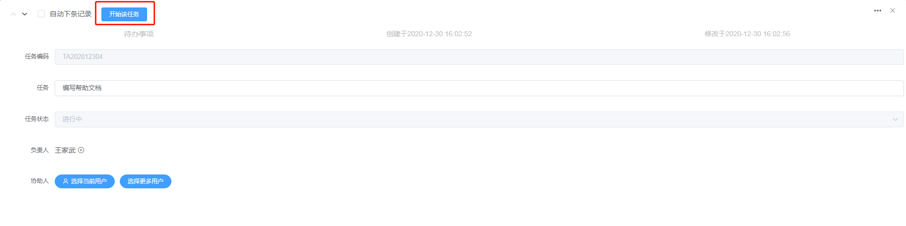
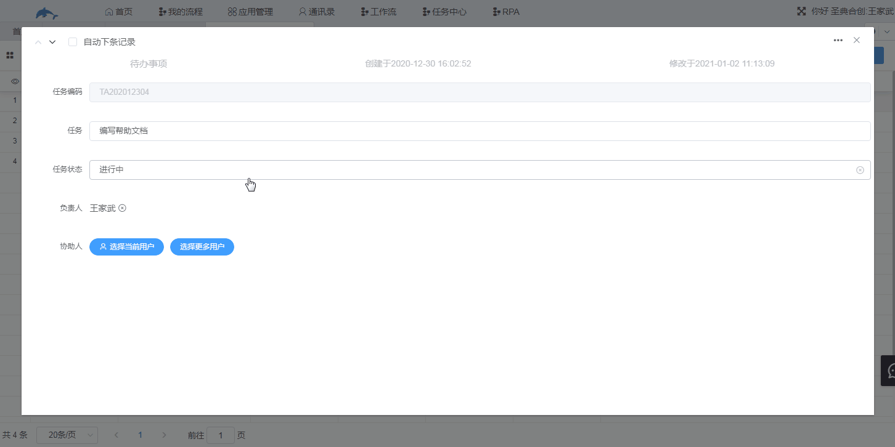
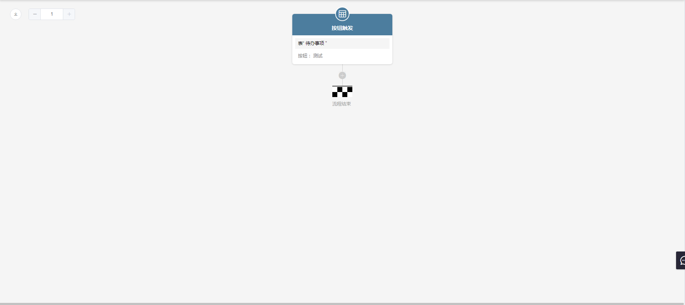

## 5.3角色工作流按钮设置

1.功能说明

​	添加并设置按钮工作流，按钮工作流通过点击按钮人为触发，工作流的作用请移步到该文档的“工作流”部分了解详细内容。按钮工作流的按钮会出现在数据管理编辑数据页面。

2.设置

​	入口：表单设计→扩展功能→角色工作流按钮设置

​	（1）点击“新增工作流按钮”进入到设置界面。

​		a.设置可看到该按钮的角色，取消勾选“所有角色可见”后可选择角色。

​		b.设置按钮名称。

​		c.打开后，点击按钮并激活成功会刷新当前编辑的数据。

​		d.打开后，激活了工作流会自动进入到下一条记录的编辑页面。

​		e.显示状态，“一直”表示该按钮会一直出现在编辑页面中；“满足筛选条件”则是满足设置的条件时该按钮才会显示出来。例如待办事项的按钮“开始该任务”只有在满足任务状态等于“未开始”时才显示。

​		f.禁用状态下按钮可显示但不可点击。

​		g.默认立即执行，即点击按钮后就开始执行；勾选“需要二次确认”则点击按钮后会弹出一个确认框，点击确认后才会执行。

​		h.用于编辑工作流，首次添加按钮时该部分没有内容，当已经添加了按钮时，由此处进入按钮工作流的编辑界面。

​		g.设置按钮颜色。

​		i.按钮说明，为按钮工作流添加说明，描述该按钮的作用。

​	（2）点击“添加按钮”跳转到工作流编辑界面，工作流编辑部分到文档的“工作流”了解详细内容。

