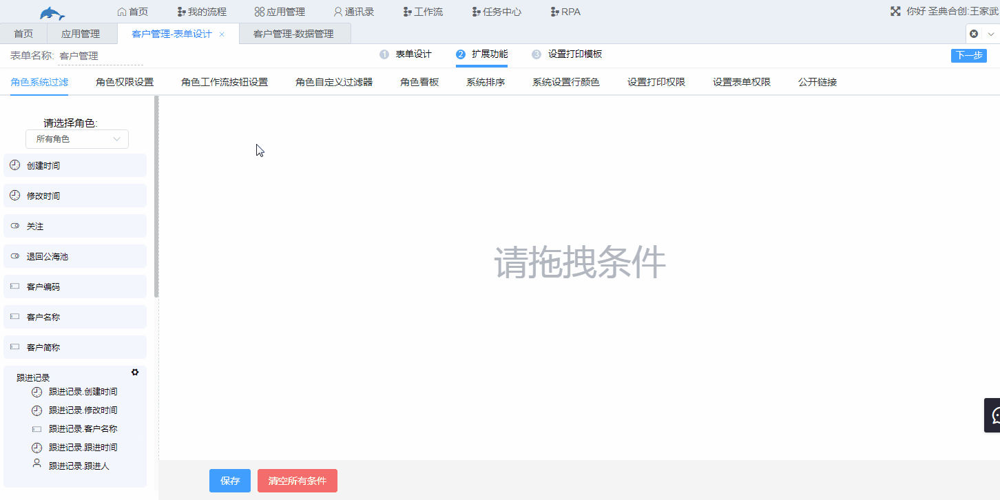

## 5.1角色系统过滤

1.功能说明

​	对数据管理显示的数据进行过滤，该过滤是对指定的角色设定的，即通过设置该功能，可实现不同角色中的用户看到的记录数量不同。

2.设置

​	入口：表单设计→扩展功能→角色系统过滤

​	所有角色过滤条件和其余角色的过滤条件之间的逻辑关系为**或**关系，**例如给某个角色设置过滤条件，当某一记录满足所有角色中的过滤条件或者满足该角色中的过滤条件，该角色中的用户即可看到这一条记录**。因此若需要设置某个角色中的用户对该表单的数据不可见，则需要让该角色中的用户不满足所有角色中的过滤条件，同时也不满足该角色中的过滤条件。

​	示例：例如设置**圣典合创：客服中心**不能看见客户管理表。给**所有角色**以及**圣典合创：客服中心**添加一个永远不能满足的条件即可。

​	设置如下图。

