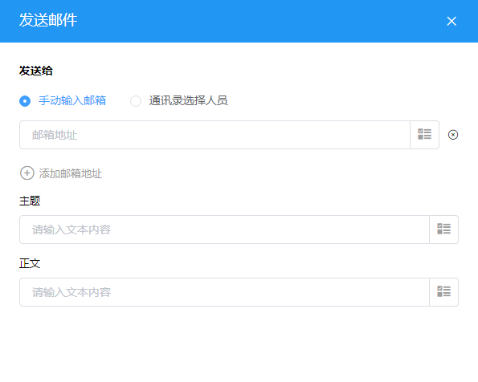

### 8.3.10发送邮件

1.节点说明

​	向指定的邮箱发送设置好的文本信息。

2.节点设置

（1）手动输入邮箱

​	手动输入邮件接收人的邮箱地址，点击“添加邮箱地址”可以新增多一个邮箱地址输入框。

（2）通讯录选择人员

​	在通讯录中选择邮件接收人，此操作需要通讯录中录有人员的邮箱地址。

3.邮件内容

​	邮件的主题和内容都可以是固定的文本内容或者是选择其他节点中的记录。