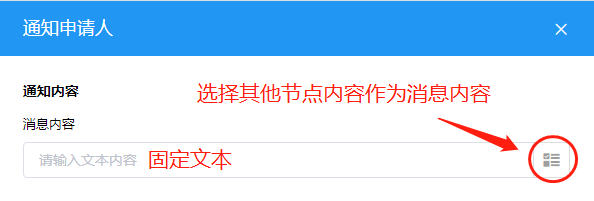
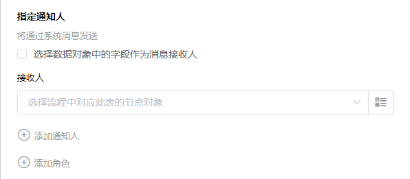
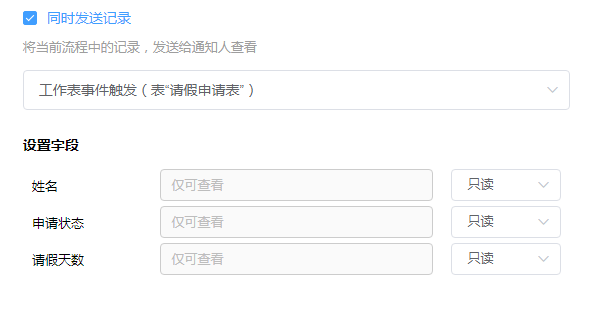

### 8.3.9发送站内消息

1.节点说明

​	向指定的人员发送鲸云站内消息通知，该通知会同时发送到接收人的企业微信中，同时可以将表单字段内容一并发送，接收人可以通过点击“查看记录”查看该记录的内容。

2.节点设置

​	（1）添加通知内容

​		通知内容可以是固定的文本内容，也可以通过选择其他节点来发送动态消息。

​	（2）添加接收人

​		a.勾选”选择数据对象中的字段作为消息接收人“后选择接收人，可将消息发送给动态获取到的消息接收人，一般在前面通过查找指定记录节点找到消息接收人。

​		b.点击下方”添加通知人“或”添加角色“可以添加固定的通知人或者角色。

​	（3）同时发送记录

​		将选择的节点中的记录同时发送出去，接收人接收到消息后，点击“查看记录”可查看此记录的内容。

