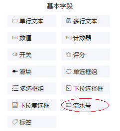
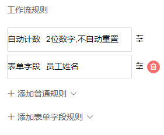
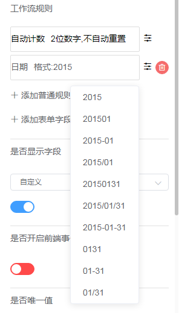

### 3.2.5流水号

1.字段说明

​	当表单各行记录需要编码时，可以使用流水号字段，流水号字段会通过“工作流规则”自动生成编码，不需要手动填写。

2.字段属性

​	工作流规则

​	（1） 自动计数

​		a.计数位数

​			每新增一次数据该位计数数值加1，当计数数值的位数超过计数位数时，计数数值会重置，重新开始计算。例如计数位数为2时，当数值为99时，下	一个流水号的计数会重新从0开始。

​		b.重置周期

​			•设置了重置周期的流水号，当满足重置周期后将会以初始值重新开始计算。

​			• 不自动重置，设置为不自动重置的流水号，会一直计数到最大值才重新开始计算。

​		c. 初始值

​			指计数的初始值，初始值默认为0。

​		d. 固定位数

​			开启固定位数后，计数数值的位数未达到计数位数会自动补上0，比如计数位数为3，此时开启固定位数，计数数值为1时，会显示成001。

​	（2）提交日期，按照新增数据时提交的时间组成流水号的一部分，提交日期有10种不同的格式。

​	（3）固定字符，加上固定字符后，生成的水流号都会添加上该段固定字符。

​	（4） 表单字段，可以使用表单中的字段来组成流水号的一部分。