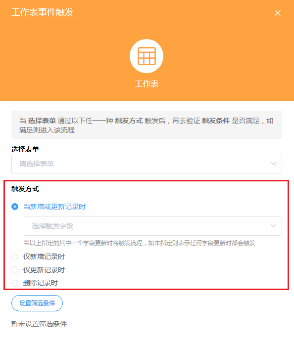
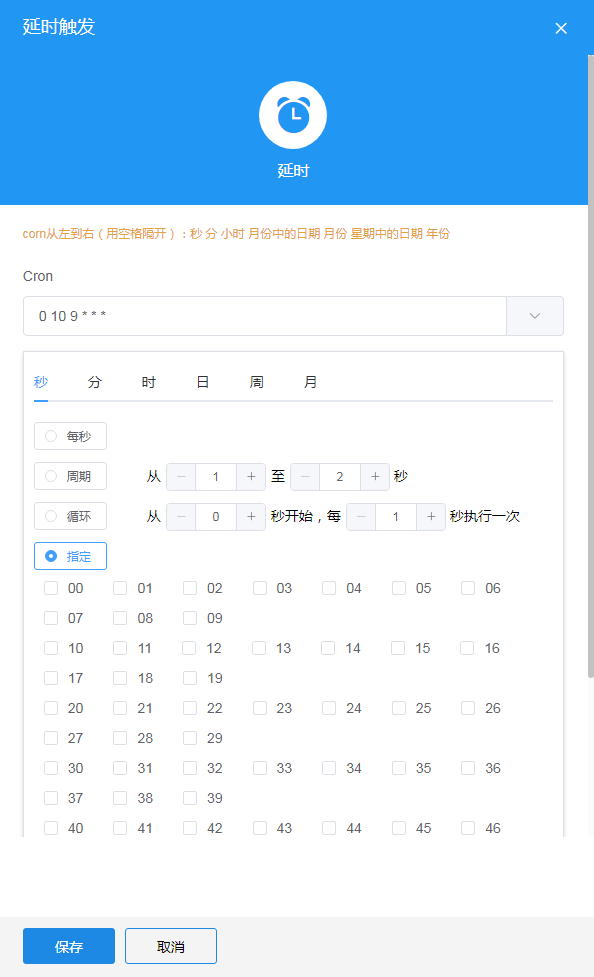
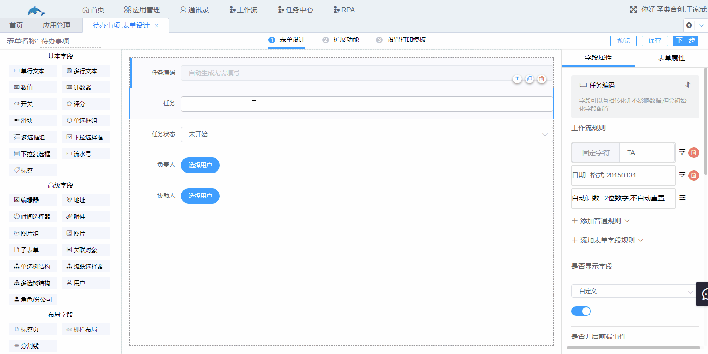
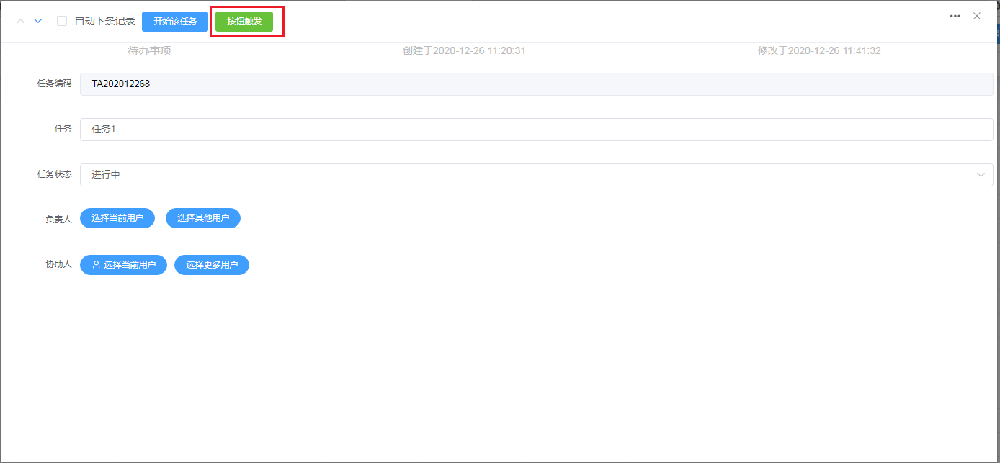

## 8.2工作流的触发方式

1.工作流的几种触发方式

* 工作表事件触发
* 时间触发
* 按钮触发
* Webhook触发

​	（1）工作表事件触发

​		当监听的工作表的操作（如新增记录或者更新记录等）触发工作流后，工作流开始执行。例如：“费用报销”工作表有新的记录产生，就触发工作流，让领导进行审批。工作表事件触发的触发方式有4种：当新增或更新记录时、仅新增记录时、仅更新记录时、删除记录时。

​		a.当新增或更新记录时

​			当监听的工作表新增或更新记录时触发工作流，可以设置监听的字段，设置后只有被监听的字段新增或者更新时才会触发工作流。

​		b.仅新增记录时

​			只有当被监听的工作表新增记录时才会触发工作流。

​		c.仅更新记录时

​			只有当被监听的工作表更新记录时才会触发工作流，该触发方式也可以设置监听的字段。

​		d.删除记录时

​			被监听的工作表删除记录时触发。

​	（2）时间触发

​		按照设置好的时间触发工作流。可以设定一个循环周期时间，每当时间到达一个周期时间，都可以执行一次计划动作。例如：工作日每天早上9点时给同事发送信息，提醒待办事项；下午6点发送消息提醒写工作日志。

​	（3）按钮触发

​		当按下按钮时触发工作流。按钮触发工作流在表单设计的扩展功能中设置。

​		触发的按钮在数据管理的编辑数据的页面中显示，按下该按钮可触发工作流。

	（4）Webhook触发