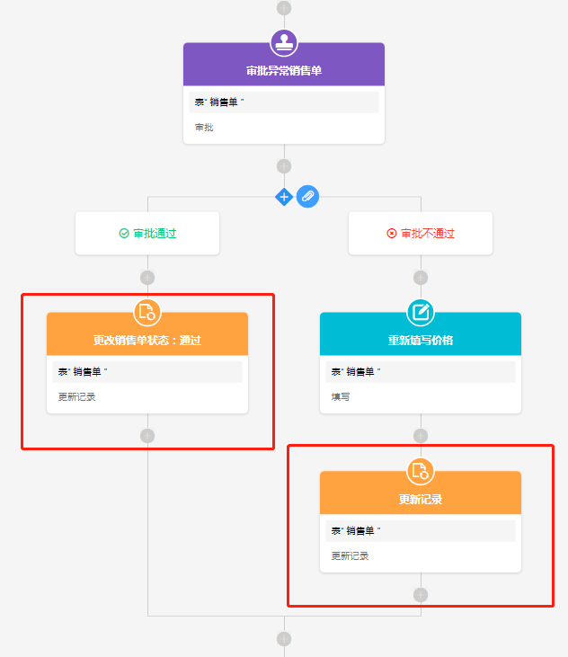
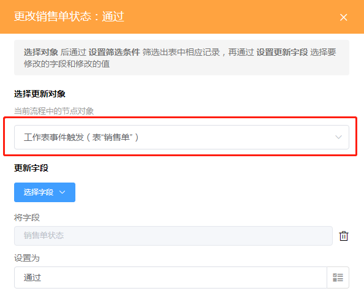
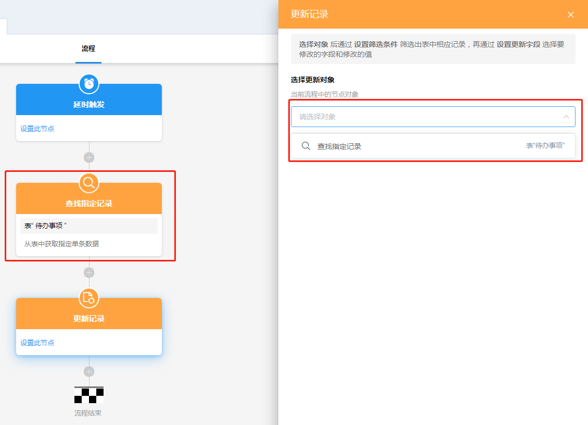
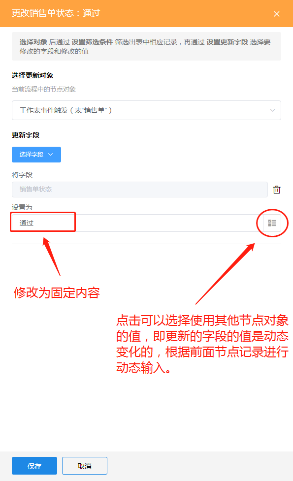
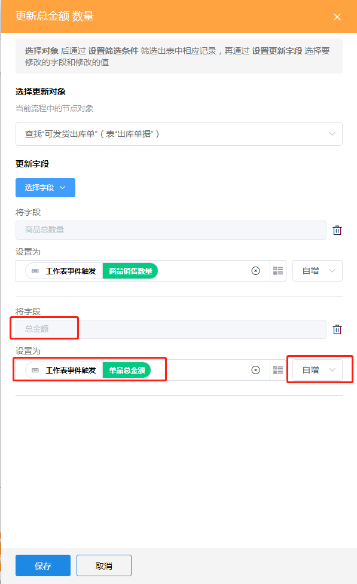

### 8.3.2更新记录

1.节点说明

​	更新某条记录中的一个或多个字段的值（本表字段或关联他表字段），可以修改为新的内容、清空字段的值、增加或减少值。一般用于某个状态

2.示例

​	当销售单工作表的某一条记录出现异常，如利润异常，进入审批流程，由审批人决定“通过”或者“否决”。审批人若选择“通过”，则将销售单的状态改为“通过"；若选择“否决”，则让开该销售单的销售员重新填写价格，再将销售单的状态改为“已修改”。

3.设置步骤

​	（1）选择要更新的记录对象

​		在工作流中， 新增记录、审批、填写、查找指定记录这些节点都会指向一条记录。更新记录的更新对象需要在这些节点里面选择。

​		如果在前面的节点中没有需要更新的对象，则需要添加上述节点来获得更新的对象，比较常用的是添加查找指定记录节点，将需要修改的记录通过查找节点获取回来，然后再用更新节点进行修改。

​		例如我们使用时间触发工作流时，更新节点前没有可以更新的对象，此时可以添加一个查找指定记录节点来获取更新对象。

​	（2）设置要更新的字段

​		a.将字段设为新的值

​		b.清空字段内容

​			”设置为“下面的方框不填写内容时，该字段的内容会被清空。

​		c.为字段增加或者减少值

​			图中将总金额修改为总金额 + 单品总金额。若选择”自减“则是将总金额修改为总金额 - 单品总金额。