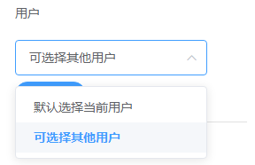

### 3.2.12用户

1.字段说明

​	用于选择通讯录中的鲸云用户，可看作是一个关联了“用户表”的关联对象，用户表的字段包括用户账号、昵称、手机号码、邮箱等。录入用户字段记录时只能选择通讯录中的人员。一般用于填写负责人、协助人等。在工作流中，通过查找节点在用户表中查找用户字段关联的记录**账号**，可获取某条记录对应的用户，例如找到某张销售单的负责人。

2.字段属性

显示方式

* 卡片（一条）
* 列表（多条）

​	（1）卡片（一条）

​		当显示方式为卡片（一条）时，该字段只能选择一个用户。在“用户”中能选择“默认选择当前用户”或者“可选择其他用户”，前者只能选择填写记录的用户，即用户填写该表记录时，在用户字段中只能选择自己的账号，后者填写记录时可以选择其他人员。

​	（2）列表（多条）

​		显示方式为列表（多条）时，可以选择多个用户。