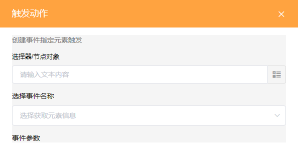
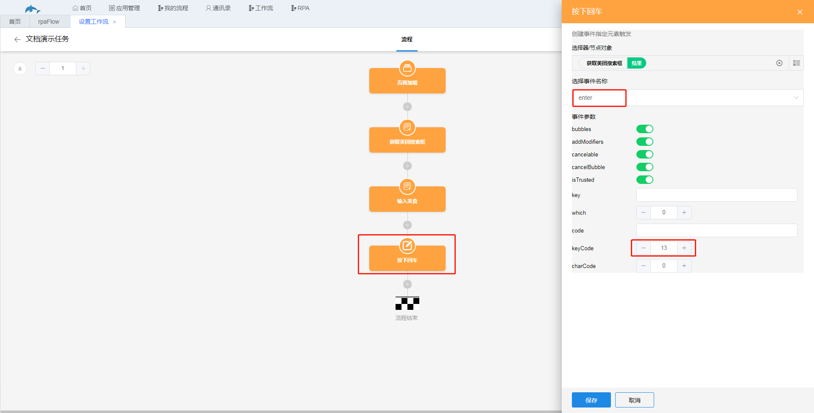
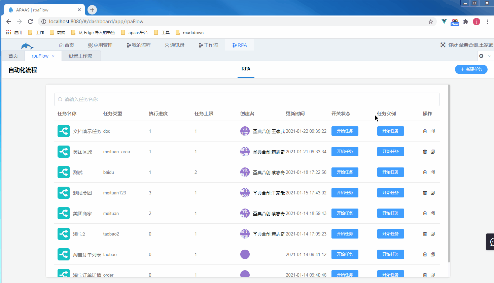
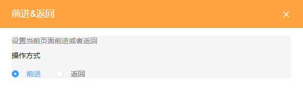
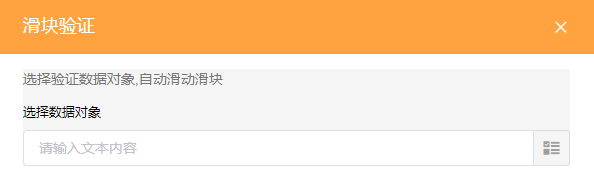

### 10.2.2用户行为

1.触发动作

（1）字节说明

​	用于模拟用户的点击、按下某个键盘按键、点击输入框使输入框获得焦点或者点击输入框以外的地方使输入框失去焦点。对应的事件分别为click、enter、focus、blur。

（2）节点设置

​	选择需要操作的元素，然后选择需要的事件即可。

​	示例：在美团官网搜索框中输入“美食”，然后按下回车键。

​	步骤：

​		a.获取搜索框

​		b.通过设置元素信息节点给搜索框输入“美食”

​		c.添加触发动作节点，选择a步骤获取到的搜索框，选择事件enter，keyCode设为13，即回车键的键码。

​	效果如图。

​	focus和blur事件较为简单，这里不进行演示。

2.延时

（1）节点说明

​	任务流程进入到延时节点后停止执行，经过指定的时间后RPA才继续执行下一个节点。

（2）节点设置

​	设置延时时间，时间单位为毫秒。

3.关闭标签

节点说明

​	关闭网页，该节点没有设置项。

4.结束任务

节点说明

​	停止该任务流程，并将任务集合表中的任务状态置为done，表示任务已结束，任务结束后无法再开始该任务，需要将任务状态重新修改为空值或者doing，该节点没有设置项。

5.重新注入脚本

节点说明

​	RPA运行需要向操作对象，即网页注入脚本，才可以正常运行。在任务流程的页面加载中已经向网页注入了脚本，但当自动打开的页面是通过iframe标签嵌套进来的页面时，此时网页地址跳转到了另外一个网页中，RPA无法再进行后续工作。通过添加重新注入脚本节点可以将脚本注入到新的页面中，RPA才能继续正常工作。该节点没有设置项。

6.前进&返回

（1）节点说明

​	即浏览器的前进和返回按钮，回退到上一次访问的页面或者前进到回退前的页面。

（2）节点设置

​	选择前进或者后退。

​	

7.滑块验证

（1）字节说明

​	模拟用户滑动滑块操作，用于登录时的滑动验证。

（2）节点设置

​	填入描述用户滑动滑块动作的对象，该对象包含用户滑动的速度等信息，由鲸云提供的api计算获取，暂时未开放该api。

​	