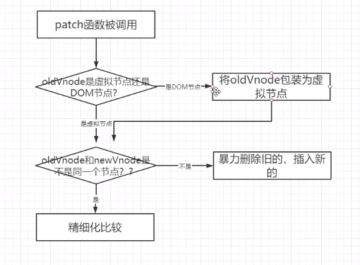
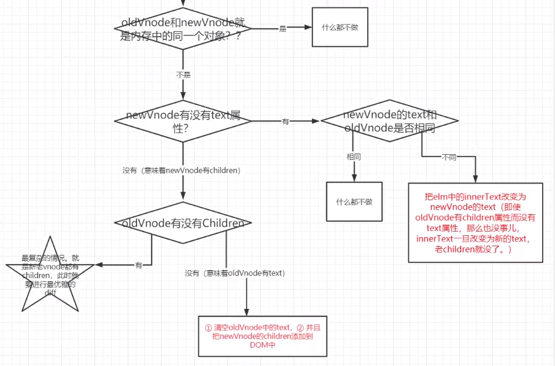
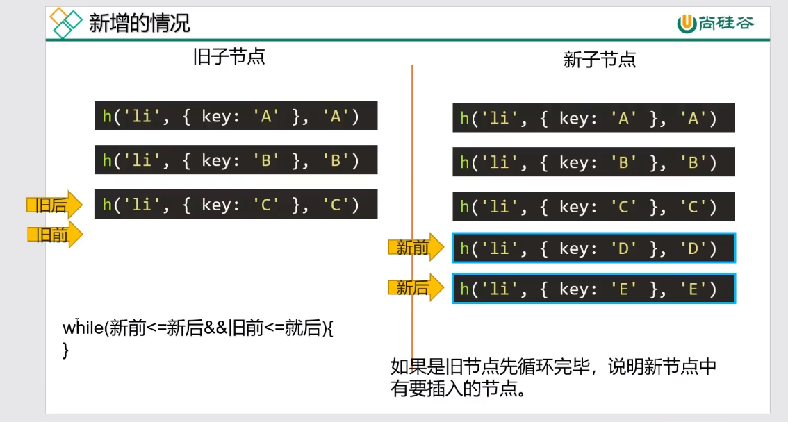
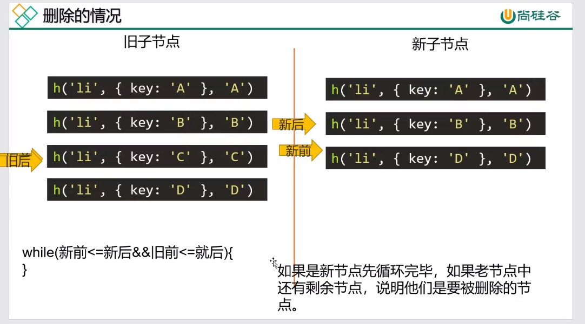
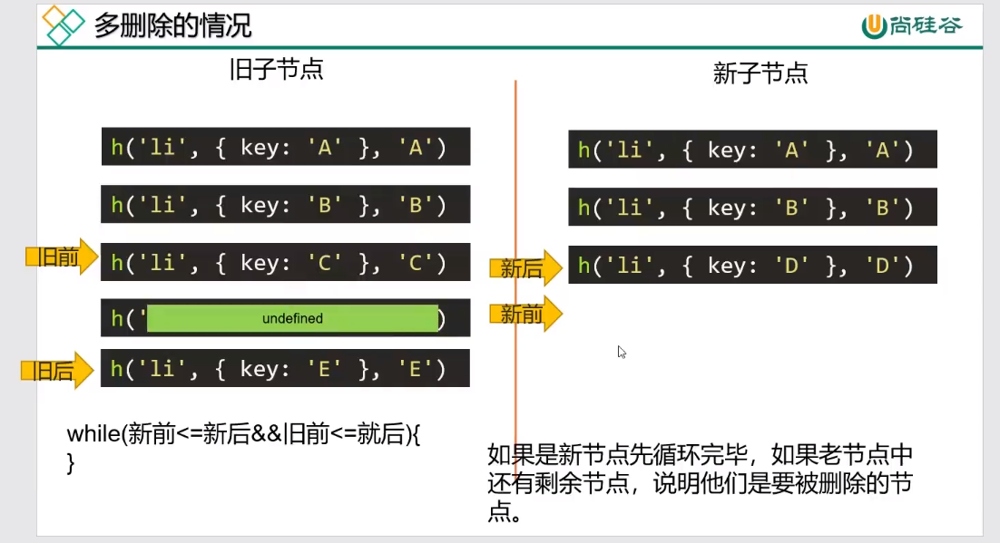
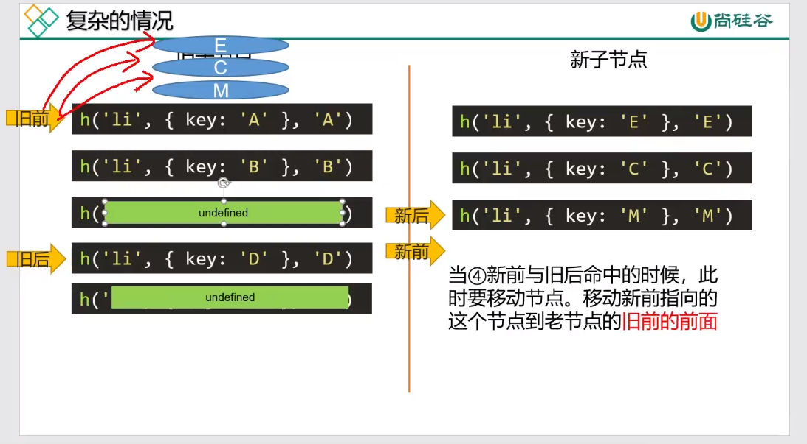
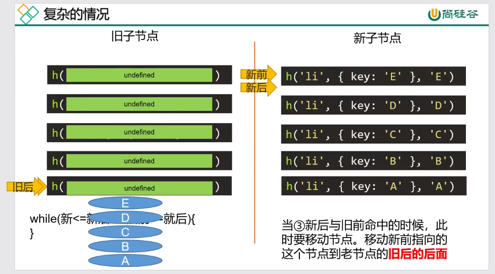

比较更新前和更新后的虚拟DOM，snabbdom中的h函数负责创造出虚拟节点，patch函数负责将虚拟节点上树（由createElement将虚拟节点创建出来，若h函数有嵌套结构需要用递归创建出来，patch将createElement创建出来的DOM上树）。

+ key是节点的唯一标识，告诉diff算法，在更新前后它们是同一个DOM节点
+ 只有是同一个虚拟节点，才进行精细化比较，否则就是暴力删除旧的、插入新的。（选择器相同且key相同就为同一个虚拟节点）
+ 只进行同层比较，不会进行跨层比较。 

**patch函数：**

**精细化比较如下图：**

**newVnode和oldVnode都有children时：**

经典的diff算法优化策略

四种命中查找：

+ 新前与旧前
+ 新后与旧后
+ 新后与旧前
+ 新前与旧后

命中一种就不再进行命中判断了，如果都没有命中，就需要用循环来寻找旧节点中是否有新前，有就将其变为undefined，然后新前继续下移。

新增情况

删除情况

多删除情况

复杂情况1

 

复杂情况2

