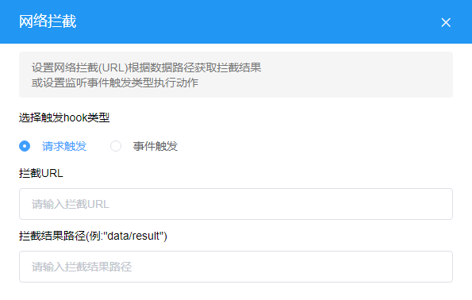
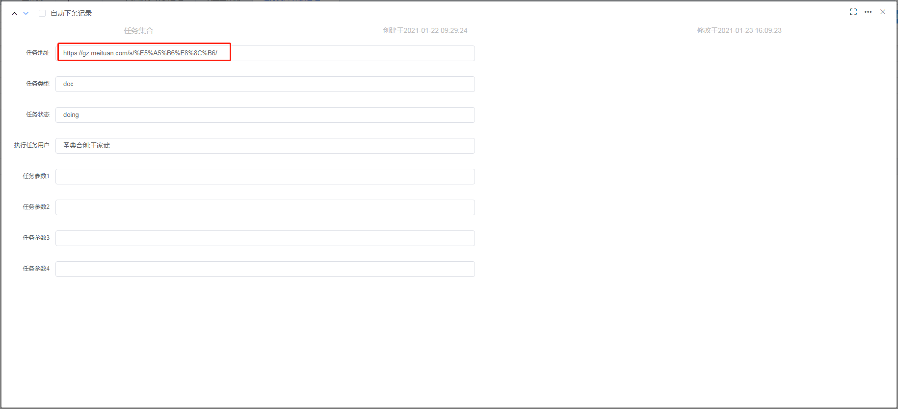
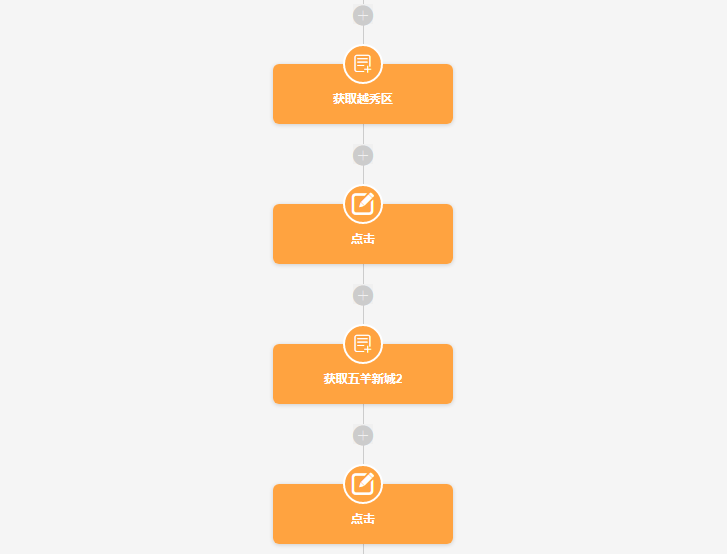
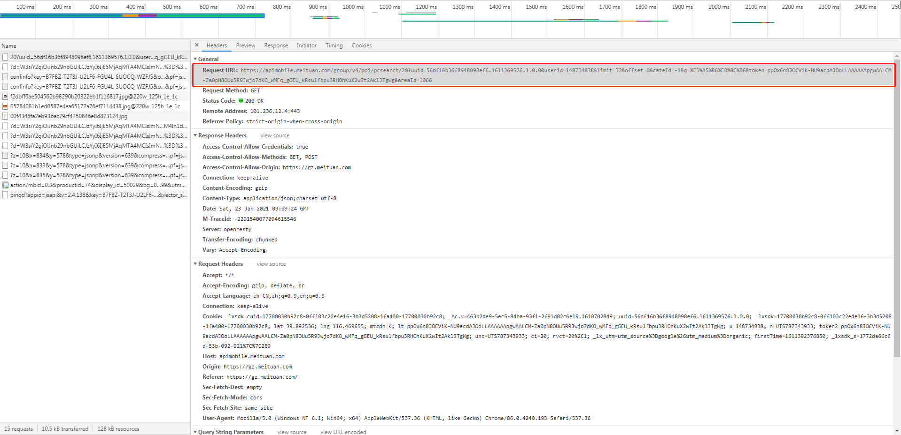
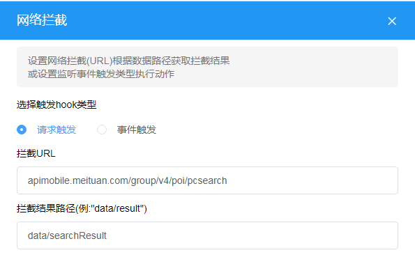
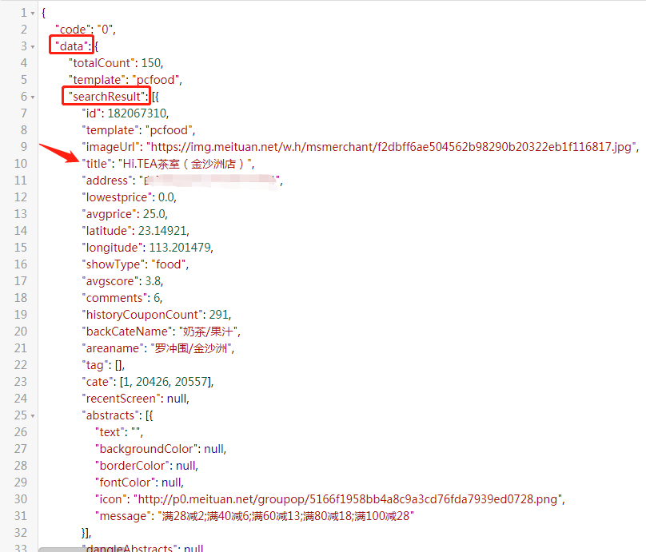
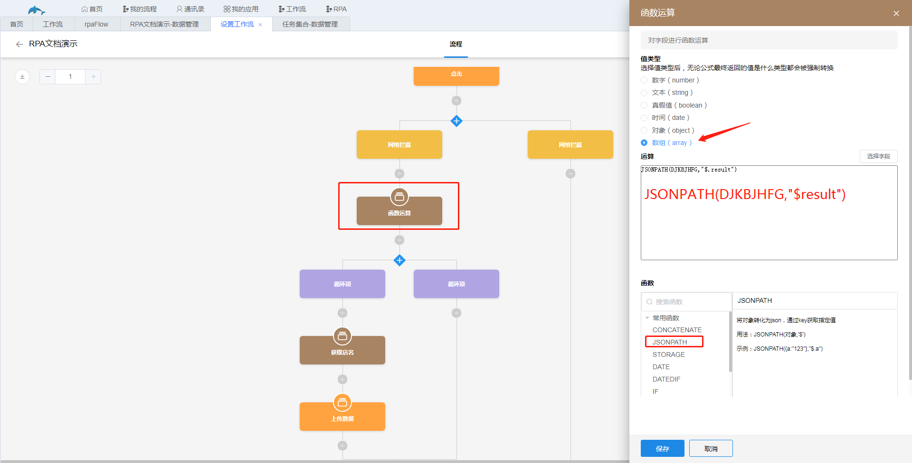
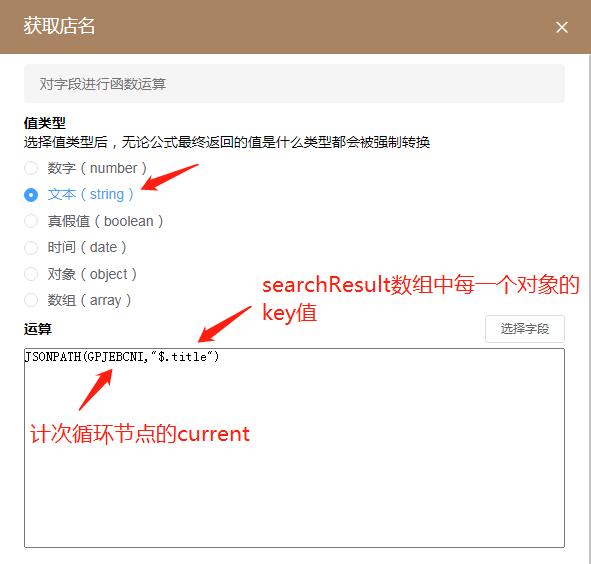
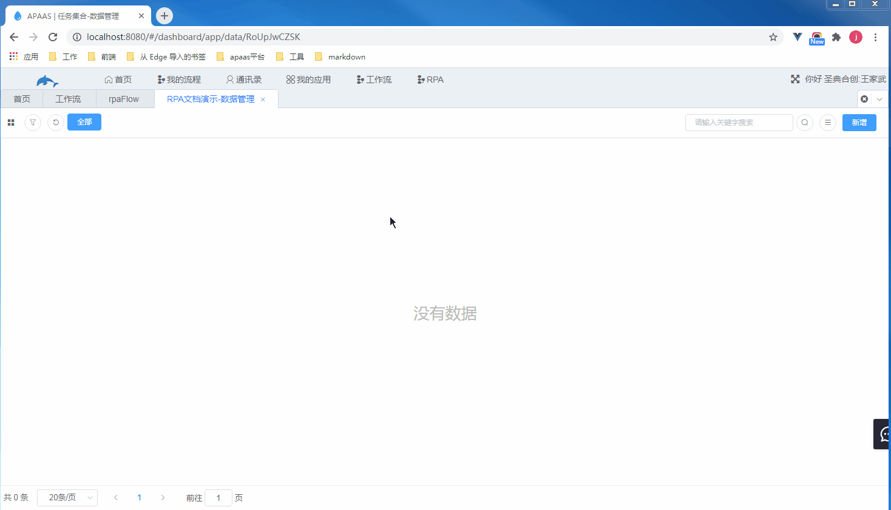

### 10.2.5webhook

1.节点说明

​	拦截某个url并获取其中的信息。

2.节点设置

​	拦截URL：网页加载时需要向某个URL发起请求来请求后台的数据，接收数据后再把数据渲染到网页上，我们可以拦截网页请求的URL并获取其中的数据。将需要拦截的URL填入到该输入框中。

​	拦截结果路径：即拦截的数据在json格式对象中的路径。

​	

​	示例：拦截美团向后台请求的广州越秀区五羊新城的奶茶店信息，获取该地区的所有奶茶店店名。

​	步骤：

​		a.进入美团网，切换城市到广州，搜索奶茶，然后复制此时的网址，在任务集合数据管理中将任务地址修改为该网址，此页面是我们任务流程需要加载的页面。

​	b.获取区域中的越秀区并点击，再获取其中的五羊新城，并点击，若对获取元素信息节点和触发动作节点还未了解请退回到对应的部分进行了解，此处不展开详细步骤。

​		该步骤为了点击下图的位置。

​		c.此时为了渲染五羊新城的奶茶店页面，美团会向后台请求数据，打开谷歌浏览器的DevTools，在Network中找到该URL。

​		d.新增webhook节点，将c步骤找到的URL填入到“拦截URL”输入框中，拦截URL输入框只需要填写该URL具有辨识性的一部分即可，拦截结果路径需要分析拦截下来的json格式对象的数据，找到我们需要的数据，将该数据的路径填写到输入框中。

​		访问c步骤找到的URL，格式化该数据，找到我们需要的数据的路径是data下的searchResult这个数组，把该数组的路径填入到“拦截结果路径”中。

​		e.添加函数运算节点，使用函数JSONPATH获取webhook节点拦截的数据，即数组searchResult。该函数把第一个参数转换为json格式的对象，通过第二个参数的key获取数据。其中DJKBJHFG就是webhook节点的结果。

​		f.添加计次循环节点循环遍历e步骤获得的数组，数组的每一项为一个对象，我们需要拿到对象中key为“title”的值，因此需要再添加一个函数运算节点来获取该值。

​		g.添加上传数据节点上传f步骤获取到的店名。

​		效果如下图。

