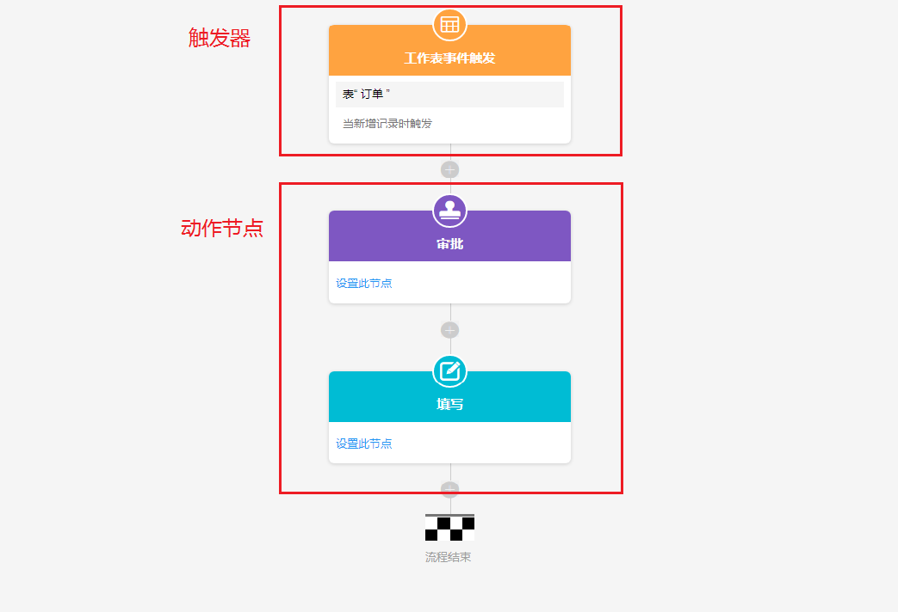

# 8.工作流

1.工作流介绍

​	简单来说就是自动化工作，当某个操作触发了工作流后，工作流便按照事先设置好的各个动作节点开始按顺序自动工作，节省一些手动的操作，让工作更高效率。工作流可以自动给工作表添加记录、更新记录以及删除记录；另外鲸云提供了一些人工的操作来控制工作流的流程，例如审批以及填写，当工作流自动执行到审批或者填写节点时，需要审批人或者填写人完成审批或者填写的操作才可以继续往下进行，达到控制流程的目的。

2.工作流的组成

​	工作流由一个触发器和多个动作节点组成，触发器用来触发一个工作流程，动作节点用来完成各个步骤的操作。

3.触发器

​	工作流的触发器有：工作表事件触发器、时间触发器、按钮触发器、Webhook触发器。

4.使用场景

​	（1）销售单和出库单据

​		当新增一张销售单后，会自动在出库单中添加一条数据，即自动填写对应的一张出库单据。

​	（2）上级审批异常的销售单

​		当销售单因为销售价异常出现问题后，通过预先设置好的工作流可以自动检测出该异常，并进入审批环节，按工作流审批节点中设置的审批人给审批人发送审批消息，审批人可以选择“通过”或者“否决”来完成该节点的操作，让工作流进入到下个节点，可以通过“分支”节点给“通过”和“否决”两个结果设置不同的动作，若审批人不完成审批操作，则流程会一直停留在该节点中，直到审批人完成审批再继续执行。

​	（3）待办事项提醒

​		提醒还未完成事项，提醒次数以及频率可以在时间触发器中设置，提醒的消息通过“发送站内信息”节点设置，除了会发送在鲸云系统的消息框中，还会同时发到绑定的企业微信中。