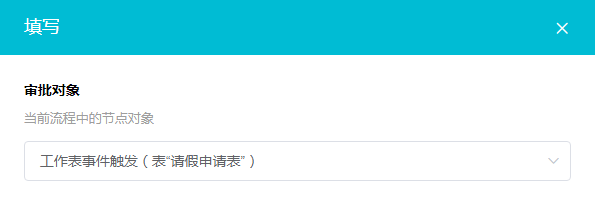
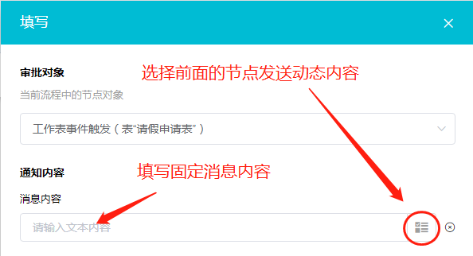
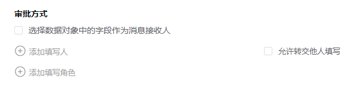

### 8.3.8填写

1.节点说明

​	在流程中，需要某个成员填写一些字段信息或者重新填写某个信息，可以通过填写节点完成。可以在填写节点中给填写人设置权限，有隐藏，选填，必填，只读四项。

2.设置步骤

​	（1）选择需要填写的对象（该对象需要在前面节点中选择）

​	（2）设置消息内容

​	（3）添加填写人

​		a.勾选”选择数据对象中的字段作为消息接收人“后选择接收人，可将填写通知信息发送给动态获取到的填写人，一般在前面通过查找指定记录节点找到填写人。

​		b.点击下方”添加填写人“或”添加填写角色“可以添加固定的填写人或者角色。

​		c.”允许转交他人填写“，即允许填写人将填写操作转交给他人。

​	（4）设置填写权限

​			填写权限默认为只读，即只能看不能更改，将需要填写的字段权限设为”填写“后填写人才可以填写字段的数据。必填为填写人必须填写该字段数据才能提交。隐藏则是将字段隐藏，填写人看不到该字段。